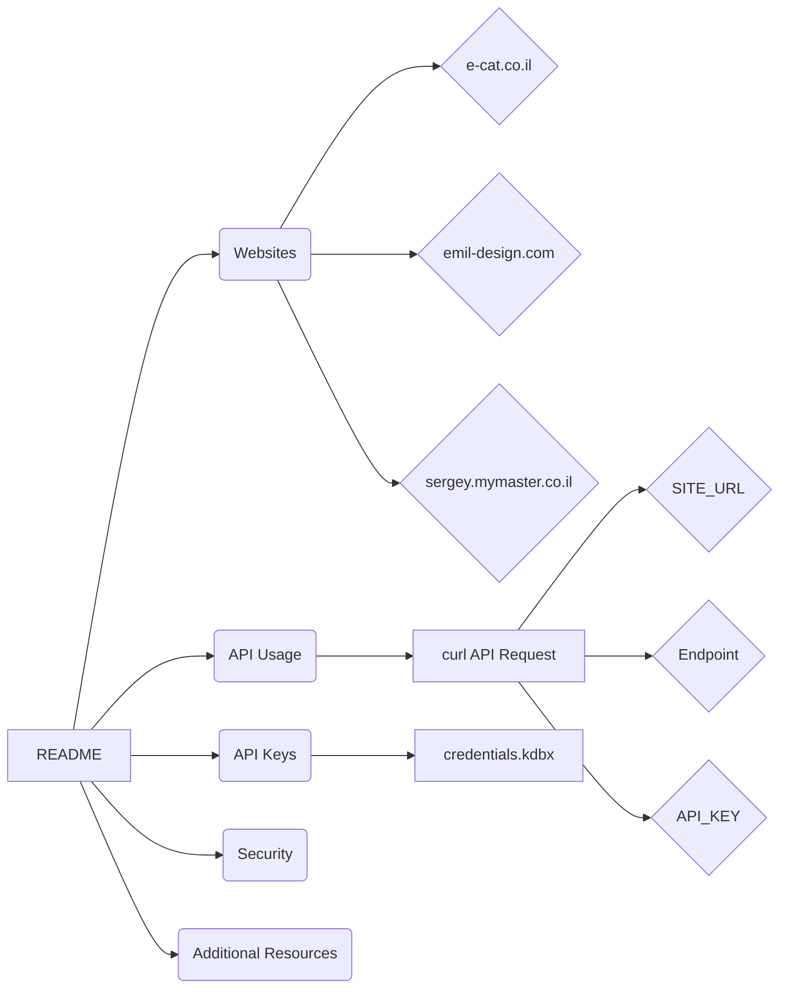

# <input code>

```markdown
# Managing PrestaShop Websites

This `README` file explains the structure and usage of your PrestaShop websites, as well as the storage and use of API keys.

## Websites

Your PrestaShop websites:
1. [e-cat.co.il](https://e-cat.co.il)
2. [emil-design.com](https://emil-design.com)
3. [sergey.mymaster.co.il](https://sergey.mymaster.co.il)

Each of these websites uses APIs to interact with various parameters and functions.

## Storing API Keys

API keys for each website are stored in the `credentials.kdbx` file. This file is a secure password database and contains the following data for each website:
- Website URL
- API Key
- Additional metadata (if necessary)

To work with the keys from the file, use a password manager that supports the `.kdbx` format, such as [KeePass](https://keepass.info/) or [KeePassXC](https://keepassxc.org/).

## Example API Usage

To connect to the API of one of your websites, follow the template below:

### API Request Example

**API Request Template:**
```bash
curl -X GET 'https://<SITE_URL>/api/<endpoint>' \
-H 'Authorization: Basic <base64(API_KEY)>'
```

**Parameter Explanation:**
- `<SITE_URL>` — the website address, e.g., `e-cat.co.il`.
- `<endpoint>` — the API endpoint (e.g., `products`, `customers`).
- `<API_KEY>` — the API key, encoded in Base64.

### Example API Call
To fetch a list of products from `e-cat.co.il`:
```bash
curl -X GET 'https://e-cat.co.il/api/products' \
-H 'Authorization: Basic <base64(API_KEY)>'
```

## Security Recommendations

- Never share the `credentials.kdbx` file with others.
- Ensure the file is stored in a secure location accessible only to you.
- Regularly update your API keys and database passwords.

## Additional Resources

If you encounter any issues or have questions about connecting to the API, refer to the [official PrestaShop API documentation](https://devdocs.prestashop.com/), which provides information on available endpoints and how to interact with them.
```

# <algorithm>

This code is a README file, not executable code. It describes how to interact with PrestaShop websites using their APIs.  There is no algorithm to describe in terms of steps, functions, or data flow. The file describes:

1. **Websites:** Lists the websites and implies they use APIs.
2. **API Keys:** Explains where to store API keys securely (in `credentials.kdbx`).
3. **API Usage Examples:** Provides a template and examples for using `curl` to make API requests to PrestaShop sites.
4. **Security Recommendations:** Advises on secure handling of API keys and credentials.


# <mermaid>



**Explanation of the Mermaid Diagram:**

The diagram shows a simple structure of the README file and its relation to the topics.  It demonStartes the general organization but doesn't represent any flow of data or execution. The `curl API Request` box represents the example usage for accessing the APIs described within the file. The links represent the described dependencies in the context of the information provided by the README.

# <explanation>

This file is a `README` explaining how to interact with PrestaShop websites using their APIs.  There is no executable code to analyze.

* **Imports:** There are no imports as this is a plain text file.
* **Classes:** No classes are defined.
* **Functions:** No functions are defined.
* **Variables:** No variables are defined.
* **Possible Errors/Improvements:**  The document could benefit from adding more specific information on how the API keys are structured within the `.kdbx` file.  A brief example of the `.kdbx` format or a suggested key structure could be helpful.

**Relationships to other parts of the project:**

The `README` file documents the interaction with external services (the PrestaShop APIs) and the way to access them.  The file does not directly relate to any internal components of a hypothetical project.  It serves as external documentation for users intending to interact with the PrestaShop APIs.