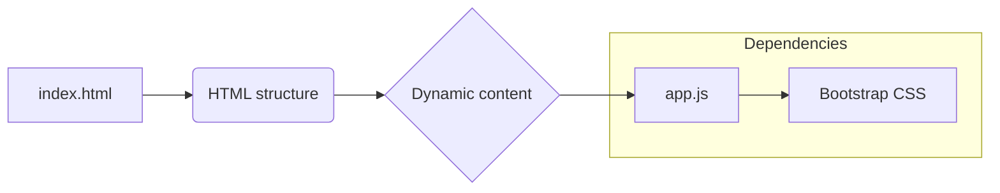

```MD
# Анализ кода index.html

**1. <input code>**

```html
## \file hypotez/src/fast_api/gemini/frontent/index.html
# -*- coding: utf-8 -*-\
#! venv/Scripts/python.exe

""" module: src.fast_api.gemini.frontent """
MODE = 'debug'
<!DOCTYPE html>
<html lang="en">
<head>
    <meta charset="UTF-8">
    <meta name="viewport" content="width=device-width, initial-scale=1.0">
    <title>Chat with Generative AI</title>
    <link rel="stylesheet" href="/static/bootstrap.min.css">
    <style>
        body {
            padding: 2rem;
        }
    </style>
</head>
<body>
    <div class="container">
        <h1>AI Chat Interface</h1>
        <div id="chat-app"></div>
    </div>

    <script type="text/babel" src="/static/app.js"></script>
</body>
</html>
```

**2. <algorithm>**

Этот HTML-файл определяет структуру веб-страницы для интерфейса чата с генеративным ИИ.  Алгоритм прост:

1. Создает HTML-документ с заголовком, стилями и содержимым.
2. Включает CSS-стили (bootstrap).
3. Создает заголовок "AI Chat Interface".
4. Вставляет пустой `<div>` с id "chat-app" для размещения динамического контента.
5. Включает JavaScript-код из файла `app.js`.

Пример: Если `app.js` динамически создаёт элементы HTML и размещает их в div с id "chat-app", то этот HTML-шаблон будет их отображать.


**3. <mermaid>**



**Описание диаграммы:**

* `index.html` (A) определяет статическую структуру страницы.
* `HTML structure` (B) - это шаблон страницы.
* `Dynamic content` (C) - это  динамическая часть, которая будет наполняться кодом из `app.js`.
* `app.js` (D) отвечает за заполнение этой динамической части.
* `Bootstrap CSS` (E) - внешний CSS-фреймворк, используемый для стилизации.

**4. <explanation>**

* **Импорты:**  Нет прямых импортов модулей Python. Файл является HTML-шаблоном, который использует внешние ресурсы (CSS и JavaScript). 
* **Классы:** Нет классов.
* **Функции:** Нет функций.
* **Переменные:** `MODE = 'debug'` - константа, хранящая строку, скорее всего, используемая для определения режима работы приложения (например, отладки).
* **Комментарии:**  Есть комментарии, описывающие роль файла.
* **Структура:**
    * `<html>`: Основная структура HTML-документа.
    * `<head>`:  Заголовок документа, содержит мета-данные (charset, viewport), заголовок страницы и ссылку на Bootstrap CSS.
    * `<body>`: Тело документа, содержит заголовок "AI Chat Interface" и пустой `<div>` с id "chat-app".  Этот `div` предназначен для отображения динамически генерируемого контента.
    * `<script>`: Включает скрипт `app.js`, который, скорее всего, отвечает за взаимодействие с сервером и построение интерфейса.

* **Возможное улучшение:** Добавление атрибутов `id` для `div` `container`  позволило бы использовать CSS-селекторы для стилизации отдельных элементов.


**Цепочка взаимосвязей:**

`index.html` является фронтед-частью приложения.  Он взаимодействует с `app.js` (вероятно, JavaScript-код, используемый на клиенте), который, в свою очередь, взаимодействует с backend-сервером (FastAPI) для получения и отображения данных. `src.fast_api.gemini` - это, по-видимому, часть проекта, которая содержит серверную логику.