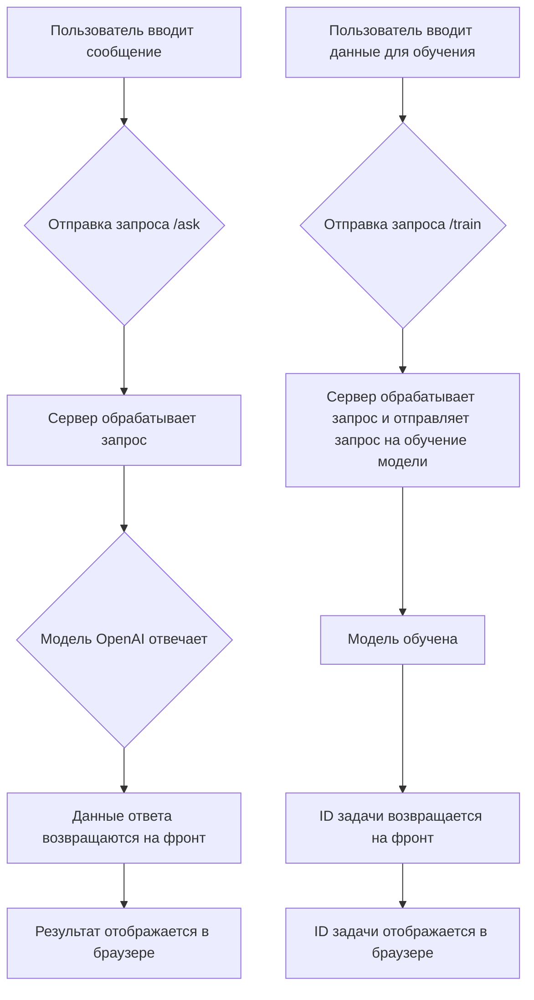

# Анализ кода index.html

## <input code>

```html
## \file hypotez/src/fast_api/html/openai/index.html
# -*- coding: utf-8 -*-
#! venv/Scripts/python.exe

""" module: src.fast_api.html.openai """
MODE = 'debug'
<!DOCTYPE html>
<html lang="en">
<head>
    <meta charset="UTF-8">
    <meta name="viewport" content="width=device-width, initial-scale=1.0">
    <title>OpenAI Model Interaction</title>
    <link rel="stylesheet" href="https://stackpath.bootstrapcdn.com/bootstrap/4.5.2/css/bootstrap.min.css">
    <script src="https://code.angularjs.org/1.8.2/angular.min.js"></script>
</head>
<body ng-app="openaiApp" ng-controller="MainController as ctrl">
    <!-- ... (HTML код формы и вывода) ... -->
    <script>
        angular.module('openaiApp', [])
            .controller('MainController', ['$http', function($http) {
                var vm = this;
                // ... (переменные) ...
                vm.askModel = function() {
                    $http.post('/ask', {
                        message: vm.message,
                        system_instruction: vm.systemInstruction
                    }).then(function(response) {
                        vm.response = response.data.response;
                    }, function(error) {
                        console.error('Error:', error);
                        vm.response = 'Error: ' + error.data.detail;
                    });
                };
                // ... (функция trainModel) ...
            }]);
    </script>
    <!-- ... (подключение Bootstrap и jQuery) ... -->
</body>
</html>
```

## <algorithm>



**Пример:** Пользователь вводит сообщение "Привет, как дела?".
1. Пользователь взаимодействует с формой, которая вызывает функцию `vm.askModel()`.
2. `$http.post('/ask', ...)` отправляет запрос на сервер `/ask` с данными.
3. Сервер обрабатывает запрос и запрашивает ответ у модели OpenAI.
4. OpenAI возвращает ответ.
5. Сервер возвращает ответ в формате JSON на фронт.
6. AngularJS обновляет переменную `vm.response` и отображает ответ в браузере.


## <mermaid>

```mermaid
graph LR
    A[index.html] --> B(AngularJS);
    B --> C{$http};
    C --> D[/ask];
    C --> E[/train];
    D --> F[Сервер OpenAI];
    E --> G[Сервер обучения модели];
    F --> H[Ответ модели];
    G --> I[Результат обучения];
    H --> J[vm.response];
    I --> K[vm.jobId];
    style B fill:#ccf,stroke:#333,stroke-width:2px;
    style C fill:#ccf,stroke:#333,stroke-width:2px;
    style D fill:#ccf,stroke:#333,stroke-width:2px;
    style E fill:#ccf,stroke:#333,stroke-width:2px;
    style F fill:#ccf,stroke:#333,stroke-width:2px;
    style G fill:#ccf,stroke:#333,stroke-width:2px;
    style H fill:#ccf,stroke:#333,stroke-width:2px;
    style I fill:#ccf,stroke:#333,stroke-width:2px;
```
**Объяснение зависимостей:**

* `index.html` использует AngularJS для управления взаимодействием с пользователем и `$http` для отправки запросов на сервер (`/ask`, `/train`).
* Сервер (`/ask`, `/train`) обрабатывает запросы и взаимодействует с моделью OpenAI, а также с компонентами для обучения (`/train`).  
* Bootstrap и jQuery обеспечивают стили и функционал для отображения данных.

## <explanation>

* **Импорты**: Нет прямых импортов Python-модулей.  Используются внешние библиотеки, такие как Bootstrap и AngularJS, для визуализации, а `$http` — для взаимодействий с сервером.  Важно понимать, что эти библиотеки подключаются через внешние ссылки (`<script>`).


* **Классы**: Нет самостоятельных классов в чисто HTML-коде.  Существует контроллер `MainController` в AngularJS, определяющий поведение элементов страницы.


* **Функции**:
    * `vm.askModel()`: Обрабатывает запросы к API `/ask`, принимая `message` и `system_instruction` как параметры.  Возвращает ответ в `vm.response`.  Обрабатывает ошибки при обращении к `/ask`.
    * `vm.trainModel()`: Обрабатывает запросы к API `/train`, принимая `data` и `positive` как параметры.  Возвращает `job_id` в `vm.jobId` (и обрабатывает ошибки).


* **Переменные**:  `vm.message`, `vm.systemInstruction`, `vm.trainingData`, `vm.response`, `vm.jobId` — переменные JavaScript, используемые AngularJS для управления данными на странице.


* **Возможные ошибки/улучшения**:
    * Отсутствует валидация входных данных (message, trainingData) в AngularJS. 
    * Нет обработки возможных ошибок на серверной стороне (fastAPI).
    * Непонятно, как осуществляется взаимодействие между `/ask` и `/train` с серверной частью.  Должно быть API на Python (fastAPI, вероятно), которое обрабатывает эти запросы.
    * Отсутствует обработка ошибок на стороне сервера, в коде AngularJS обработка есть.
    * Необходимо более детальное описание модели OpenAI, с которой взаимодействует код, и какие типы данных она ожидает.


**Взаимосвязи с другими частями проекта:**  Код взаимодействует с серверной частью (предположительно на Python с использованием fastAPI) через API-пути `/ask` и `/train`.  Сервер, в свою очередь, вероятно, взаимодействует с API OpenAI.  Не хватает детализации серверной части, поэтому сложно проследить все взаимосвязи.