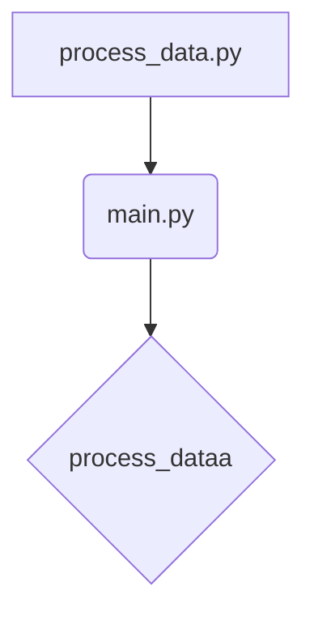

# <input code>

```python
## \file hypotez/src/fast_api/html/process_data.py
# -*- coding: utf-8 -*-
#! venv/Scripts/python.exe
#! venv/bin/python/python3.12

"""
.. module: src.fast_api.html 
	:platform: Windows, Unix
	:synopsis:

"""
MODE = 'dev'

"""
	:platform: Windows, Unix
	:synopsis:

"""

"""
	:platform: Windows, Unix
	:synopsis:

"""


"""
  :platform: Windows, Unix

"""
"""
  :platform: Windows, Unix
  :platform: Windows, Unix
  :synopsis:
"""MODE = 'dev'
  
""" module: src.fast_api.html """


""" @namespace src.fast_api.html """
from .. import main
from main import process_dataa
```

# <algorithm>

Этот код импортирует функцию `process_dataa` из модуля `main`, который находится в подпапке `src.fast_api`.  На данный момент, алгоритм не выполняет никакой обработки. Он лишь импортирует необходимые компоненты.  В связи с отсутствием вызова функции, нет  возможности представить блок-схему ее работы.  

# <mermaid>



**Описание диаграммы:**

* **A:** файл `process_data.py`
* **B:** файл `main.py`
* **C:** функция `process_dataa`

Диаграмма демонстрирует, что `process_data.py` импортирует функцию `process_dataa` из `main.py`.


# <explanation>

**Импорты:**

* `from .. import main`: Импортирует модуль `main` из родительской папки `src.fast_api` (относительно текущей директории `src.fast_api.html`).  Это позволяет обращаться к функциям и переменным, определённым в `main.py`.
* `from main import process_dataa`: Импортирует конкретную функцию `process_dataa` из модуля `main`. Это ключевой элемент кода,  показывающий, что код настроен на использование функции  `process_dataa`.

**Классы (отсутствуют):**  В коде нет объявленных классов.

**Функции (отсутствуют):** В коде нет определенных функций.  Функция `process_dataa` импортируется.

**Переменные:**

* `MODE`:  Строковая переменная, значение которой `'dev'`.  Она, скорее всего, используется для настройки режима работы приложения (например, режим разработки или производства).  Значение не используется в данном фрагменте кода.

**Возможные ошибки или области для улучшений:**

* **Неопределенный вызов:**  Код импортирует `process_dataa`, но не выполняет её.  Необходимо добавить вызов этой функции, чтобы код выполнял какую-либо полезную работу.
* **Отсутствие документации:** Комментарии в формате `"""Docstring"""` не описывают функцию `process_dataa`, что затрудняет понимание её назначения.
* **Недостаточно информации:** Для лучшего анализа, необходимо увидеть код `main.py`, чтобы понять, что делает функция `process_dataa` и как она взаимодействует с другими частями приложения.


**Цепочка взаимосвязей:**

Код `process_data.py` зависит от `main.py` для существования функции `process_dataa`.  Для корректной работы необходимо, чтобы функция `process_dataa` была определена и доступна в модуле `main.py`.


```
```

**Важное замечание:**  Без дополнительного контекста (кода из `main.py`), трудно дать более подробный и точный анализ.  Необходимо просмотреть весь код `main.py`, чтобы понять, как `process_dataa` обрабатывает данные и как это интегрировано в приложение.