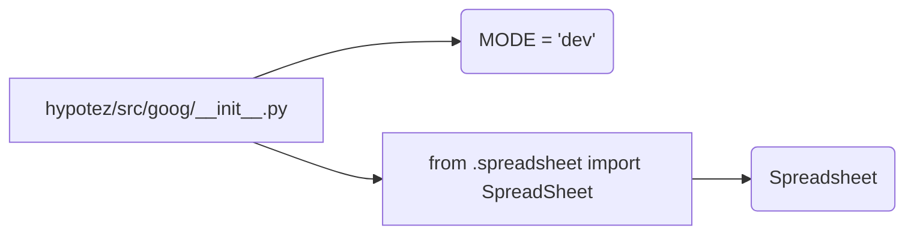

# <input code>

```python
## \file hypotez/src/goog/__init__.py
# -*- coding: utf-8 -*-
#! venv/Scripts/python.exe
#! venv/bin/python/python3.12

"""
.. module: src.goog 
	:platform: Windows, Unix
	:synopsis:

"""
MODE = 'dev'

from .spreadsheet import SpreadSheet
```

# <algorithm>

Этот код представляет собой инициализацию модуля `goog` в пакете `hypotez/src`.

Алгоритм работы довольно прост:

1. **Инициализация:** Модуль `goog` устанавливает глобальную переменную `MODE` со значением 'dev'. Это, скорее всего, режим работы (например, 'dev' для разработки, 'prod' для производства).
2. **Импорт:**  Модуль импортирует класс `Spreadsheet` из подмодуля `spreadsheet` внутри `goog`.

**Пример:**

Если в другом месте кода потребуется использовать класс `Spreadsheet`, импорт из этого `__init__.py`  разрешит его использование.


# <mermaid>



**Объяснение диаграммы:**

Модуль `goog` (A) инициализирует переменную `MODE` (B) и импортирует класс `Spreadsheet` (D) из подмодуля `spreadsheet` (C).

# <explanation>

* **Импорты:**
    `from .spreadsheet import SpreadSheet`: Этот импорт позволяет использовать класс `Spreadsheet`, определенный в файле `spreadsheet.py` внутри пакета `hypotez/src/goog`. Символ `.` указывает на то, что импортируемый модуль находится в той же папке или в подпапке. Это стандартная практика для организации Python-кода.

* **Классы:**
    `Spreadsheet`:  Этот класс, определенный в `spreadsheet.py`,  вероятно, представляет собой объект для работы с электронными таблицами Google Sheets или подобными сервисами.  Он не определён в данном файле, но нам известно, что он существует.  Настоящее поведение и структура этого класса пока не определены.

* **Функции:**
    В данном `__init__.py` нет функций.  Функции, если они есть, будут определены в файлах, импортированных в данном модуле.

* **Переменные:**
    `MODE = 'dev'`: Глобальная переменная, вероятно, хранит конфигурационное значение для режима работы. Используется для различных сценариев в проекте, например, для активации опций разработки.

* **Возможные ошибки или области для улучшений:**

    * **Дополнения в коде:** Этот файл является точкой входа для модуля `goog`. Но для полноценной работы он должен быть дополнен другими определениями, например, функциями, которые взаимодействуют с классом `Spreadsheet`.
    * **Документация:**  Комментарии  `""" ... """`  предназначены для документации, но могли бы быть более полными.
    * **Стандартизация:** Необходимо придерживаться Python Style Guide (PEP 8) для улучшения читабельности и соответствия лучшим практикам.


* **Цепочка взаимосвязей:**

    Данный `__init__.py` служит связующим звеном для взаимодействия с другими частями проекта, которые используют класс `Spreadsheet`.  Другие модули, вероятно, импортируют этот класс из данного файла для работы с Google Sheets.

**В заключение:**

Код представляет собой простой модуль инициализации, который готовит необходимый класс для дальнейшей работы с Google Sheets.  Для более глубокого анализа необходимо посмотреть на файл `spreadsheet.py`.