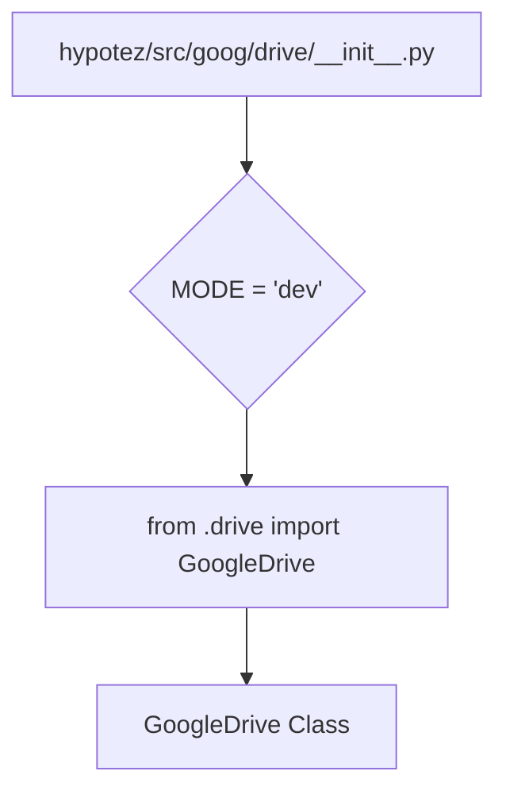

```MD
# Анализ кода hypotez/src/goog/drive/__init__.py

1. **<input code>**

```python
## \file hypotez/src/goog/drive/__init__.py
# -*- coding: utf-8 -*-\
#! venv/Scripts/python.exe
#! venv/bin/python/python3.12

"""
.. module: src.goog.drive 
	:platform: Windows, Unix
	:synopsis:

"""
MODE = 'dev'


from .drive import GoogleDrive
```

2. **<algorithm>**

Код представляет собой инициализацию модуля `goog.drive`. Алгоритм работы крайне прост:

*   **Шаг 1:** Определяется константа `MODE` со значением 'dev'. Эта константа, скорее всего, используется для настройки режима работы (например, "development" или "production").
*   **Шаг 2:** Импортируется класс `GoogleDrive` из модуля `drive`.

В данном случае, алгоритм - это последовательное выполнение простых действий: инициализация переменной и импорт класса.


3. **<mermaid>**



**Объяснение диаграммы:**

Модуль `hypotez/src/goog/drive/__init__.py` (A) инициализирует константу `MODE` (B) и импортирует класс `GoogleDrive` (C) из подмодуля `drive` (C). Класс `GoogleDrive` (D) определяется в файле `.drive`.


4. **<explanation>**

* **Импорты:**
    * `from .drive import GoogleDrive`:  Этот импорт подключает класс `GoogleDrive` из модуля `drive`, который, скорее всего, находится в той же директории (`hypotez/src/goog/drive/drive.py`).  Символ `.drive` указывает на то, что `drive.py` находится в текущем пакете (подпапке).  Это стандартный способ импорта внутри пакета Python.

* **Классы:**
    * `GoogleDrive`:  Этот класс определен в файле `hypotez/src/goog/drive/drive.py`. В данном файле `__init__.py`  он просто импортируется, без создания экземпляра.  Точное поведение и функциональность класса `GoogleDrive` нам неизвестны без просмотра самого файла `drive.py`.

* **Функции:**
    * Нет определенных функций в данном файле.

* **Переменные:**
    * `MODE`:  Строковая переменная, которая, вероятно, определяет режим работы (например, "dev", "prod").  В данном контексте значение `'dev'`  полагает, что данный код предназначен для разработки.


* **Возможные ошибки или области для улучшений:**

    *  Отсутствует описание класса `GoogleDrive`. Необходимо просмотреть файл `hypotez/src/goog/drive/drive.py` для понимания его поведения.
    * Отсутствие информации о использовании переменной `MODE`. Если данная переменная используется в коде, необходимо посмотреть как она используется в других местах проекта.
    * Отсутствие тестов.  Не ясно,  есть ли тесты для класса `GoogleDrive` и как он взаимодействует с другими частями проекта.


* **Взаимосвязь с другими частями проекта:**

    * `GoogleDrive` скорее всего взаимодействует с Google Drive API.
    * Вероятно, существуют другие модули, которые импортируют и используют `GoogleDrive` для работы с Google Drive.  Необходимо проанализировать остальные файлы в проекте (`hypotez`) для получения полной картины.  Без доступа к остальному коду, трудно определить все связи.


**Вывод:**

Файл `hypotez/src/goog/drive/__init__.py` — это инициализационный модуль, который импортирует класс `GoogleDrive` для дальнейшего использования.  Для глубокого анализа необходим код `hypotez/src/goog/drive/drive.py`.