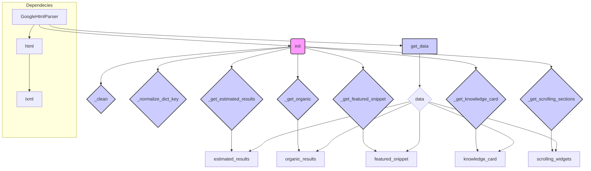

# <input code>

```python
## \file hypotez/src/goog/google_search.py
# -*- coding: utf-8 -*-\
#! venv/Scripts/python.exe
#! venv/bin/python/python3.12

"""
.. module: src.goog 
	:platform: Windows, Unix
	:synopsis:

"""
MODE = 'dev'


from lxml import html


class GoogleHtmlParser:
    """Класс для парсинга HTML с Google Search.

    Парсит HTML страницы поисковой выдачи Google и преобразует её в словарь.
    Работает как с мобильной, так и с десктопной версией HTML.

    Атрибуты:
        tree (html.Element): Дерево документа, полученное через html.fromstring().
        user_agent (str): User agent, использованный для получения HTML Google Search.
    """

    def __init__(self, html_str: str, user_agent: str = 'desktop') -> None:
        """Инициализация парсера.

        Создает дерево документа из строки HTML.

        Args:
            html_str (str): HTML Google Search в виде строки.
            user_agent (str): User agent для получения HTML. Может быть 'mobile' или 'desktop'.

        Returns:
            None
        """
        self.tree = html.fromstring(html_str)
        if user_agent in ['mobile', 'desktop']:
            self.user_agent = user_agent
        else:
            self.user_agent = 'desktop'

    # ... (остальной код)
```

# <algorithm>

**Пошаговая блок-схема:**

1. **Инициализация (`__init__`)**:
   - Принимает HTML-строку (`html_str`) и необязательный параметр `user_agent`.
   - Создает дерево документа `self.tree` с помощью `html.fromstring(html_str)`.
   - Устанавливает `self.user_agent` на основе переданного значения, по умолчанию 'desktop'.
   - **Пример:** `parser = GoogleHtmlParser('<html><body>...</body></html>', 'mobile')`

2. **Очистка строки (`_clean`)**:
   - Принимает строку `content`.
   - Удаляет лишние пробелы и символы.
   - **Пример:** `_clean("  Hello World  ")` возвращает `"Hello World"`.

3. **Нормализация ключа словаря (`_normalize_dict_key`)**:
   - Принимает строку `content`.
   - Заменяет пробелы на подчеркивания, убирает двоеточия, переводит в нижний регистр.
   - **Пример:** `_normalize_dict_key("Name :   Value")` возвращает `"name_value"`.

4. **Получение количества результатов (`_get_estimated_results`)**:
   - Ищет элемент с количеством результатов.
   - Возвращает целое число, если найден.
   - **Пример:** возвращает число из `//*[@id="result-stats"]/text()`

5. **Получение органических результатов (`_get_organic`)**:
   - Итерируется по элементам `div[@class="g"]`.
   - Извлекает URL, заголовок, snippet и rich snippet из каждого элемента.
   - Добавляет результаты в список `organic`.
   - **Пример:** формирует словарь с результатами, например, `{'url': 'url1', 'title': 'title1', 'snippet': 'snippet1'}`.

6. **Получение featured snippet (`_get_featured_snippet`)**:
   - Ищет элемент `div[contains(@class, "kp-blk")]`
   - Извлекает заголовок и URL, если найдены.
   - Возвращает словарь с результатом.
   - **Пример:** возвращает `{'title': 'title', 'url': 'url'}` или `None`.


7. **Получение карточки знаний (`_get_knowledge_card`)**:
   - Ищет элемент `div[contains(@class, "kp-wholepage")]`
   - Извлекает заголовок, подзаголовок, описание и дополнительные данные.
   - Возвращает словарь с результатом.


8. **Получение скроллируемых секторов (`_get_scrolling_sections`)**:
    - Ищет элементы `g-section-with-header`
    - Для каждого секции извлекает заголовок и данные из `g-inner-card`
    - Создаёт вложенные словари
    - Возвращает список с результатами.


9. **Получение итоговых данных (`get_data`)**:
   - Вызывает вспомогательные методы для получения всех необходимых данных.
   - Формирует итоговый словарь `data` на основе user agent.
   - Возвращает итоговый словарь.

# <mermaid>




# <explanation>

**Импорты**:

- `from lxml import html`: Импортирует модуль `html` из библиотеки `lxml`.  `lxml` — это мощная библиотека для работы с XML и HTML, которая предоставляет инструменты для парсинга, обработки и манипуляции данными. Она используется здесь для парсинга HTML-страниц, полученных с Google Search.  Связь с пакетом `src` напрямую не видна, но предполагается, что этот import используется в рамках проекта `hypotez`.

**Классы**:

- `GoogleHtmlParser`:  Этот класс предназначен для парсинга HTML кода с Google Search. Он хранит в себе дерево HTML-документа (`tree`) и User-Agent (`user_agent`), используемый для получения HTML. Методы класса обрабатывают различный тип данных, извлекая из HTML-кода нужную информацию и возвращая её в виде словарей.  Взаимодействие с другими частями проекта осуществляется через методы этого класса, которые извлекают данные и возвращают их в виде словарей.


**Функции**:

- `__init__`: Инициализирует объект `GoogleHtmlParser`, принимая HTML-строку и User-Agent.
- `_clean`: Очищает строку от лишних пробелов.
- `_normalize_dict_key`: Нормализует строку для использования в качестве ключа словаря.
- `_get_estimated_results`: Возвращает количество результатов поиска.
- `_get_organic`: Возвращает список органических результатов поиска.
- `_get_featured_snippet`: Возвращает данные о featured snippet.
- `_get_knowledge_card`: Возвращает данные о карточке знаний.
- `_get_scrolling_sections`: Возвращает данные из скроллируемых виджетов.
- `get_data`:  Собирает данные из разных источников, описанных выше, и возвращает словарь с собранными данными.


**Переменные**:

- `MODE`:  Глобальная константа, хранящая режим работы программы.
- `user_agent`: Свойство класса, определяющее тип User-Agent для запроса.
- `tree`: Свойство класса, содержащее дерево HTML.
- `estimated_results`: Переменная, содержащая количество результатов поиска.
- `organic`: Список словарей с органическими результатами.
- `fs`: Переменная для хранения данных featured snippet.
- `kc_el`: Переменная, хранящая данные о карточках знаний.
- `sections`: Список скроллируемых секторов
- `data`: Итоговый словарь с данными.


**Возможные ошибки или улучшения**:

- Обработка ошибок:  Код не содержит явного контроля ошибок. Например, если `xpath` не находит ожидаемого элемента, может возникнуть `IndexError`.  Добавление проверок на `len(estimated_el) > 0` в `_get_estimated_results` - важный шаг для защиты от ошибок.
- Избыточные проверки `if` в `_get_organic`: Вложенные `if len(snippets) == 1` и `elif len(snippets) > 1:` могут быть заменены на более удобочитаемый способ, например, с использованием `if` и `elif`, если `len(snippets)` - это количество элементов для snippet.
- Более гибкий `user_agent`: Возможно, целесообразно использовать более расширенный способ задания `user_agent`, например, через конфигурационный файл или отдельный класс, для хранения и управления различными user-agents.
- Валидация данных:  Полезно добавить валидацию возвращаемых данных. Например, проверить, что `url`  и `title` содержат корректные значения.

**Взаимосвязь с другими частями проекта**:

Код использует `lxml`, предполагается, что это библиотека, доступная в проекте.  Предположительно, этот класс используется в других частях проекта `hypotez` для получения данных с поисковой страницы Google, которые затем обрабатываются и используются в дальнейших вычислениях или отображении.  Более точная информация о взаимосвязи с другими частями проекта зависит от контекста всего проекта `hypotez`.