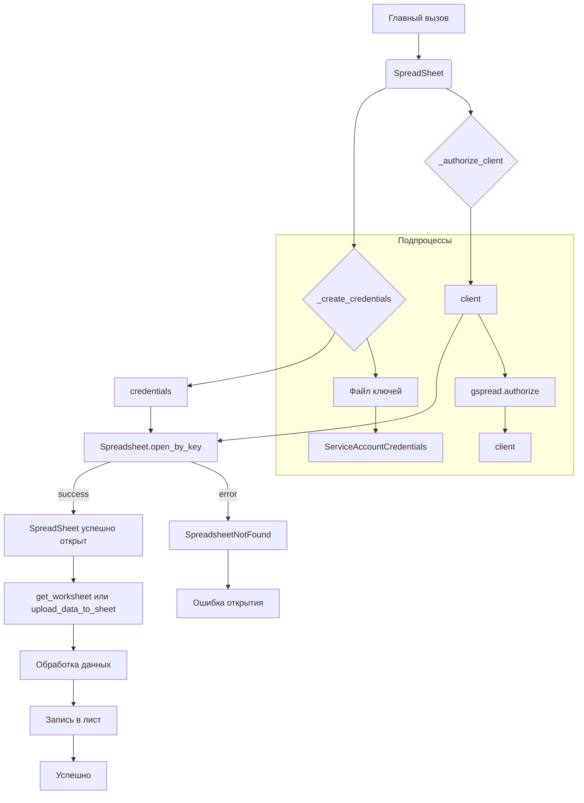

```MD
# <input code>

```python
## \file hypotez/src/goog/spreadsheet/spreadsheet.py
# -*- coding: utf-8 -*-\
#! venv/Scripts/python.exe
#! venv/bin/python/python3.12

"""
.. module: src.goog.spreadsheet 
	:platform: Windows, Unix
	:synopsis: Minimal library for working with Google Sheets.

```python
# Example usage of the class
if __name__ == "__main__":
    from pathlib import Path

    data_file = Path(\'/mnt/data/google_extracted/your_data_file.csv\')  # Replace with actual data file
    sheet_name = \'Sheet1\'  # Replace with actual sheet name in Google Sheets

    # Create a new Spreadsheet if spreadsheet_id is not specified
    google_sheet_handler = SpreadSheet(
        spreadsheet_id=None,  # Specify None to create a new Spreadsheet
        sheet_name=sheet_name,
        spreadsheet_name=\'My New Spreadsheet\'  # Name of the new Spreadsheet if spreadsheet_id is not specified
    )
    google_sheet_handler.upload_data_to_sheet()
```
"""
MODE = 'dev'


from pathlib import Path
import gspread
from gspread import Spreadsheet, Worksheet
from oauth2client.service_account import ServiceAccountCredentials
import pandas as pd
from src.logger import logger
from src import gs
from src.utils import pprint


class SpreadSheet:
    """ Class for working with Google Sheets.

    This class provides basic methods for accessing the Google Sheets API, creating and managing spreadsheets,
    and uploading data from a CSV file to Google Sheets.
    """

    # Path to the credentials file for accessing Google Sheets.
    #creds_file = gs.path.root / 'secrets' / 'hypo69-c32c8736ca62.json'

    """ оригинал файла хранится в базе данных вместе с паролями
    @todo организовать копирование файла в прогамно созаданом `tmp`,чтобы не хранить файл в физической директории
    """


    spreadsheet_id: str | None
    spreadsheet_name: str | None
    spreadsheet: Spreadsheet
    data_file: Path
    sheet_name: str
    credentials: ServiceAccountCredentials
    client: gspread.Client
    worksheet: Worksheet
    create_sheet: bool

    def __init__(self,
                 spreadsheet_id: str, *args, **kwards):  # Name of the sheet in Google Sheets
        """ Initialize GoogleSheetHandler with specified credentials and data file.

        @param spreadsheet_id ID of the Google Sheets spreadsheet. Specify None to create a new Spreadsheet.
        @param spreadsheet_name Name of the new Spreadsheet if spreadsheet_id is not specified.
        @param sheet_name Name of the sheet in Google Sheets.
        """
        self.spreadsheet_id = spreadsheet_id
        self.credentials = self._create_credentials()
        self.client = self._authorize_client()

        try:
            self.spreadsheet = self.client.open_by_key(self.spreadsheet_id)
            #logger.debug(f"Opened existing spreadsheet with ID: {self.spreadsheet_id}")
        except gspread.exceptions.SpreadsheetNotFound:
            logger.error(f"Spreadsheet with ID '{self.spreadsheet_id}' does not exist.")
            raise


    def _create_credentials(self):
        """ Create credentials from a JSON file.

        Creates credentials for accessing the Google Sheets API based on the key file.
        @return Credentials for accessing Google Sheets.
        """
        try:
            creds_file: Path = gs.path.secrets / 'e-cat-346312-137284f4419e.json' # <-  e.cat.co.il@gmail.com
            SCOPES: list = ['https://www.googleapis.com/auth/spreadsheets', 'https://www.googleapis.com/auth/drive']
            credentials = ServiceAccountCredentials.from_json_keyfile_name(
                creds_file, SCOPES
            )
            #logger.debug("Credentials created successfully.")
            return credentials
        except Exception as ex:
            logger.error("Error creating credentials.", ex, exc_info=True)
            raise


    def _authorize_client(self):
        """ Authorize client to access the Google Sheets API.

        Creates and authorizes a client for the Google Sheets API based on the provided credentials.
        @return Authorized client for working with Google Sheets.
        """
        try:
            client = gspread.authorize(self.credentials)
            #logger.debug("Client authorized successfully.")
            return client
        except Exception as ex:
            logger.error("Error authorizing client.", ex, exc_info=True)
            raise


    # ... (rest of the code)
```

# <algorithm>

**Алгоритм работы класса SpreadSheet:**

1. **Инициализация (\_\_init\_\_):**
    * Принимает ID файла Google Таблицы и другие параметры.
    * Создает объект `ServiceAccountCredentials` с помощью `_create_credentials`.  
    * Авторизует клиента `gspread.Client`  с помощью `_authorize_client`.
    * Пытается открыть существующую таблицу по `spreadsheet_id`. Если таблицы нет, генерирует исключение `SpreadsheetNotFound`
    * В противном случае, `self.spreadsheet`  хранит открытую таблицу.


2. **Получение листа (get_worksheet):**
    * Пытается получить лист по имени.
    * Если лист не найден, вызывает `create_worksheet` для создания нового листа.
    * Возвращает объект Worksheet.


3. **Создание листа (create_worksheet):**
    * Создает новый лист в открытой таблице с заданным именем и размерами.


4. **Загрузка данных в лист (upload_data_to_sheet):**
    * Читает данные из CSV-файла с помощью pandas.
    * Подготавливает данные для загрузки в Google Таблицы.
    * Записывает данные в лист Google Таблиц, используя метод `update`.


**Примеры данных:**

* **Входные данные:** CSV-файл с данными.
* **Выходные данные:** Google Таблица с загруженными данными.

**Перемещение данных:**

Данные из CSV-файла считываются в pandas DataFrame, преобразуются в список списков, и затем записываются в лист Google Таблиц.

# <mermaid>



# <explanation>

**Импорты:**

* `from pathlib import Path`: Используется для работы с путями к файлам.
* `import gspread`: Библиотека для работы с Google Sheets API.
* `from gspread import Spreadsheet, Worksheet`:  Классы для работы с Google Таблицами.
* `from oauth2client.service_account import ServiceAccountCredentials`:  Для аутентификации с помощью сервисных аккаунтов Google.
* `import pandas as pd`: Библиотека для работы с данными в формате DataFrame.
* `from src.logger import logger`:  Модуль для логирования.
* `from src import gs`:  Вероятно, модуль, содержащий пути к файлам.
* `from src.utils import pprint`: Модуль для красивой печати.

**Классы:**

* `SpreadSheet`: Класс для работы с Google Таблицами.
    * `spreadsheet_id`, `spreadsheet_name`, `spreadsheet`, `data_file`, `sheet_name` - Атрибуты для хранения параметров таблицы и данных.
    * `credentials`, `client`, `worksheet` - Атрибуты для аутентификации и доступа к Google Sheets.
    * `__init__`: Конструктор, инициализирующий атрибуты класса.
    * `_create_credentials`: Создает `ServiceAccountCredentials` на основе файла ключей.
    * `_authorize_client`: Авторизует клиента Google Sheets.
    * `get_worksheet`: Возвращает объект `Worksheet` по имени листа. Если листа нет, то создает его.
    * `create_worksheet`: Создает новый лист.
    * `upload_data_to_sheet`: Загружает данные из CSV-файла в Google Таблицу.


**Функции:**

* `_create_credentials`: Возвращает объект `ServiceAccountCredentials`, необходимый для работы с Google Sheets API.  Использует файл `e-cat-346312-137284f4419e.json` в качестве источника ключей.

* `_authorize_client`: Авторизует клиента Google Sheets и возвращает аутентифицированный экземпляр `gspread.Client`.

* `get_worksheet`: Получает объект Worksheet, связанный с конкретным листом.  Обрабатывает ситуацию, когда лист не существует.

* `create_worksheet`: Создает новый лист с указанным именем.

* `upload_data_to_sheet`: Загружает данные из файла CSV в Google Таблицу.  Использует `pandas` для чтения данных.


**Переменные:**

* `MODE`: Вероятно, переменная, определяющая режим работы приложения.
* `data_file`: Путь к CSV-файлу.
* `sheet_name`: Имя листа в Google Таблице.

**Возможные ошибки и улучшения:**

* Обработка ошибок:  Код содержит `try...except` блоки, но для более robustной программы необходимо добавить более подробные проверки и обработку различных исключений (например, `FileNotFoundError`, `IOError`).

* Управление данными: Лучше использовать pandas для обработки и преобразования данных, что обеспечит более гибкое и эффективное решение.

* Управление ресурсами: При закрытии приложения важно освободить ресурсы (например, закрыть подключение к Google Sheets).

* Доступ к файлам:  В примере используется абсолютный путь к CSV-файлу.  Для улучшения рекомендуется использовать относительный путь или передавать путь в качестве аргумента в функцию.

* Логирование:  Использование логирования хорошо, но можно указать более подробные сообщения и уровни логирования.


**Взаимосвязь с другими частями проекта:**

Модуль `spreadsheet.py` зависит от `logger` (для логирования), `gs` (для работы с путями к конфигурационным файлам), и `utils` (для обработки данных).  Связи с другими частями проекта могут быть представлены в виде диаграмм классов или архитектурных диаграмм.