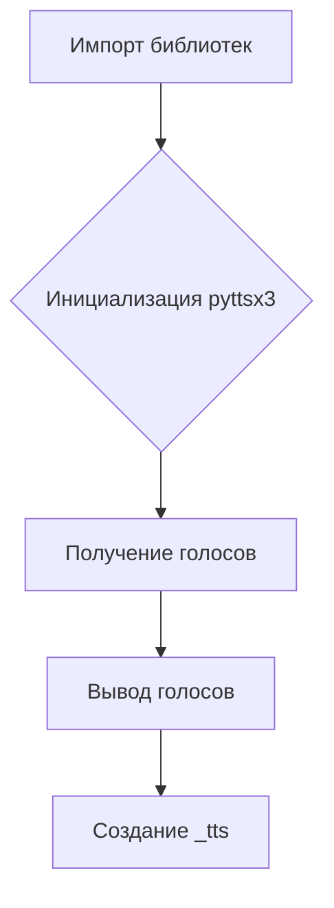

1. **<input code>**

```python
## \file hypotez/src/goog/text_to_speech/__init__.py
# -*- coding: utf-8 -*-\
#! venv/Scripts/python.exe
#! venv/bin/python/python3.12

"""
.. module: src.goog.text_to_speech 
	:platform: Windows, Unix
	:synopsis: Google TTS 

"""
MODE = 'dev'

import header   

from attr import attr, attrs

import pyttsx3

from gtts import gTTS


class TTS():
    """ Google text to speach """
    def __init__(self,*args,**kwards):
        tts = pyttsx3.init()
        voices = tts.getProperty('voices')
        for v in voices:
            print(v)
    ...
_tts = TTS()
```

2. **<algorithm>**

Этот код импортирует необходимые библиотеки и определяет класс `TTS` для работы с Google Text-to-Speech.  Однако, реализация класса `TTS` неполная, в нём отсутствует основная логика преобразования текста в речь.  

Алгоритм работы существующей части кода:

1. **Импорт библиотек:** Импортируются `header`, `attr`, `pyttsx3`, `gTTS`.
2. **Определение константы:** Определяется константа `MODE` со значением `'dev'`.
3. **Создание экземпляра класса `TTS`:** Создаётся экземпляр класса `TTS` и сохраняется в переменной `_tts`.
4. **Инициализация `pyttsx3`:** Внутри конструктора `__init__`  инициализируется движок `pyttsx3`.
5. **Получение голосов:** Получаются доступные голоса у `pyttsx3`.
6. **Вывод голосов:** Выводятся характеристики доступных голосов.

**Пример данных:**

Входные данные: нет.
Выходные данные:  выводятся характеристики голосов.



3. **<mermaid>**

```mermaid
graph LR
    subgraph Импорт
        header --> Импорт;
        attr --> Импорт;
        pyttsx3 --> Импорт;
        gTTS --> Импорт;
    end
    subgraph Класс TTS
        TTS --> __init__;
        __init__ --> pyttsx3.init;
        __init__ --> voices = tts.getProperty('voices');
        voices --> for v in voices;
        for v in voices --> print(v);
    end
    subgraph Общее
        MODE --> Общее;
        _tts --> Общее;
    end

    Импорт --> TTS;
    Общее --> TTS;
```

**Описание зависимостей:**

* `header`:  Предполагается, что это локальный модуль, некий заголовочный файл,  связанный с проектом `hypotez`.
* `attr`:  Библиотека для аннотаций,  используемая для описания атрибутов и методов в классах, likely part of the Python ecosystem, and may not be project-specific.
* `pyttsx3`: Библиотека для синтеза речи на Python.
* `gTTS`: Библиотека для синтеза речи, использующая Google Text-to-Speech API.

4. **<explanation>**

* **Импорты:**
    * `header`:  Вероятно, содержит конфигурацию или другие вспомогательные функции для проекта.
    * `attr`: Используется для улучшения читаемости и понятности кода, но в данном примере, не играет значительной роли.
    * `pyttsx3`:  Библиотека для синтеза речи.  Необходима для создания звуковых выходов, но пока не используется для самой конвертации текста.
    * `gTTS`:  Библиотека, скорее всего, для взаимодействия с Google TTS API.

* **Классы:**
    * `TTS`:  Предназначен для работы с Text-to-Speech, но не содержит функциональности преобразования текста в речь.  Сейчас он просто выводит список доступных голосов.  `...` в коде указывает на необходимость доработки.

* **Функции:**
    * `__init__(self, *args, **kwards)`: Конструктор класса `TTS`. Инициализирует движок `pyttsx3` и выводит доступные голоса.

* **Переменные:**
    * `MODE`: Строковая переменная, используемая для выбора режима работы (в данном случае `'dev'`).
    * `_tts`: Экземпляр класса `TTS`.

* **Возможные ошибки и улучшения:**
    * **Неполная реализация:** Класс `TTS` не содержит логики конвертации текста в речь, и лишь показывает доступные голоса.  Нужно добавить метод `speak(text)` или подобный для преобразования текста в звук.
    * **Отсутствие обработки ошибок:** Код не содержит проверок на ошибки, например, при инициализации `pyttsx3`.
    * **Зависимости от окружения:** Использование `#! venv/Scripts/python.exe` и других подобных директив говорит о том, что скрипт должен выполняться с конкретной средой (virtualenv).

**Цепочка взаимосвязей:**

Код `hypotez/src/goog/text_to_speech/__init__.py`  зависит от библиотек `pyttsx3` и `gTTS`, которые, в свою очередь, зависят от зависимостей Python.  Функциональность `header`  неясна без доступа к его содержанию, но скорее всего он также связан с настройками и логикой проекта `hypotez`.