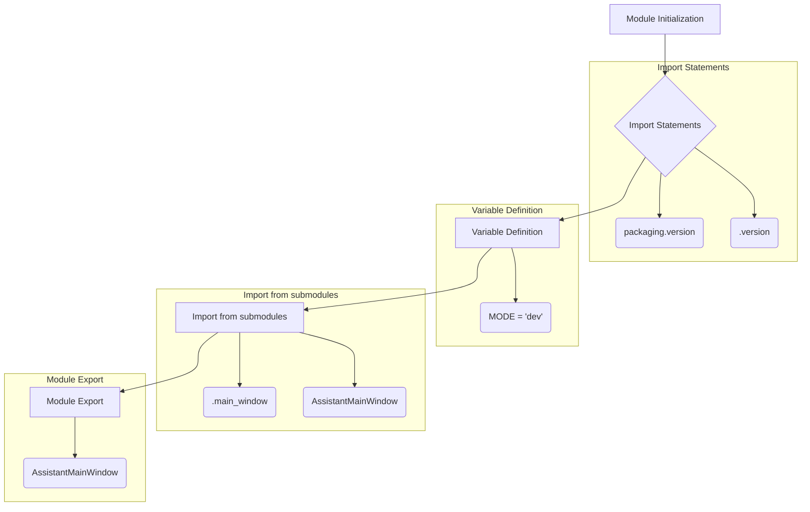

# <input code>

```python
## \file hypotez/src/gui/openai_trаigner/__init__.py
# -*- coding: utf-8 -*-
#! venv/Scripts/python.exe
#! venv/bin/python/python3.12

"""
.. module: src.gui.openai_trаigner 
	:platform: Windows, Unix
	:synopsis:

"""
MODE = 'dev'

"""
	:platform: Windows, Unix
	:synopsis:

"""


"""
	:platform: Windows, Unix
	:synopsis:

"""


"""
  :platform: Windows, Unix

"""
"""
  :platform: Windows, Unix
  :platform: Windows, Unix
  :synopsis:
"""MODE = 'dev'
  
""" module: src.gui.openai_trаigner """


""" @namespace src.fast_api """


""" """
...

from packaging.version import Version
from .version import __version__, __doc__, __details__   

from .main_window import AssistantMainWindow
```

# <algorithm>



**Пример:** При запуске скрипта, переменная `MODE` принимает значение 'dev'.  Импорты `packaging.version` и `__version__`, `__doc__`, `__details__`  из подмодуля `.version` используются для управления версией и документацией, а `AssistantMainWindow` из `main_window`  является классом, представляющим главное окно приложения.


# <mermaid>

```mermaid
graph LR
    subgraph Package: hypotez.src.gui.openai_trаigner
        A[__init__.py] --> B(.main_window);
        A --> C(.version);
        B --> D[AssistantMainWindow];
        C --> E[__version__];
        C --> F[__doc__];
        C --> G[__details__];
    end
    
    classDef package fill:#ccf,stroke:#333,stroke-width:2px
    class AssistantMainWindow, __version__, __doc__, __details__ package
```

**Описание:** Диаграмма показывает иерархию модулей. Модуль `__init__.py` в пакете `hypotez.src.gui.openai_trаigner` импортирует необходимые классы и переменные из подмодулей `.main_window` и `.version`.  `AssistantMainWindow` -  это ключевой класс, отвечающий за работу главного окна приложения.

# <explanation>

**Импорты:**

- `from packaging.version import Version`: Импортирует класс `Version` из библиотеки `packaging`.  Эта библиотека используется для работы с версиями пакетов.  Связь с `src` - косвенная; эта библиотека устанавливается отдельно и используется многими Python-проектами.
- `from .version import __version__, __doc__, __details__`: Импортирует переменные `__version__`, `__doc__`, `__details__` из модуля `.version` текущей директории.  Связь с `src` – внутри пакета. Это информация о версии, документации и деталях модуля `openai_trаigner`.
- `from .main_window import AssistantMainWindow`: Импортирует класс `AssistantMainWindow` из модуля `main_window`.  Связь с `src` – внутри пакета.  Это ключевой класс, вероятно,  определяющий пользовательский интерфейс (GUI) приложения.

**Переменные:**

- `MODE = 'dev'`: Переменная, вероятно, задающая режим работы (например, "разработка" или "производство").  Значение  `dev` указывает на режим разработки.

**Классы:**

- `AssistantMainWindow`:  Этот класс, импортированный из `main_window`, скорее всего,  представляет главное окно графического интерфейса пользователя (GUI) приложения. Его подробное описание и использование  должны быть в файле `hypotez/src/gui/openai_trаigner/main_window.py`.

**Функции:**

Код `__init__.py` не содержит функций.  Функции, если они есть, должны быть определены в файлах `main_window.py` или других модулях пакета.

**Возможные ошибки или улучшения:**

- **Недостающая документация:** Недостаточно комментариев внутри кода, особенно для переменных и импортов.
- **Недостающие зависимости:**  Для использования `packaging.version` требуется установить соответствующий пакет.  Необходимость в установке дополнительных пакетов должна быть документирована.
- **Неясный контекст:** Необходимо больше контекста для полного понимания роли этого файла в общем проекте.  В частности, неизвестна структура пакета `hypotez` и роль `src`.

**Цепочка взаимосвязей:**

Файл `__init__.py` является точкой входа для пакета `openai_trаigner`.  Он импортирует необходимые компоненты из подмодулей и экспортирует ключевой класс `AssistantMainWindow`.  Дальнейшая работа приложения будет зависеть от запуска экземпляра `AssistantMainWindow` и взаимодействий между импортированными классами.  Для понимания полной функциональности приложения необходимо проанализировать `main_window.py`.