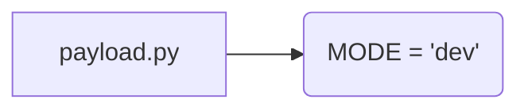

# <input code>

```python
## \file hypotez/src/gui/openai_trаigner/payload.py
# -*- coding: utf-8 -*-
#! venv/Scripts/python.exe
#! venv/bin/python/python3.12

"""
.. module: src.gui.openai_trаigner 
	:platform: Windows, Unix
	:synopsis:

"""
MODE = 'dev'

"""
	:platform: Windows, Unix
	:synopsis:

"""


"""
	:platform: Windows, Unix
	:synopsis:

"""


"""
  :platform: Windows, Unix

"""
"""
  :platform: Windows, Unix
  :platform: Windows, Unix
  :synopsis:
"""MODE = 'dev'
  
""" module: src.gui.openai_trаigner """


```

# <algorithm>

Этот код не содержит логики, а представляет собой лишь пустой файл Python с комментариями.  В нем определены константы `MODE`, но их значения и использование не описаны.  Поскольку нет функций и классов, блок-схема не требуется.


# <mermaid>



# <explanation>

Этот Python-файл, `payload.py`, находится в подпапке `openai_trаigner` папки `gui` внутри проекта `hypotez`.  Он пустой, но содержит много документационных строк (`"""Docstrings"""`). Это пример того, как можно структурировать код с документацией в стиле Sphinx.


* **Комментарии:** Файл содержит много комментариев, написанных в формате docstrings (тройные кавычки).  Они объясняют назначение модуля и отдельных констант.  Однако эти комментарии не используются никакими инструментами анализа, и, в общем, являются неэффективными.


* **Константы:**  Определена единственная константа `MODE` со значением `'dev'`.  Константы обычно используются для хранения неизменяемых значений, например, конфигурационных параметров, режимов работы программы.  Без контекста, трудно определить, как эта переменная используется в дальнейшем коде.


* **Импорты:** Нет импортов.


* **Классы и функции:**  Нет определений классов или функций.


* **Возможные улучшения:**

    * Удалить лишние комментарии, повторяющие информацию.
    * Уточнить назначение константы `MODE` и её роль в системе. Если она используется для определения режима (например, девелопмент, продакшен), то следует это явно указать.
    * Добавить соответствующий код, если переменная `MODE` используется в дальнейшем.


**Взаимосвязи с другими частями проекта:**

Без дополнительной информации о проекте трудно сказать, как файл `payload.py` связан с другими частями.  Вероятно, эта константа `MODE` используется в других частях проекта для выбора параметров запуска или конфигурации.


**Возможные ошибки:**

Нет явных ошибок в этом пустом файле, но присутствие множества пустых комментариев указывает на недостаточную структуризацию кода и потенциальные проблемы с пониманием и поддержанием проекта, если он станет больше.