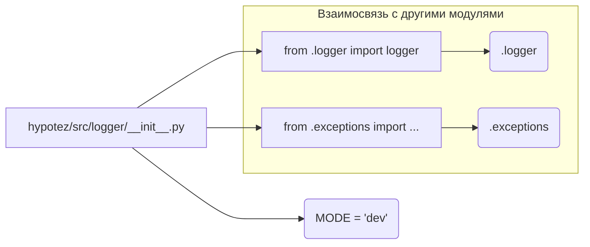

```MD
# Анализ файла hypotez/src/logger/__init__.py

## <input code>

```python
## \file hypotez/src/logger/__init__.py
# -*- coding: utf-8 -*-\
#! venv/Scripts/python.exe
#! venv/bin/python/python3.12

"""
.. module: src.logger 
	:platform: Windows, Unix
	:synopsis:

"""
MODE = 'dev'

from .logger import logger
#from .beeper import Beeper
from .exceptions import ( ExecuteLocatorException, 
                         DefaultSettingsException, 
                         CredentialsError, 
                         PrestaShopException, 
                         PayloadChecksumError
                        )
```

## <algorithm>

Файл `hypotez/src/logger/__init__.py` - это модуль инициализации для пакета `logger`.  Он содержит конфигурацию, импорты и необходимые импорты.  Алгоритм работы сводится к инициализации переменной `MODE` и импорту необходимых компонентов.  Логики работы в виде пошаговой блок-схемы в данном случае нет, так как это файл инициализации, не выполняющий каких-либо сложных вычислений.

## <mermaid>




## <explanation>

**Импорты:**

* `from .logger import logger`: Импортирует функцию (или класс) `logger` из подпапки `logger` текущего пакета (`src.logger`).  Это ключевой элемент для использования логирования внутри пакета.
* `from .exceptions import ...`: Импортирует все классы исключений из пакета `exceptions`, расположенного в той же директории. Этот импорт необходим для обработки потенциальных ошибок, возникающих при использовании функций и классов внутри пакета `logger` и других пакетов, использующих этот файл инициализации.

**Переменная:**

* `MODE = 'dev'`:  Очевидно, что эта переменная задаёт режим работы, вероятно, для последующей конфигурации логирования (например, включение/отключение debug-вывода). Это глобальная переменная, доступная во всём пакете, если не будут определены локальные переменные с тем же именем.


**Классы (неявные):**

Импортируются классы исключений (`ExecuteLocatorException`, `DefaultSettingsException`, и т.д.) из пакета `exceptions`,  они необходимы для обработки ошибок, которые могут возникнуть в модулях, относящихся к пакетам `logger` и др.

**Функции (неявные):**

Из файла `hypotez/src/logger/__init__.py`  не экспортируются никакие функции, только импортируются классы (`logger` и классы исключений).


**Возможности улучшения:**

* **Документация:**  Добавление более детальной документации к переменной `MODE`, особенно если она используется в других частях кода, может улучшить читаемость и понимание кода.
* **Типизация:**  В Python 3.x рекомендуется использовать аннотации типов для большей ясности и помощи IDE.
* **Доступ к переменной MODE:** В зависимости от использования, если переменная `MODE` должна быть доступна извне пакета, то её следует экспортировать с помощью `__all__`.

**Цепочка взаимосвязей:**

Этот файл инициализации служит связующим звеном между пакетом `logger` и другими частями проекта, например, модулями, использующими логирование.  Пакет `logger` скорее всего содержит функции и классы для записи логических сообщений, а исключения `exceptions` предназначены для обработки ошибок, возникающих при взаимодействии с другими компонентами.  Это логично, так как этот файл является частью структуры проекта, ориентированной на логирование.

**Выводы:**

Файл `hypotez/src/logger/__init__.py` служит для инициализации пакета `logger`. В нём импортируются необходимые компоненты (логирование и исключения). Примеры использования и детальные объяснения функций и классов в файле `__init__.py` отсутствуют.