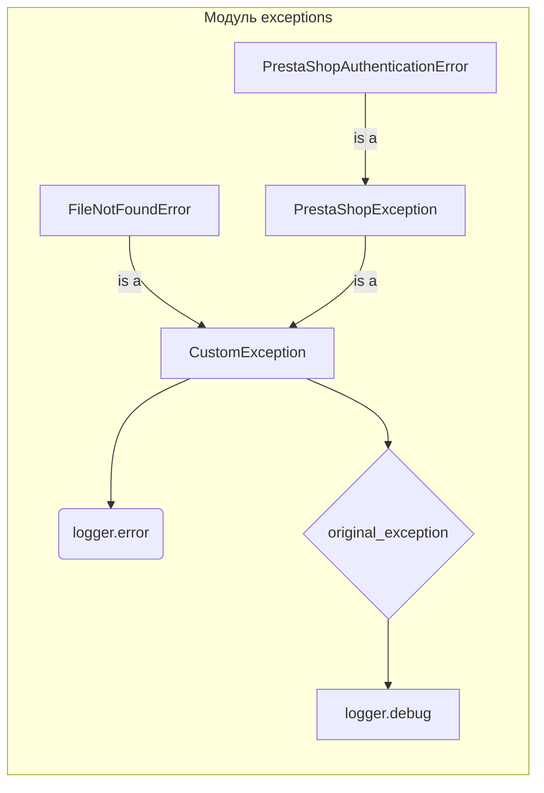
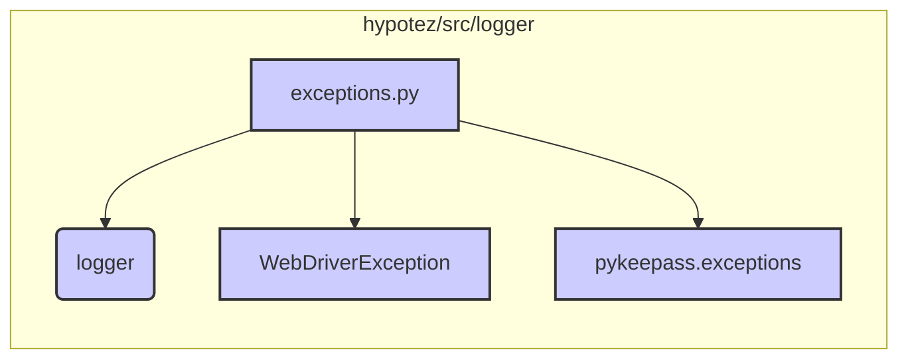

```MD
# <input code>

```python
## \file hypotez/src/logger/exceptions.py
# -*- coding: utf-8 -*-
#! venv/Scripts/python.exe
#! venv/bin/python/python3.12

"""
.. module: src.logger.exceptions
    :platform: Windows, Unix
    :synopsis: This module defines custom exceptions used in the application.

Program Exceptions
------------------

This module contains several custom exception classes to handle errors related to various application components, including file operations, product fields, KeePass database connections, and PrestaShop WebService errors.

Classes:
--------
- CustomException: The base custom exception class that handles logging.
- FileNotFoundError: Raised when a file is not found.
- ProductFieldException: Raised for errors related to product fields.
- KeePassException: Raised for errors related to KeePass database connections.
- DefaultSettingsException: Raised when there are issues with default settings.
- WebDriverException: Raised for errors related to WebDriver.
- ExecuteLocatorException: Raised for errors related to locator executors.
- PrestaShopException: Raised for generic PrestaShop WebService errors.
- PrestaShopAuthenticationError: Raised for authentication errors with PrestaShop WebServices.

"""

MODE = 'dev'

from typing import Optional
from src.logger import logger
from selenium.common.exceptions import WebDriverException as WDriverException
from pykeepass.exceptions import (CredentialsError, BinaryError,
                                   HeaderChecksumError, PayloadChecksumError,
                                   UnableToSendToRecycleBin)
```
```
# <algorithm>

**Пошаговый алгоритм работы модуля:**

1. **Импорты:**
   - Импортируются необходимые типы данных (`Optional` из `typing`).
   - Импортируется класс `logger` из `src.logger` - для логирования ошибок.
   - Импортируется класс `WebDriverException` из `selenium.common.exceptions`.
   - Импортируются исключения из `pykeepass.exceptions` -  для обработки ошибок, связанных с KeePass.


2. **Базовый класс CustomException:**
   - Принимает сообщение об ошибке (`message`) и, необязательно, исходную ошибку (`e`).
   - Логирует основное исключение с помощью `logger.error()`.
   - Если указана исходная ошибка, логирует её с помощью `logger.debug()`.
   - Вызывает `handle_exception()` для обработки исключения.


3. **Наследники CustomException:**
   - `FileNotFoundError`, `ProductFieldException`, `KeePassException`, `DefaultSettingsException`, `ExecuteLocatorException` - реализуют конкретные типы ошибок, связанные с разными частями приложения.


4. **Класс PrestaShopException:**
   - Хранит сообщение об ошибке (`msg`), код ошибки (`error_code`), детали ошибки от PrestaShop (`ps_error_msg`, `ps_error_code`).
   - Переопределяет метод `__str__()` для возврата текстового представления ошибки.


5. **Наследники PrestaShopException:**
   - `PrestaShopAuthenticationError` - реализует специализированное исключение для проблем с авторизацией в PrestaShop.


**Пример использования:**

```python
try:
    # ... код, который может вызвать исключение ...
    raise FileNotFoundError("Файл не найден", OSError("Файл повреждён"))
except FileNotFoundError as e:
    # Обработка ошибки
    print(f"Ошибка: {e}")
    # ... дальнейшая обработка ...
```

**Передача данных:**

Данные передаются между классами через аргументы конструкторов и атрибуты экземпляров классов.  Например, `CustomException` принимает `e` (исходную ошибку) в качестве аргумента и сохраняет её в атрибуте `original_exception`.



# <mermaid>



# <explanation>

**Импорты:**

- `from typing import Optional`: Импортирует тип `Optional` из модуля `typing`, который используется для указания, что значение может быть либо значением типа, либо `None`.  Это важно для обозначения параметров, которые могут быть не заданы.
- `from src.logger import logger`: Импортирует объект `logger` из модуля `logger` в подпакете `src.logger`. Предполагается, что этот модуль отвечает за логирование.  Это критически важная зависимость, показывающая связь с компонентом логирования в проекте.
- `from selenium.common.exceptions import WebDriverException as WDriverException`: Импортирует класс `WebDriverException` из библиотеки Selenium. Это говорит о том, что приложение использует Selenium для управления браузером, а импорт исключения сигнализирует о необходимости обработки ошибок, связанных с WebDriver.
- `from pykeepass.exceptions import ...`: Импортирует исключения из библиотеки `pykeepass`. Эти исключения используются для обработки ошибок, связанных с взаимодействием с базой данных KeePass. Это указывает на зависимость от `pykeepass` в проекте.

**Классы:**

- `CustomException`: Базовый класс для пользовательских исключений. Обрабатывает и логирует исходные исключения (`e`), что улучшает отладку. Атрибут `exc_info` позволяет управлять уровнем подробности логирования.  Метод `handle_exception` явно вызывается для обработки, что полезно для организации кода.
- `FileNotFoundError`, `ProductFieldException`, `KeePassException`, `DefaultSettingsException`, `WebDriverException`, `ExecuteLocatorException`, `PrestaShopException`, `PrestaShopAuthenticationError`: Классы конкретных исключений, используемые для обработки разных типов ошибок. `PrestaShopException` и `PrestaShopAuthenticationError` предлагают структурированный способ работы с ошибками PrestaShop.  Они хранят данные, которые могут помочь в диагностике проблем.


**Функции:**

- `__init__` во всех классах: Конструкторы, инициализирующие атрибуты и вызывающие `handle_exception` для базовых исключений.  В `PrestaShopException`  конструтор принимает несколько аргументов для хранений подробностей ошибки, что удобно для пользовательского анализа.
- `__str__` в `PrestaShopException`: Переопределенный метод `__str__`, возвращающий читаемое представление ошибки PrestaShop.

**Переменные:**

- `MODE`: Поле, вероятно, для управления режимами работы приложения (например, 'dev' или 'prod').

**Возможные ошибки и улучшения:**

- Не хватает обработки для исключений `except` внутри класса `CustomException` или наследников. Если внутреннее исключение не перехвачено, будет выброшено исключение `CustomException` не с полностью детализированной информацией.
- Отсутствие явных проверок типов данных в аргументах методов.
- Дополнительная информация об ошибке в атрибутах могла бы помочь при отладке. Например, в `PrestaShopException` дополнительная информация об ошибке была бы полезна.

**Взаимосвязи с другими частями проекта:**

Модуль `exceptions` тесно связан с модулем `logger` для логирования ошибок. Также присутствует зависимость от `pykeepass` и `selenium` для работы с соответствующими компонентами приложения.  Цепочка взаимосвязей в проекте: `src.app` -> `src.logger` -> `exceptions.py`  -> `selenium`, `pykeepass`.   Этот модуль является важным связующим звеном между разными частями приложения и  системой логирования.