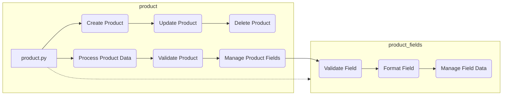

# Анализ модуля `product`

## <input code>

### **product Module**: Product Management

The **product** module is responsible for managing all aspects of product data, including processing, validation, and field management. It consists of the following components:

1. **product.py**  
   Manages the core logic for handling products, including operations such as creating, updating, and deleting product records. It provides functions to process product data and ensures compliance with business rules for managing products within the application.

2. **product_fields**  
   Controls the logic related to product fields, handling field validation, formatting, and management. This module ensures that product fields meet the necessary criteria for consistent data entry, enabling accurate and efficient processing of product information.
```

## <algorithm>

К сожалению, предоставленный код не содержит функционального кода. Это описание модуля, а не реализация.  Поэтому построить блок-схему и примеры работы невозможно.


## <mermaid>



## <explanation>

**Импорты**:  Нет импортов, так как это описание модуля, а не реализация кода.  
В реальном коде, для модуля `product` могли бы использоваться импорты из других частей приложения (например, `src.validation`, `src.database`, `src.utils`).

**Классы**: Описание предполагает наличие классов для управления продуктами и полями.  Примеры таких классов: `Product`, `ProductField`, `ProductValidator`, `ProductManager`.  В реальном коде они были бы определены в `product.py` и `product_fields.py`.


**Функции**: Описание указывает на функции для создания, обновления, удаления и обработки продуктов (например, `create_product`, `update_product`, `delete_product`, `process_product_data`). В реальном коде они были бы определены внутри классов или в отдельных файлах.

**Переменные**:  Переменные могут хранить данные о продуктах (идентификатор, название, описание, цена и т.д.) и данные полей.  В реальном коде они были бы определены внутри функций и методов, а также могли бы являться атрибутами объектов классов `Product` и `ProductField`.

**Возможные ошибки или области для улучшений**:

* Недостаточно информации для выявления конкретных ошибок. В реальном коде необходимы более точные спецификации для проверки правильности работы модуля.
* Не указано, как модуль `product` взаимодействует с другими частями проекта (например, с базой данных).


**Взаимосвязи с другими частями проекта**:  В реальном коде `product`  мог бы взаимодействовать с модулями обработки данных из базы данных, валидации данных, логики бизнеса (например, `src.database`, `src.validators`, `src.business_logic`).  Эти зависимости определяли бы точное местоположение импорта и взаимодействия между компонентами.