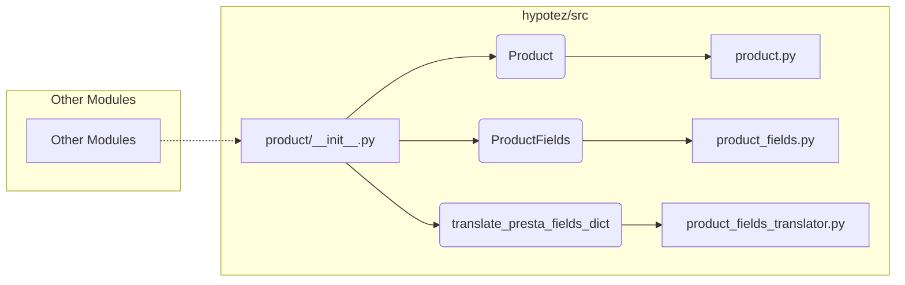

# <input code>

```python
## \file hypotez/src/product/__init__.py
# -*- coding: utf-8 -*-
#! venv/Scripts/python.exe
#! venv/bin/python/python3.12

"""
.. module: src.product 
	:platform: Windows, Unix
	:synopsis: Product module
External classes and attributes:
- `Product`: Methods and attributes of the product. Detailed description in `product.py`
- `ProductFields`: Product fields. Detailed description in `product_fields.py`
- `record`: A dictionary of product fields in flat format (without nesting)
- `translate_presta_fields_dict`: Function that translates multilingual fields of `ProductFields`

"""
MODE = 'dev'

from .product import Product
from .product_fields.product_fields import ProductFields
from .product_fields.product_fields_translator import translate_presta_fields_dict
```

# <algorithm>

В данном коде происходит импорт необходимых модулей из пакета `src.product`.  Алгоритм заключается в импорте и экспорте компонентов для работы с продуктами:

1. **Импорт**:  Модуль `product/__init__.py` импортирует классы `Product` и `ProductFields`, а также функцию `translate_presta_fields_dict` из соответствующих файлов.

2. **Экспорт**:  Переменная `MODE` и импортированные классы и функция доступны для использования в других частях проекта.


**Пример использования**:
```python
# в другом модуле
from hypotez.src.product import Product, ProductFields, translate_presta_fields_dict

# создание объекта Product
product = Product(...)

# использование функции translate_presta_fields_dict
translated_fields = translate_presta_fields_dict(...)
```


# <mermaid>



**Объяснение диаграммы**:

*   `product/__init__.py` является точкой входа для модуля `product`.
*   Он импортирует классы `Product` и `ProductFields`, а также функцию `translate_presta_fields_dict` из соответствующих файлов в том же пакете.
*   `product.py`, `product_fields.py` и `product_fields_translator.py` — это модули, содержащие определения классов и функций, которые импортируются.
*   Другие модули ( `H`) могут использовать классы и функции из `product/__init__.py`.

# <explanation>

**Импорты**:

*   `from .product import Product`: Импортирует класс `Product` из модуля `product.py` в текущем пакете (`src.product`).  `.` указывает на поиск в подпакетах текущего.
*   `from .product_fields.product_fields import ProductFields`: Импортирует класс `ProductFields` из модуля `product_fields.py` в подпакете `product_fields` внутри пакета `src.product`.
*   `from .product_fields.product_fields_translator import translate_presta_fields_dict`: Импортирует функцию `translate_presta_fields_dict` из файла `product_fields_translator.py` в подпакете `product_fields` внутри пакета `src.product`.

**Классы**:

*   `Product`: Определен в модуле `product.py`.  Его подробное описание должно быть в `product.py` (согласно документации).
*   `ProductFields`: Определен в модуле `product_fields.py`.  Представляет собой данные о полях продукта.

**Функции**:

*   `translate_presta_fields_dict`:  Переводящая функция для многоязычных полей `ProductFields`.  Подробное описание её работы должно находиться в `product_fields_translator.py`.

**Переменные**:

*   `MODE = 'dev'`:  Представляет режим работы (например, 'dev', 'prod'). Эта переменная скорее всего используется для настройки поведения в разных средах.


**Возможные ошибки и улучшения**:

*   Отсутствует документация внутри модуля.  Необходимо дополнить комментариями для лучшего понимания работы каждого класса, функции, переменной.
*   Не указан тип данных для `record`.  Добавьте описание (`dict`, например, `dict[str, Any]`) и обработку возможных ситуаций.
*   Не ясна роль `record`, особенно в контексте перевода, если она не используется в `translate_presta_fields_dict`.


**Взаимосвязи с другими частями проекта:**

Модуль `product` скорее всего взаимодействует с другими частями проекта, которые обращаются к данным продуктов (например, модули для отображения данных, обработки заказов, формирования отчётов).  Подробности взаимодействия можно проследить по импортированным функциям/классам из других файлов.