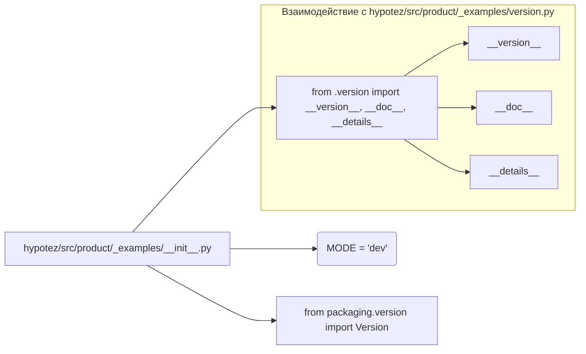

# <input code>

```python
## \file hypotez/src/product/_examples/__init__.py
# -*- coding: utf-8 -*-\
#! venv/Scripts/python.exe
#! venv/bin/python/python3.12

"""
.. module: src.product._examples 
	:platform: Windows, Unix
	:synopsis:

"""
MODE = 'dev'

"""
	:platform: Windows, Unix
	:synopsis:

"""


"""
	:platform: Windows, Unix
	:synopsis:

"""


"""
  :platform: Windows, Unix

"""
"""
  :platform: Windows, Unix
  :platform: Windows, Unix
  :synopsis:
"""MODE = 'dev'
  
""" module: src.product._examples """


from packaging.version import Version
from .version import __version__, __doc__, __details__
```

# <algorithm>

Этот код представляет собой модуль `__init__.py` для пакета `_examples` внутри пакета `product` в проекте `hypotez`.  Алгоритм работы заключается в определении переменной `MODE` и импорте функций/переменных из подмодуля `version`.  В данном случае алгоритм крайне прост, так как он не включает сложных вычислений, функций или циклов.  Пошаговая блок-схема:

1. **Инициализация переменной:** `MODE` получает значение 'dev'.
2. **Импорт:** `packaging.version` и подмодули `__version__`, `__doc__`, `__details__` из пакета `version` импортируются.  Данные о версии, документации и других деталях проекта из `version.py` загружаются в текущий модуль.

# <mermaid>



# <explanation>

**Импорты:**

- `from packaging.version import Version`: Импортирует класс `Version` из пакета `packaging`. Этот пакет предоставляет инструменты для работы с версиями программного обеспечения.  `Version` позволяет проверять и сравнивать версии программ.  Связь с `src` - через `packaging` (зависимость от сторонней библиотеки).

- `from .version import __version__, __doc__, __details__`: Импортирует переменные `__version__`, `__doc__`, `__details__` из файла `version.py` в текущем каталоге (`_examples`).  Эти переменные, вероятно, содержат информацию о версии, документации и других метаданных модуля `_examples`.  Связь с `src` - через подмодуль `version`.

**Переменные:**

- `MODE = 'dev'`:  Переменная глобального уровня, определяющая режим работы (`dev`, `prod` или др.).  Вероятно, это используется для настройки поведения или включения дополнительных функций в режиме разработки.

**Функции (отсутствуют):**

В данном коде нет функций.

**Классы (отсутствуют):**

В данном коде нет классов.

**Возможные ошибки или области для улучшений:**

- **Недостаточность описания**: `"""..."""` строки документации (docstrings) в коде очень короткие и не описывают назначение кода достаточно подробно.  Неясно, для чего именно используется переменная `MODE`.

- **Отсутствие функциональности**: Код просто импортирует переменные.  Для практического использования необходимо добавить код, который будет использовать эти импорты.

**Взаимосвязи с другими частями проекта:**

- Файл `version.py` внутри пакета `_examples` определяет значения для `__version__`, `__doc__`, и `__details__`. Это указывает на то, что информация о версии находится в отдельном модуле, что соответствует хорошим практикам модульного дизайна.

**Общие замечания:**

Код `__init__.py`  служит для инициализации пакета.  В данном случае он инициализирует глобальную переменную `MODE` и импортирует информацию о версии и др. метаданных из подмодуля `version`.  В `__init__.py` не должно быть сложной логики, только импорты и инициализация.  Для того чтобы код был полностью функциональным, необходимо определить как используются значения из `version.py` и `MODE` в других частях проекта.