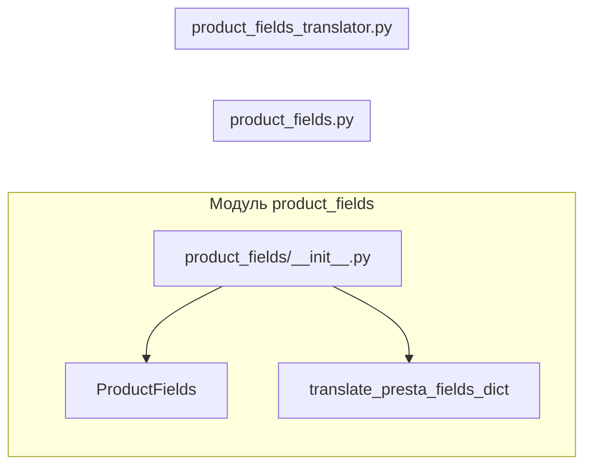

```MD
# Анализ файла hypotez/src/product/product_fields/__init__.py

## <input code>

```python
## \file hypotez/src/product/product_fields/__init__.py
# -*- coding: utf-8 -*-
#! venv/Scripts/python.exe
#! venv/bin/python/python3.12

"""
.. module: src.product.product_fields 
	:platform: Windows, Unix
	:synopsis: Модуль полей товара

"""
MODE = 'dev'

from .product_fields import ProductFields
from .product_fields_translator import translate_presta_fields_dict
```

## <algorithm>

Этот код представляет собой инициализацию модуля `product_fields`. Алгоритм прост: он импортирует классы и функции из других файлов внутри того же пакета.

1. **Импорт:** Модуль импортирует класс `ProductFields` и функцию `translate_presta_fields_dict` из подпапок `product_fields` и `product_fields_translator` соответственно.

**Пример:**

Предположим, что `product_fields.py` содержит класс `ProductFields`, а `product_fields_translator.py` - функцию `translate_presta_fields_dict`. При выполнении `__init__.py`, эти объекты будут доступны в текущем модуле.


## <mermaid>



Диаграмма показывает импорты из других файлов внутри пакета `product_fields`. `__init__.py` импортирует необходимые компоненты.

## <explanation>

**Импорты:**

- `from .product_fields import ProductFields`: Импортирует класс `ProductFields` из файла `product_fields.py` внутри текущего пакета. Это означает, что класс `ProductFields` доступен для использования в модуле `__init__.py`.
- `from .product_fields_translator import translate_presta_fields_dict`: Импортирует функцию `translate_presta_fields_dict` из файла `product_fields_translator.py` внутри текущего пакета.  Эта функция вероятно предназначена для перевода данных полей продукта из формата, используемого в PrestaShop, в другой формат (например, формат, ожидаемый внутренними системами).

**Классы:**

- `ProductFields`: (определен в `product_fields.py`) Класс, который, вероятно, представляет структуру или набор полей для товара.  Его функциональность не описана в данном файле.

**Функции:**

- `translate_presta_fields_dict`: (определен в `product_fields_translator.py`) Функция, вероятно, принимает словарь данных, связанных с полями товара из PrestaShop, и возвращает эквивалентный словарь в формате, используемом внутри проекта.


**Переменные:**

- `MODE = 'dev'`:  Переменная, вероятно, устанавливает режим работы приложения (например, 'dev' для разработки, 'prod' для производства). Может использоваться для выбора конфигураций или библиотек, которые задействованы в обработке данных.

**Возможные ошибки или области для улучшений:**

- Отсутствует документация для `ProductFields` и `translate_presta_fields_dict`. Важно документально описать поведение этих компонентов для облегчения дальнейшего использования кода.
- Необходимо убедиться, что `product_fields.py` и `product_fields_translator.py` существуют в указанных путях.
- Файлы с расширением `.py` должны использовать `encoding utf-8`, это указано в коде, но следует убедиться, что это правильно настроено в редакторе.


**Взаимосвязи с другими частями проекта:**

Данный `__init__.py`  является частью пакета `product_fields`, что предполагает наличие других файлов в этом пакете, которые взаимодействуют с `ProductFields` и `translate_presta_fields_dict` для обработки данных товаров.  Эти функции, вероятно, используются в других частях приложения `hypotez` для работы с данными товаров.  Например, они могут использоваться в модулях для управления товарами, их отображения или обработки заказа.