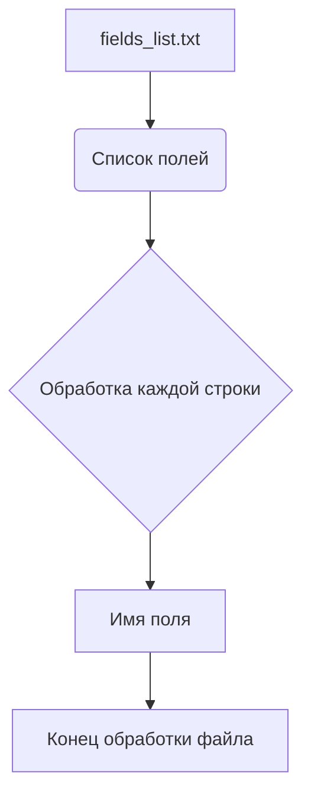

# Анализ файла `hypotez/src/product/product_fields/fields_list.txt`

## <input code>

```active
additional_delivery_times
additional_shipping_cost
advanced_stock_management
affiliate_short_link
affiliate_summary
affiliate_summary_2
affiliate_text
affiliate_image_large
affiliate_image_medium
affiliate_image_small
associations
available_date
available_for_order
available_later
available_now
cache_default_attribute
cache_has_attachments
cache_is_pack
condition
customizable
date_add
date_upd
delivery_in_stock
delivery_out_stock
depth
description
description_short
ean13
ecotax
height
how_to_use
specification
id_category_default
id_default_combination
id_default_image
locale
id_manufacturer
id_product
id_shop_default
id_shop
id_supplier
id_tax
id_type_redirected
indexed
ingredients
is_virtual
isbn
link_rewrite
location
low_stock_alert
low_stock_threshold
meta_description
meta_keywords
meta_title
minimal_quantity
mpn
name
online_only
on_sale
out_of_stock
pack_stock_type
price
product_type
quantity_discount
redirect_type
reference
show_condition
show_price
state
supplier_reference
text_fields
unit_price_ratio
unity
upc
uploadable_files
visibility
volume
weight
wholesale_price
width
local_saved_image
local_saved_video
```

## <algorithm>

Данный файл (`fields_list.txt`) не содержит алгоритма в традиционном понимании.  Это текстовый файл, содержащий список строк, вероятно, представляющих поля, используемые для описания продуктов в системе.  Нет циклов, ветвлений или вычислений.  Алгоритм здесь - перечисление.

**Пошаговая блок-схема:**

1. Чтение файла `fields_list.txt`
2. Обработка каждой строки как имени поля.  (Здесь нет логических операций с данными, кроме их чтения.)
3. Конец обработки файла.

**Пример данных:**

Каждая строка файла представляет собой строковое значение, представляющее имя поля: `additional_delivery_times`, `additional_shipping_cost`, и т.д.

## <mermaid>



## <explanation>

**Импорты:**

Нет импортов в данном коде, так как это просто текстовый файл.


**Классы:**

Нет классов.


**Функции:**

Нет функций.


**Переменные:**

Нет переменных.


**Подробное объяснение:**

Файл `fields_list.txt` содержит список строк, каждая из которых представляет собой имя поля, используемое для хранения данных о продукте. Это, скорее всего, используется для:

* **Дескриптор товаров:**  Поля, описывающие характеристики продукта (название, цена, доступность, и т.д.).
* **Обработка данных:** Списки полей, которые используются системами управления товарами или базами данных для хранения информации о продуктах.
* **Взаимодействие с базами данных:** В приложениях, которые работают с базами данных, список полей может использоваться для определения схемы таблиц или других структур данных.
* **Конфигурирование:** Список полей, которые позволяют настраивать поведение системы (например, поля для определения настроек доставки).

**Возможные ошибки или области для улучшений:**

* **Отсутствует структура данных:** Файл содержит только имена полей. Без дополнительной информации о типах данных и связях между полями, сложно эффективно использовать эту информацию.
* **Отсутствует валидация:** Неясно, как обрабатываются дубликаты или неправильные значения в файле. В реальной системе нужно предусмотреть механизм валидации.
* **Отсутствие метаданных:**  Не хватает информации о типе данных каждого поля (строковый, числовой, дата и т.д.).  Добавление такой информации существенно улучшило бы использование этого файла.


**Взаимосвязь с другими частями проекта:**

Файл `fields_list.txt` вероятно используется другими компонентами системы (например, модулем для обработки данных о продуктах, модулем базы данных, контроллерами веб-приложения), для определения структуры данных, необходимых для работы. Например, при добавлении или изменении поля в базе данных, нужно обновить и этот файл, чтобы информация была синхронизирована.