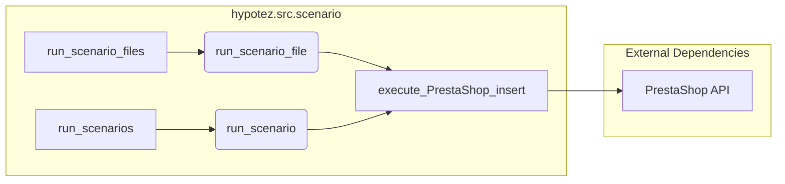

```MD
# <input code>

```python
## \file hypotez/src/scenario/__init__.py
# -*- coding: utf-8 -*-\
#! venv/Scripts/python.exe
#! venv/bin/python/python3.12

"""
.. module: src.scenario 
	:platform: Windows, Unix
	:synopsis: Module with scenario execution functions: `run_scenario_files`, `run_scenarios`  
Scenario executor for suppliers.
----


The logic executed is as follows:
<pre>
  +-----------+
  |  Scenario |
  +-----------+
        |
        | Defines
        |
        v
  +-----------+
  | Executor  |
  +-----------+
        |
        | Uses
        |
        v
  +-----------+        +-----------+
  |  Supplier | <----> |  Driver   |
  +-----------+        +-----------+
        |                     |
        | Provides Data        | Provides Interface
        |                     |
        v                     v
  +-----------+        +-----------+
  |  PrestaShop       | Other Suppliers |
  +-----------+        +-----------+
</pre>
@code
s = Supplier('aliexpress')

run_scenario_files(s, 'file1')


scenario_files = ['file1', ...]
run_scenario_files(s, scenario_files)


scenario1 = {'key': 'value'}
run_scenarios(s, scenario1)


list_of_scenarios = [scenario1, ...]
run_scenarios(s, list_of_scenarios)


@endcode
Example of a scenario file:
```json
{
  "scenarios": {

    "feet-hand-treatment": {
      "url": "https://hbdeadsea.co.il/product-category/bodyspa/feet-hand-treatment/",
      "name": "Foot and Hand Care",
      "condition": "new",
      "presta_categories": {
        "default_category": 11259,
        "additional_categories": []
      }
    },

    "creams-butters-serums-for-body": {
      "url": "https://hbdeadsea.co.il/product-category/bodyspa/creams-butters-serums-for-body/",
      "name": "Creams, Butters, and Serums for Body",
      "condition": "new",
      "presta_categories": {
        "default_category": 11260,
        "additional_categories": []
      }
    }
}
```
```python

For detailed information on the scenario dictionary, read here: ...

When the program is started via main(), the following sequence of execution occurs:
@code
s = Supplier('aliexpress')


s.run()


s.run('file1')


scenario_files = ['file1', ...]
s.run(scenario_files)


scenario1 = {'key': 'value'}
s.run(scenario1)


list_of_scenarios = [scenario1, ...]
s.run(list_of_scenarios)
```
"""
MODE = 'dev'
from .executor import (
    run_scenario, 
    run_scenarios, 
    run_scenario_file, 
    run_scenario_files, 
    execute_PrestaShop_insert, 
    execute_PrestaShop_insert_async,
)
```

# <algorithm>

```mermaid
graph TD
    A[Supplier Initialization] --> B{run() / run(file1) / run(list)};
    B --> C[run_scenario_files(scenario_files)];
    B --> D[run_scenarios(scenario)];
    C --> E[run_scenario_file(file)];
    D --> F[run_scenario(scenario)];
    E --> G[execute_PrestaShop_insert];
    F --> G;
    subgraph "Scenario Logic"
        G --> H[PrestaShop Insertion];
    end
```

**Пошаговое описание:**

1. **Supplier Initialization (A):**  Создается экземпляр класса `Supplier` с заданным параметром (например, `'aliexpress'`).  

2. **Scenario Execution (B):** Вызываются методы `run()`, `run(file1)`, `run(scenario_files)`,  `run(scenario)` для обработки сценариев.

3. **Scenario File Execution (C):**  Функция `run_scenario_files` обрабатывает список файлов, содержащих сценарии.

4. **Scenario Execution (D):** Функция `run_scenarios` обрабатывает отдельный сценарий или список сценариев.

5. **Scenario File Processing (E):**  Функция `run_scenario_file` обрабатывает отдельный сценарий из файла.

6. **Scenario Logic Execution (F):**  Функция `run_scenario` исполняет логику, содержащуюся в сценарии.

7. **PrestaShop Insertion (G):**  Вызывается `execute_PrestaShop_insert` или `execute_PrestaShop_insert_async` для добавления данных в PrestaShop.


# <mermaid>



**Диаграмма и зависимости:**

Эта диаграмма показывает, что модуль `scenario` содержит функции, ответственные за обработку сценариев и взаимодействие с PrestaShop API (`execute_PrestaShop_insert`).  `execute_PrestaShop_insert` является зависимостью, которая скорее всего находится в другом модуле (возможно, `hypotez.src.prestashop` или подобном).


# <explanation>

**Импорты:**

- `from .executor import ...`: Импортирует функции для выполнения сценариев и работы с PrestaShop из модуля `executor`, который, скорее всего, находится в том же каталоге `hypotez/src/scenario`.  Использование `.` указывает на то, что модуль `executor` находится в текущем пакете `scenario`.  Это ключевая зависимость, так как выполнение сценариев и взаимодействие с PrestaShop происходят в `executor`.

**Классы:**

-  Не обнаружены классы. Код демонстрирует функции для обработки различных типов ввода (сценарии, списки файлов).


**Функции:**

- `run_scenario_files`, `run_scenarios`, `run_scenario_file`, `run_scenario`:  Функции, ответственные за выполнение сценариев.  Они принимают данные о сценариях и вызывают функции для выполнения.
- `execute_PrestaShop_insert`, `execute_PrestaShop_insert_async`:  Функции, взаимодействующие с PrestaShop, вероятно, для вставки данных.


**Переменные:**

- `MODE`:  Переменная, вероятно, содержит конфигурацию (например, `'dev'` или `'prod'`), влияющую на логику работы.


**Возможные ошибки и улучшения:**

- **Обработка ошибок:** Отсутствует обработка ошибок. В случае проблем при чтении файлов, валидации сценариев или выполнении операций в PrestaShop, код будет аварийно завершаться. Необходимо добавить обработку исключений (try...except блоки), чтобы программа не падала.

- **Документация:** Несмотря на комментарии, документация могла бы быть более подробной и структурированной. Особенно полезно было бы иметь описания аргументов и возвращаемых значений для каждой функции.


**Взаимосвязи с другими частями проекта:**

- **`hypotez/src/executor`:**  Ключевой модуль, предоставляющий функции для выполнения сценариев и взаимодействия с PrestaShop.

- **`PrestaShop API`:**  Внешний API, необходимый для вставки данных.

- **`Supplier` класс (предполагается):**  Классы `Supplier` необходимы для организации взаимодействия между логикой сценариев и системой поставок.  Без него, сценарии не смогут направить данные поставщикам.

- **Файлы сценариев:**  Файлы, содержащие описание сценариев (JSON).

В целом, код демонстрирует структуру для управления сценариями и передачи данных для взаимодействия с PrestaShop.  Но, для стабильного и расширяемого кода, необходимо добавить обработку ошибок и более подробную документацию.