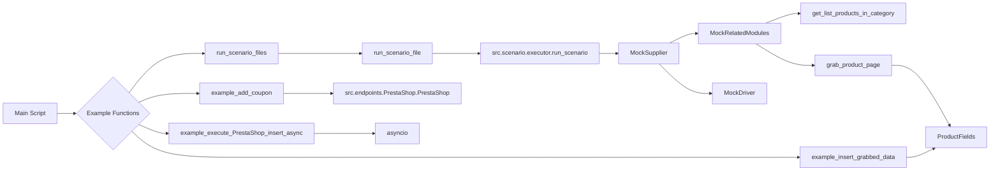

# <input code>

```python
## \file hypotez/src/scenario/_examples/_example_executor.py
# -*- coding: utf-8 -*-\
#! venv/Scripts/python.exe
#! venv/bin/python/python3.12

"""
.. module: src.scenario._examples 
	:platform: Windows, Unix
	:synopsis:

"""
MODE = 'dev'

"""
	:platform: Windows, Unix
	:synopsis:

"""


"""
	:platform: Windows, Unix
	:synopsis:

"""


"""
  :platform: Windows, Unix

"""
"""
  :platform: Windows, Unix
  :platform: Windows, Unix
  :synopsis:
"""MODE = 'dev'
  
""" module: src.scenario._examples """


...
"""
Examples for the `executor` module from `src.scenario.executor`.

This file contains examples of how to use the functions provided in the `executor` module.
The examples demonStarte how to run scenarios, handle scenario files, and interact with PrestaShop API.

@details
- `Example 1` shows how to run a list of scenario files.
- `Example 2` demonStartes how to run a single scenario file.
- `Example 3` illuStartes how to run a single scenario.
- `Example 4` provides an example of executing a product page scenario.
- `Example 5` shows how to add a coupon using PrestaShop API.

@image html executor.png
"""

import asyncio
from pathlib import Path
from src.scenario.executor import run_scenario_files, run_scenario_file, run_scenarios, run_scenario, insert_grabbed_data, execute_PrestaShop_insert, execute_PrestaShop_insert_async, add_coupon
from src.utils import j_loads
from src.product import ProductFields
from src.endpoints.PrestaShop import PrestaShop

# Assuming `Supplier` class is available and has necessary methods and attributes
class MockSupplier:
    def __init__(self):
        self.supplier_abs_path = Path('/path/to/scenarios')
        self.scenario_files = [Path('scenarios/scenario1.json'), Path('scenarios/scenario2.json')]
        self.current_scenario = None
        self.supplier_settings = {'runned_scenario': []}
        self.related_modules = MockRelatedModules()
        self.driver = MockDriver()

class MockRelatedModules:
    def get_list_products_in_category(self, s):
        return ['http://example.com/product1', 'http://example.com/product2']

    def grab_product_page(self, s):
        return ProductFields(
            presta_fields_dict={'reference': 'REF123', 'name': [{'id': 1, 'value': 'Sample Product'}], 'price': 100},
            assist_fields_dict={'images_urls': ['http://example.com/image1.jpg'], 'default_image_url': 'http://example.com/default_image.jpg', 'locale': 'en'}
        )

    async def grab_page(self, s):
        return self.grab_product_page(s)

class MockDriver:
    def get_url(self, url):
        return True

# ... (Example functions)
```

# <algorithm>

The code defines example functions for executing scenarios, interacting with PrestaShop API, and handling data.  The functions rely on classes `MockSupplier`, `MockRelatedModules`, `MockDriver`, and `ProductFields` that simulate the behavior of the actual classes involved in scenario execution. 
The workflow is as follows:

1. **Initialization**: Create instances of `MockSupplier` to provide data for scenario execution.
2. **Scenario Execution**: Call functions `run_scenario_files`, `run_scenario_file`, `run_scenario` for running different types of scenarios (e.g., lists of files, single files or scenarios).
3. **Data Handling**: The functions utilize data like `scenario`, `scenario_files`, which is then processed by the respective functions (e.g., `run_scenario`, `insert_grabbed_data`).
4. **PrestaShop Interaction**: Functions `execute_PrestaShop_insert`, `execute_PrestaShop_insert_async`, `add_coupon` demonStarte interactions with the PrestaShop API.


**Example for `run_scenario_files`:**

* Input: `supplier` object, list of `Path` objects to scenario files.
* Processing: The function likely iterates through the list of files, calling `run_scenario_file` for each file.
* Output: True if all scenarios succeed, False otherwise.


# <mermaid>



**Explanation of Dependencies:**

* **`src.scenario.executor`**: Contains core functions for scenario execution (`run_scenario_files`, `run_scenario`, etc.).
* **`src.utils`**: Likely contains utility functions (e.g., JSON loading - `j_loads`).
* **`src.product`**: Contains `ProductFields` class for representing product data.
* **`src.endpoints.PrestaShop`**: Contains classes for interacting with the PrestaShop API (`PrestaShop`).


# <explanation>

**Imports:**

The code imports necessary modules from various parts of the project, including `src`.  This indicates a modular structure. `asyncio` is crucial for asynchronous operations. `pathlib` is used for handling file paths.  `j_loads` suggests JSON handling, which is a common requirement for loading configuration or scenario data. `ProductFields` class is defining data model for product.  Import from `PrestaShop` module signifies interaction with e-commerce platform's API.


**Classes:**

* **`MockSupplier`**: A mock class simulating the behavior of a class responsible for managing scenario data, which likely handles tasks like file loading and interactions with external APIs.  Includes mocks of `MockRelatedModules` and `MockDriver`.
* **`MockRelatedModules`**:  This mocks functions that interact with other components of the system (likely modules). It's designed for handling external data fetching (e.g., products in a category) in a mock environment.
* **`MockDriver`**: Simulates the interaction with a web driver, necessary for web scraping and data retrieval from web pages.
* **`ProductFields`**: Encapsulates data for products, likely with a structure for storing product information relevant to PrestaShop.


**Functions:**

The example functions demonStarte different ways to use functions from the `src.scenario.executor` module.  They showcase how to run different types of scenarios, handle scenario files, and interact with PrestaShop API.


**Variables:**

Variables like `scenario_files` and `scenario` hold the data necessary for running scenarios, including paths to scenario files and the scenario data itself. `credentials` stores API keys and domains.


**Possible Errors/Improvements:**

* **Hardcoded paths:** `/path/to/scenarios` and `scenarios/scenario1.json` are hardcoded. These should be configurable.
* **Error handling:** The examples lack proper error handling.  If a scenario fails, only a generic message is printed.  Error handling should be implemented to provide more detailed information, allowing for debugging and recovery.
* **Missing input validation:** The functions don't validate the inputs, which could lead to unexpected behavior.
* **Asynchronous operations**: Using `asyncio` for asynchronous calls is a good approach but could be enhanced for better error handling and control flow.  Consider using `try...except` blocks for asynchronous functions, similar to synchronous ones.
* **Testing:**  The code lacks unit tests.  Add tests to verify the correct behavior of functions, especially the PrestaShop interaction.


**Relationship to other parts of the project:**

The code directly interacts with classes and functions in `src.scenario.executor`, `src.utils`, `src.product`, and `src.endpoints.PrestaShop`, indicating a clear dependency structure. The code is part of a larger system responsible for scenario execution and interaction with PrestaShop API.