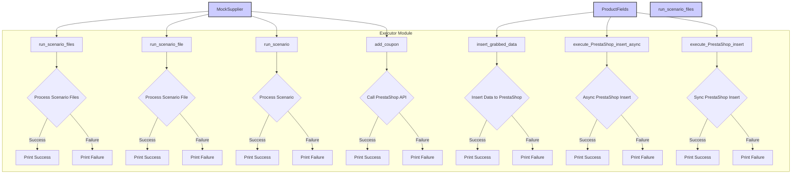

# Анализ кода модуля executor.py

```
Вот файл примеров для модуля `executor.py`, который иллюстрирует использование всех функций и методов, представленных в коде. В примерах показано, как можно использовать функции для выполнения сценариев, обработки файлов сценариев, работы с продуктами и взаимодействия с PrestaShop API.

```python
# ... (код из запроса)
```

## <algorithm>

Алгоритм работы кода представлен в виде последовательности вызовов функций и методов, обработкой данных и использованием асинхронности (где применимо).  Подробная блок-схема не нужна, так как код представляет собой набор примеров использования функций.  

* **Example 1, 2, 3:** Вызовы `run_scenario_files`, `run_scenario_file`, `run_scenario` принимают экземпляр класса `MockSupplier` и сценарий (список файлов, файл или словарь).  Эти функции, вероятно, обрабатывают данные сценария и выполняют действия, описанные в нем.  Возвращаемое значение – логическое (True/False) для успеха выполнения.

* **Example 4:** Функция `insert_grabbed_data` принимает объект `ProductFields` с данными продукта и выполняет вставку в PrestaShop.

* **Example 5:** Функция `add_coupon` принимает данные для добавления купона (credentials, reference, coupon_code, start_date, end_date) и выполняет соответствующий запрос к API PrestaShop.

* **Example 6:** Функция `execute_PrestaShop_insert_async` принимает данные продукта и выполняет вставку асинхронно.

* **Example 7:** Функция `execute_PrestaShop_insert` принимает данные продукта и выполняет вставку синхронно.


В каждом примере происходит инициализация `MockSupplier`, передача данных функции и обработка возвращенного значения.  В случае с асинхронной операцией (`example_execute_PrestaShop_insert_async`) используется `asyncio.run`.

## <mermaid>



**Описание зависимостей:**

Код использует модули `pathlib`, `src.scenario.executor`, `src.utils`, `src.product`, `src.endpoints.PrestaShop`.  Все они, вероятно, находятся в одном проекте, и `src` указывает на его структуру пакетов.  `MockSupplier`, `MockRelatedModules`, `MockDriver` — это имитации (моки) реальных классов, позволяющие протестировать функциональность `executor` без обращения к внешним системам.


## <explanation>

**Импорты:**

* `from pathlib import Path`: Импортирует класс `Path` для работы с файловыми путями.
* `from src.scenario.executor import ...`: Импортирует функции для выполнения сценариев ( `run_scenario_files`, `run_scenario_file`, `run_scenarios`, `run_scenario`, `insert_grabbed_data`, `execute_PrestaShop_insert`, `execute_PrestaShop_insert_async`, `add_coupon`).  Эти функции, вероятно, определены в модуле `executor` в пакете `src.scenario`.
* `from src.utils import j_loads`: Импортирует функцию `j_loads` для обработки JSON-данных (вероятно, для парсинга сценариев).
* `from src.product import ProductFields`: Импортирует класс `ProductFields` для работы с данными продуктов.
* `from src.endpoints.PrestaShop import PrestaShop`: Импортирует класс `PrestaShop` для взаимодействия с API PrestaShop.


**Классы:**

* `MockSupplier`:  Представляет поставщика данных.  Используется для тестирования, так как содержит имитацию необходимых свойств и методов для работы с сценариями.
* `MockRelatedModules`: Мок для модулей, взаимодействующих с `MockSupplier`, например, для получения данных о продуктах.
* `MockDriver`: Мок, вероятно, имитирует веб-драйвер для работы с веб-страницами.

*`ProductFields`:* Класс для работы с данными продуктов.  Вероятно, содержит атрибуты для хранения и доступа к информации о продукте, необходимой для вставки в PrestaShop.


**Функции:**

* `run_scenario_files`, `run_scenario_file`, `run_scenario`:  Выполняют сценарии, полученные из файлов или словарей.  Возвращают булево значение, указывающее на успех выполнения.
* `insert_grabbed_data`: Вставляет данные продукта в PrestaShop.
* `add_coupon`: Добавляет купон в PrestaShop.
* `execute_PrestaShop_insert`, `execute_PrestaShop_insert_async`:  Выполняют вставку продукта в PrestaShop синхронно и асинхронно.


**Переменные:**

* `scenario_files`, `scenario_file`, `scenario`:  Хранят данные сценариев (списки файлов, файл или словарь).


**Возможные ошибки и улучшения:**

* Нет обработки ошибок при выполнении сценариев (например, при запросе к API).
* Нет валидации входных данных для функций.
* Моки `MockSupplier`, `MockRelatedModules`, `MockDriver`  являются упрощенными, в реальном коде требуется более полная имитация.
* Отсутствует явная обработка ошибок при работе с PrestaShop API.
* В коде использованы примеры, но отсутствует описание типов данных для различных входных параметров (например, тип данных для `credentials` в функции `add_coupon`).
* Лучше было бы использовать структурированные объекты (например, `dataclass`) для хранения данных вместо словарей, как в `MockSupplier`.

**Взаимосвязи с другими частями проекта:**

Модуль `executor` тесно связан с другими модулями `src.utils`, `src.product`, `src.endpoints.PrestaShop`,  которые предоставляют вспомогательные функции и классы для работы с данными, сценариями и взаимодействием с PrestaShop.  Очевидно, есть сценарии (в файлах JSON) и данные продуктов, которые обрабатываются этим кодом.