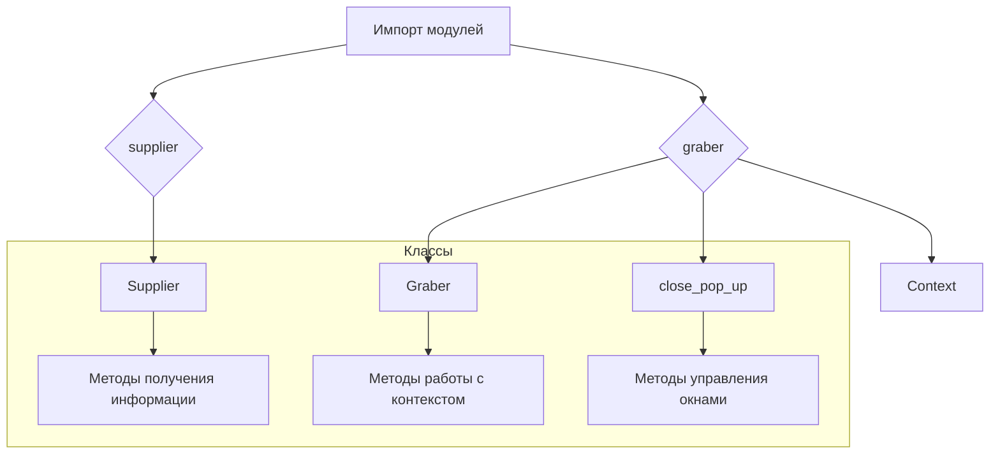
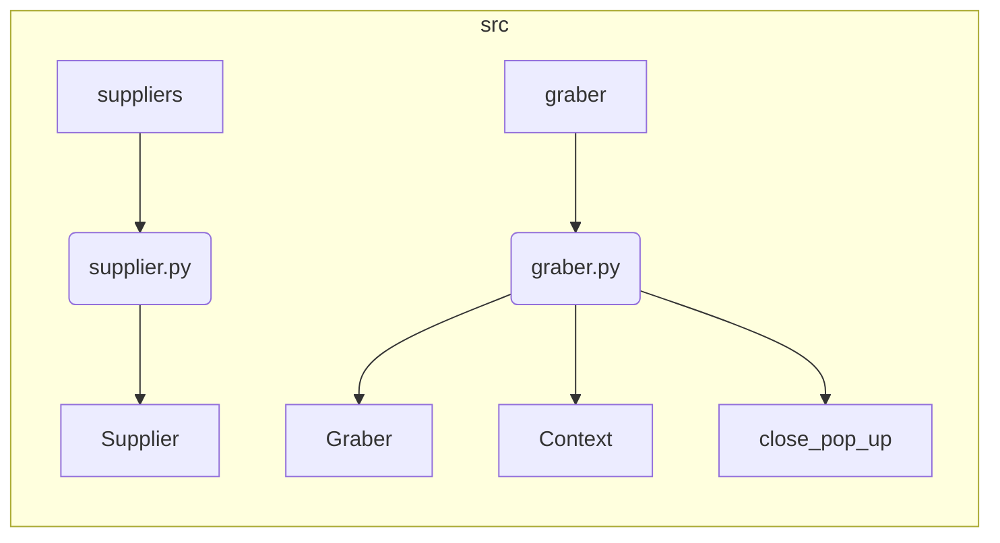

# <input code>

```python
## \file hypotez/src/suppliers/__init__.py
# -*- coding: utf-8 -*-\
#! venv/Scripts/python.exe
#! venv/bin/python/python3.12

"""
.. module: src.suppliers 
	:platform: Windows, Unix
	:synopsis: Модуль поставщика. Класс `Supplier`

Для каждого конкретного поставщика есть свои специфичные методы (функции) извлечения информации. 
Эти функции дополняют базовый класс `Supplier` и подключаются через интерфейс `supplier.related_functions`.

Методы каждого конкретного поставщика находятся в директориях с именем <supplier_prefix>, 
например: `amazon`, `aliexpress`, `morlevi`,...  
- `supplier_prefix` задается во время создания в системе нового поставщика и обычно основывается на сокращении имени или сайта поставщика.

## Взаимосвязь сущностей Supplier, Driver, Product
@image html supplier-warehouse-client.png

"""
MODE = 'dev'

from .supplier import Supplier
from .graber import Graber, Context, close_pop_up
```

# <algorithm>



**Пошаговое описание:**

1. **Импорт модулей:** Модуль `__init__.py` импортирует классы `Supplier`, `Graber`, `Context` и функцию `close_pop_up` из модулей `supplier.py` и `graber.py` соответственно.


# <mermaid>



**Описание диаграммы:**

Диаграмма демонстрирует структуру импорта модулей. Модуль `suppliers` импортирует классы `Supplier` и `Graber` из своих подмодулей.  Модуль `graber` содержит классы `Graber`, `Context` и функцию `close_pop_up`.  Все они находятся внутри пакета `src`.


# <explanation>

**Импорты:**

- `from .supplier import Supplier`: Импортирует класс `Supplier` из модуля `supplier.py` внутри текущего пакета `suppliers`. Значок `.` перед именем модуля указывает на то, что модуль находится в той же директории, что и текущий файл.
- `from .graber import Graber, Context, close_pop_up`: Импортирует классы `Graber`, `Context` и функцию `close_pop_up` из модуля `graber.py` внутри текущего пакета `suppliers`.

**Классы:**

- `Supplier`: Базовый класс для работы с поставщиками данных.  Описание класса `Supplier` и его методов находится в файле `supplier.py`.  Этот класс, вероятно, предоставляет основные функции для работы с поставщиком (например, инициализацию, получение данных).
- `Graber`: Вероятно, класс для извлечения данных от поставщика.  Подробное описание его функциональности содержится в `graber.py`. Скорее всего, этот класс содержит методы для работы с веб-драйвером (например, поиск элементов на странице, чтение данных).
- `Context`: Возможно, класс для хранения контекстной информации, необходимой для работы с поставщиком (например, URL, cookies).
- `close_pop_up`: Функция, скорее всего, отвечает за закрытие всплывающих окон, которые могут появляться при взаимодействии с поставщиком.  Подробности в `graber.py`.


**Функции:**


- Нет функций определенных непосредственно в этом файле.

**Переменные:**

- `MODE = 'dev'`: Переменная, которая, вероятно, определяет режим работы программы (например, `dev`, `prod`).


**Возможные ошибки или области для улучшений:**

- Отсутствуют реализации методов класса `Supplier` и `Graber`.
- Не указаны типы данных для переменных, что может сделать код менее читаемым и менее понятным.
- Не хватает документации к классам и методам.
- Не ясна роль и функционал `supplier.related_functions`

**Взаимосвязь с другими частями проекта:**

Этот модуль является частью инфраструктуры для взаимодействия с поставщиками данных.  Он, скорее всего, связан с модулями, отвечающими за обработку данных, хранение информации о поставщиках и пр.  Взаимосвязь с другими модулями представлена в диаграмме Mermaid.