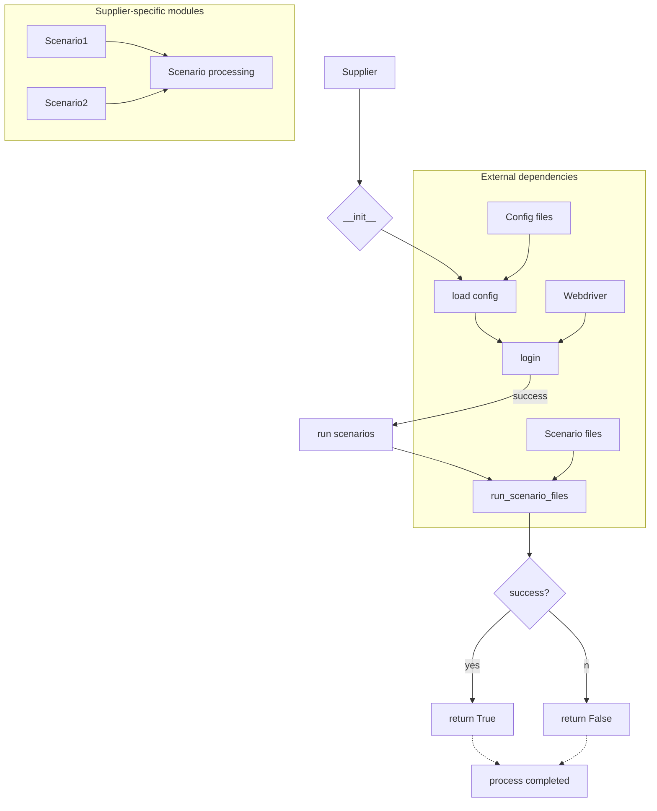

```MD
# Анализ кода класса Supplier

## <input code>

```
Here's a detailed explanation of what the `Supplier` class does, in English:

### Overview of the `Supplier` Class

The `Supplier` class serves as a base class for managing data suppliers in your application. It provides a framework for interacting with various data sources, such as Amazon, AliExpress, Walmart, and others. This class handles the initialization of supplier-specific settings, manages scenarios for data collection, and provides methods for logging in and executing scenarios.

### Components of the `Supplier` Class

#### 1. **Class Attributes**
   - `supplier_id`: Unique identifier for the supplier.
   - `supplier_prefix`: Prefix for the supplier, e.g., `aliexpress` or `amazon`.
   - `supplier_settings`: Settings for the supplier, loaded from a configuration file.
   - `locale`: Localization code (e.g., `en` for English, `ru` for Russian).
   - `price_rule`: Rule for calculating prices (e.g., adding VAT or applying discounts).
   - `related_modules`: Module containing supplier-specific functions.
   - `scenario_files`: List of scenario files to be executed.
   - `current_scenario`: The currently executing scenario.
   - `login_data`: Login credentials for accessing the supplier’s website (if required).
   - `locators`: Locators for web elements on the supplier’s site.
   - `driver`: Web driver for interacting with the supplier’s site.
   - `parsing_method`: Method for data parsing (e.g., `webdriver`, `api`, `xls`, `csv`).

#### 2. **Methods**
   - `__init__`: Constructor that initializes attributes based on the supplier prefix and other parameters.
     ```python
     def __init__(self, supplier_prefix: str, locale: str = 'en', webdriver: str | Driver | bool = 'default', *attrs, **kwargs):
         # Initializes supplier prefix, locale, and web driver
     ```

   - `_payload`: Loads supplier-specific configurations, locators, and initializes the web driver.
     ```python
     def _payload(self, webdriver: str | Driver | bool, *attrs, **kwargs) -> bool:
         # Loads configuration files and initializes the web driver
     ```

   - `login`: Handles the login process for the supplier’s site if authentication is required.
     ```python
     def login(self) -> bool:
         # Performs login to the supplier's site
     ```

   - `run_scenario_files`: Executes one or more scenario files.
     ```python
     def run_scenario_files(self, scenario_files: str | List[str] = None) -> bool:
         # Executes scenario files and returns True if all scenarios are successfully completed
     ```

   - `run_scenarios`: Executes one or more scenarios.
     ```python
     def run_scenarios(self, scenarios: dict | list[dict]) -> bool:
         # Executes given scenarios and returns True if all scenarios are successfully completed
     ```

### How It Works
```

## <algorithm>

**Блок-схема:** (К сожалению, создание блок-схемы в данном формате не поддерживается.  Необходимо использовать инструменты, например, draw.io, Lucidchart или Visio)

**Описание алгоритма:**

1. **Инициализация (Supplier):** Создается экземпляр класса `Supplier` с указанием `supplier_prefix`, `locale` и  `webdriver`.

2. **Загрузка конфигурации (_payload):** Метод `_payload` загружает специфичные настройки для поставщика, локаторы и инициализирует веб-драйвер.

3. **Авторизация (login):** Метод `login` выполняет авторизацию на сайте поставщика, если это необходимо.

4. **Выполнение сценариев (run_scenario_files / run_scenarios):** Методы `run_scenario_files` и `run_scenarios` выполняют сценарии, загруженные из файлов или предоставленные в качестве списка словарей.

## <mermaid>



## <explanation>

**Импорты:**  В предоставленном коде импорты не указаны.  Для работы класса `Supplier`  необходимы импорты для работы с веб-драйверами, загрузкой конфигурационных файлов и, вероятно, для обработки сценариев.

**Классы:** `Supplier` — базовый класс для работы с разными поставщиками данных. Он абстрагирует общие операции, такие как загрузка настроек, авторизация и выполнение сценариев.

**Атрибуты:**  Атрибуты описывают специфику поставщика (например, `supplier_prefix`, `login_data`, `locators`).

**Методы:**
* `__init__`: Инициализирует класс, настраивая необходимые параметры, такие как `supplier_prefix` и `webdriver`.
* `_payload`: Загружает и инициализирует необходимые ресурсы для работы с конкретным поставщиком данных.
* `login`: Выполняет авторизацию на сайте поставщика.
* `run_scenario_files`: Выполняет сценарии, указанные в списке файлов.
* `run_scenarios`: Выполняет сценарии, переданные в виде списка словарей.

**Функции:** Не указаны в текущем коде, но в примере можно предположить, что существуют функции внутри `related_modules`, реализующие специфические действия для обработки данных конкретного поставщика.

**Переменные:**  `supplier_prefix`, `locale`, `webdriver` — примеры переменных, определяющих поведение и настройку класса `Supplier`.

**Возможные ошибки и улучшения:**

* **Недостаток проверки входов:** Нет явных проверок корректности вводимых данных (например, `supplier_prefix`,  `webdriver`,  сценарии).
* **Отсутствие обработки исключений:**  Методы, взаимодействующие с внешними ресурсами (например, веб-драйвер), должны обрабатывать потенциальные исключения (например, `ConnectionError`, `TimeoutException`).
* **Неопределенные зависимости:** Непонятно, как осуществляется взаимодействие с конфигурационными файлами, веб-драйверами и модулями сценариев.
* **Отсутствие логирования:**  Необходимо логирование (logging) для отслеживания состояния процесса и выявления ошибок.


**Взаимосвязи с другими частями проекта:**

*  `Supplier` зависит от модулей, предоставляющих функции для работы с веб-драйвером, загрузкой конфигураций и сценариев.
*  `Supplier` взаимодействует с базами данных или хранилищами данных для сохранения результатов.
*  `Supplier` может быть частью более крупной архитектуры, которая отвечает за управление данными и выполнение задач по сбору информации.