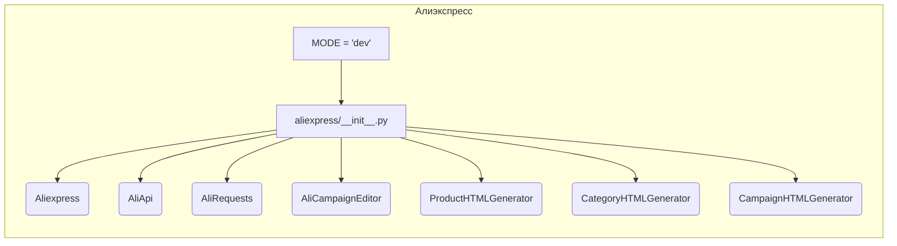

```MD
# Анализ файла hypotez/src/suppliers/aliexpress/__init__.py

**1. <input code>**

```python
## \file hypotez/src/suppliers/aliexpress/__init__.py
# -*- coding: utf-8 -*-\
#! venv/Scripts/python.exe
#! venv/bin/python/python3.12

"""
.. module: src.suppliers.aliexpress 
	:platform: Windows, Unix
	:synopsis:

"""
MODE = 'dev'

from .aliexpress import Aliexpress
from .aliapi import AliApi
from .alirequests import AliRequests
from .campaign import AliCampaignEditor
from .campaign.html_generators import ProductHTMLGenerator, CategoryHTMLGenerator, CampaignHTMLGenerator 
```

**2. <algorithm>**

Этот файл представляет собой модуль инициализации для пакета `aliexpress`.  Алгоритм работы сводится к импорту необходимых модулей.  Пошаговая блок-схема:

1. **Импорт модулей:** Модуль инициализирует себя, импортируя другие модули из того же пакета (`aliexpress`).  Это включает классы `Aliexpress`, `AliApi`, `AliRequests`, `AliCampaignEditor`, а также генераторы HTML `ProductHTMLGenerator`, `CategoryHTMLGenerator`, и `CampaignHTMLGenerator`.

   * **Пример:**
   ```
   from .aliexpress import Aliexpress
   ```
   
   Это импортирует класс `Aliexpress` из модуля `aliexpress.py` внутри пакета `aliexpress`.

2. **Константа MODE:**  Устанавливает константу `MODE` со значением 'dev'.  Это предположительно параметр, влияющий на конфигурацию или режим работы (например, разработка или производство).  


**3. <mermaid>**



**Описание диаграммы:**

*   **aliexpress/__init__.py**: Главный модуль, который импортирует другие.
*   **Aliexpress, AliApi, AliRequests, AliCampaignEditor**: Классы или функции, вероятно, определяющие взаимодействие с API Алиэкспресс, обработку запросов, и инструменты для работы с рекламными кампаниями.
*   **ProductHTMLGenerator, CategoryHTMLGenerator, CampaignHTMLGenerator**:  Вероятно, генераторы HTML для различных элементов данных.
*   **MODE**:  Константа, устанавливающая режим работы.

**4. <explanation>**

*   **Импорты:**  Файл импортирует классы и функции, необходимые для работы с сервисом Алиэкспресс.  Импорты находятся внутри пакета `src.suppliers.aliexpress`, указывают на наличие зависимостей и  структуру.  Например:
    *   `from .aliexpress import Aliexpress` - импортирует класс `Aliexpress` из модуля `aliexpress.py` внутри директории `aliexpress`. Это означает, что код в этом файле зависит от реализации класса `Aliexpress` в других файлах того же пакета.
*   **Классы**:   `Aliexpress`, `AliApi`, `AliRequests`, и `AliCampaignEditor` скорее всего представляют собой классы, отвечающие за разные аспекты работы с сервисом, в том числе взаимодействие с API (AliApi), отправку запросов (AliRequests) и работу с кампаниями (AliCampaignEditor).
*   **Функции**: В данном файле нет функций, только импортируются классы.  Определение функций находилось бы в файлах, на которые ссылаются импорты.
*   **Переменные**: `MODE` – константа, хранящая значение режима работы.  Это пример, показывающий, как в коде можно хранить конфигурацию.


**Цепочка взаимосвязей с другими частями проекта:**

Файл `aliexpress/__init__.py` является точкой входа для всех остальных модулей, связанных с поставщиком AliExpress.  Этот файл импортирует необходимые классы и функции из других файлов внутри пакета `aliexpress` (например, `aliexpress.py`, `aliapi.py`, и т.д.) и определяет зависимости между этими модулями.  Функциональность этих модулей, скорее всего, связана с логикой работы с данными АлиЭкспресс, что предполагает взаимодействие с другими частями приложения для обработки, хранения и отображения полученной информации.

**Возможные ошибки или области для улучшений:**

*   Отсутствие документации к классам.
*   Не указан конкретный способ использования константы `MODE`.
*   Не описан формат данных, с которыми работают генераторы HTML.  В реальном проекте нужно больше информации о данных и логике генерации.