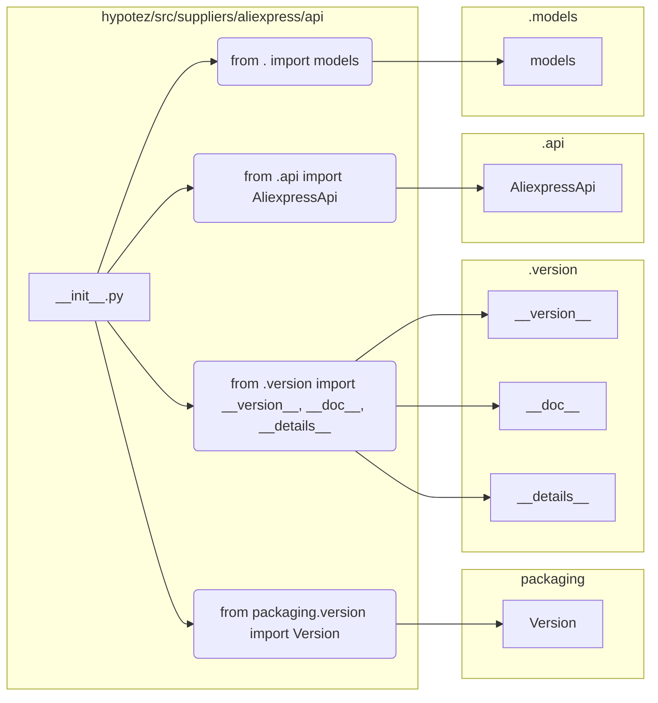

```MD
# <input code>

```python
## \file hypotez/src/suppliers/aliexpress/api/__init__.py
# -*- coding: utf-8 -*-
#! venv/Scripts/python.exe # <- venv win
## ~~~~~~~~~~~~
""" module: src.suppliers.aliexpress.api """
""" Aliexpress API wrapper"""
...

...
from packaging.version import Version
from .version import __version__, __doc__, __details__  

from .api import AliexpressApi
from . import models
```

# <algorithm>

Этот код представляет собой инициализирующий модуль для пакета `aliexpress.api`.  Он импортирует необходимые компоненты, подготавливая их для использования в других частях проекта. Алгоритм в данном случае - это просто импорт. Нет циклов или сложных вычислений.  

**Шаг 1**: Импорт функций из подмодуля `version`.
**Пример**: `__version__`, `__doc__`, `__details__` содержат информацию о версии и документировании.

**Шаг 2**: Импорт класса `AliexpressApi` из подмодуля `api`.
**Пример**: Это основной класс для взаимодействия с API AliExpress.

**Шаг 3**: Импорт подмодуля `models`.
**Пример**: Этот подмодуль, скорее всего, содержит классы, представляющие различные модели данных AliExpress (продукты, цены и т.д.).

**Перемещение данных**:  Данные здесь не перемещаются, так как это не алгоритм обработки данных. Импорт подготавливает компоненты для дальнейшего использования в других модулях проекта, где эти импортированные объекты (классы, переменные) будут использоваться.

# <mermaid>



# <explanation>

**Импорты:**

* `from packaging.version import Version`: Импортирует класс `Version` из пакета `packaging`.  Этот импорт необходим для работы с версиями пакетов Python, например, для проверки совместимости или управления версиями.  Пакет `packaging` обычно используется для более надежной работы с версиями пакетов, чем встроенные средства Python. `src` - это корневая директория проекта.

* `from .version import __version__, __doc__, __details__`: Импортирует переменные `__version__`, `__doc__`, `__details__` из модуля `version.py` в текущей подпапке `aliexpress/api`.  Эти переменные вероятно содержат информацию о версии модуля, документацию и другие данные.

* `from .api import AliexpressApi`: Импортирует класс `AliexpressApi` из модуля `api.py` в текущей подпапке `aliexpress/api`.  Это ключевой класс, предоставляющий интерфейс для работы с API AliExpress.

* `from . import models`: Импортирует подмодуль `models`. Вероятно, этот подмодуль содержит классы, представляющие данные, используемые для взаимодействия с API AliExpress (например, классы для обработки продуктов, заказов и т. д.).


**Классы:**

* `AliexpressApi`:  Этот класс - основной класс для взаимодействия с API AliExpress.  Он, вероятно, содержит методы для выполнения запросов, обработки ответов и других операций с API.


**Функции:**

В этом файле *нет* функций. Он содержит только импорты.


**Переменные:**

Нет переменных.


**Возможные ошибки и улучшения:**

* Нет ошибок в коде, показанном.
* Могут быть полезными докстроки для каждого импортированного класса или объекта.
* Проверка правильности импортирования и использования классов из `packaging`, `aliexpress/version` и `aliexpress/api` необходима.


**Взаимосвязи с другими частями проекта:**

Файл `__init__.py` в папке `aliexpress/api` инициализирует доступ к модулям `aliexpress/version`, `aliexpress/api` и `aliexpress/models`.  Эти модули, вероятно, предоставляют инструменты и данные для работы с API AliExpress.  Дальнейшее взаимодействие определяется кодом, использующим этот `__init__.py`-модуль.  Например,  код из `hypotez/src` может импортировать `AliexpressApi` из `aliexpress/api/__init__.py` для работы с AliExpress.