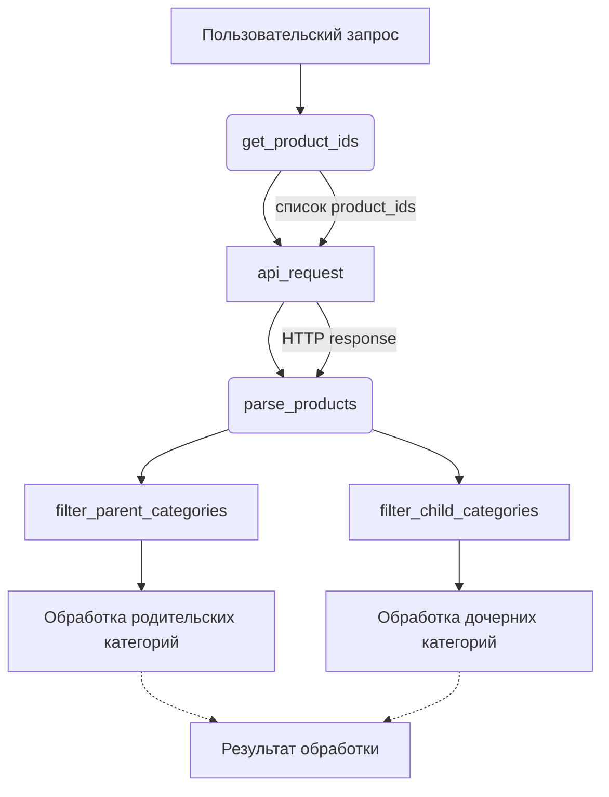

# <input code>

```python
## \file hypotez/src/suppliers/aliexpress/api/helpers/__init__.py
# -*- coding: utf-8 -*-
#! venv/Scripts/python.exe # <- venv win
## ~~~~~~~~~~~~~
""" module: src.suppliers.aliexpress.api.helpers """
from .requests import api_request
from .arguments import get_list_as_string, get_product_ids
from .products import parse_products
from .categories import filter_parent_categories, filter_child_categories
```

# <algorithm>

Этот код представляет собой модуль `__init__.py` для пакета `helpers` в подпакете `api` поставщика AliExpress.  Он импортирует функции из других файлов в том же пакете.  Блок-схема упрощена, так как я не вижу кода из импортируемых файлов.  Предполагается, что функции взаимодействуют с API AliExpress для получения и обработки данных о продуктах и категориях.

**Примерный алгоритм (предполагаемый):**

1. **`api_request`**: Функция, вероятно, выполняет HTTP-запрос к API AliExpress.  Принимает параметры запроса (например, URL, заголовки, данные).  Возвращает ответ от API в виде объекта `Response`.

2. **`get_list_as_string`**:  Функция, вероятно, преобразует список в строку, подходящую для использования в API.  Принимает список значений и возвращает строку.

3. **`get_product_ids`**:  Функция, которая извлекает список идентификаторов продуктов (например, из пользовательского ввода или из другого источника).  Возвращает список `product_ids`.

4. **`parse_products`**: Функция для парсинга данных о продуктах, возвращаемых из `api_request`.  Принимает `Response` объект и возвращает структурированные данные о продуктах.

5. **`filter_parent_categories`**: Функция, которая фильтрует список родительских категорий (например, на основе определённых критериев). Возвращает список родительских категорий.

6. **`filter_child_categories`**: Функция, которая фильтрует список дочерних категорий (например, на основе родительской категории). Возвращает список дочерних категорий.


**Пример взаимодействия (гипотетический):**

Пользовательский запрос содержит список `product_ids`. `get_product_ids` получает список. `api_request` делает запрос к API для каждого `product_id`. `parse_products` парсит ответ и формирует данные о продуктах.  Затем, эти данные могут быть использованы другими частями приложения для отображения, анализа и т.д.


# <mermaid>




# <explanation>

**Импорты:**

```python
from .requests import api_request
from .arguments import get_list_as_string, get_product_ids
from .products import parse_products
from .categories import filter_parent_categories, filter_child_categories
```

Все импорты происходят из подпакета `helpers`. Это указывает на то, что модули `requests`, `arguments`, `products` и `categories`  вероятно, содержат функции и классы, связанные с обработкой данных для AliExpress.  `src` указывает на корневую папку проекта.


**Классы (нет в данном файле):**

В данном файле определены только импорты.  Классы находятся в `requests.py`, `arguments.py`, `products.py` и `categories.py`.

**Функции (нет в данном файле):**

Функции `api_request`, `get_list_as_string`, `get_product_ids`, `parse_products`, `filter_parent_categories` и `filter_child_categories`  определены в других файлах.


**Переменные (нет в данном файле):**

В данном файле нет явных определений переменных.

**Возможные ошибки и улучшения:**

* **Отсутствие документации:** Отсутствие документации к функциям в импортируемых модулях затрудняет понимание их функциональности и аргументов.
* **Обработка ошибок:**  Нет обработки исключений, таких как ошибки при HTTP-запросе или неправильный формат данных.
* **Тестирование:**  Необходимо наличие тестов для проверки корректности работы функций.
* **Предполагается структура данных:**  Предполагается структура данных, возвращаемых API AliExpress, и логика обработки.  Это предполагает, что структура данных неизменна.

**Связь с другими частями проекта:**

Этот модуль является частью пакета, связанного с обработкой данных от AliExpress.  Он предоставляет функции, которые могут быть использованы другими частями приложения для работы с AliExpress API.   Возможная зависимость: этот модуль будет использоваться в других частях проекта, таких как  представление данных, анализ данных или для генерации отчетов.  Данные, извлечённые из AliExpress, вероятно, будут использоваться другими частями приложения.