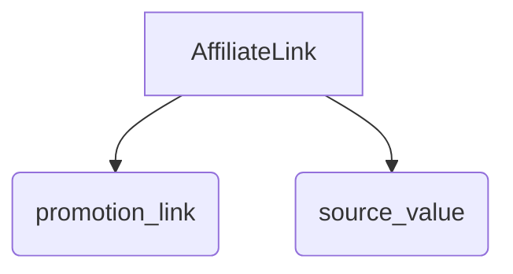
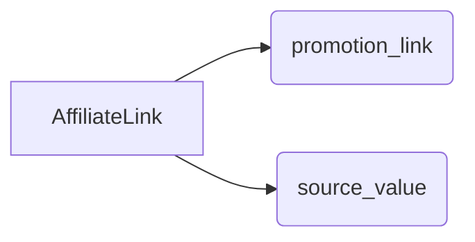

# <input code>

```python
## \file hypotez/src/suppliers/aliexpress/api/models/affiliate_link.py
# -*- coding: utf-8 -*-
#! venv/Scripts/python.exe # <- venv win
## ~~~~~~~~~~~~
""" module: src.suppliers.aliexpress.api.models """
class AffiliateLink:
    promotion_link: str
    source_value: str
```

# <algorithm>

Этот код определяет базовый класс `AffiliateLink` с двумя атрибутами: `promotion_link` (строка) и `source_value` (строка).  По сути, он описывает структуру данных, представляющую аффилиатную ссылку.  Алгоритм очень прост: определение структуры данных.



**Пример:**

```
affiliate_link = AffiliateLink()
affiliate_link.promotion_link = "https://example.com/product?aff=123"
affiliate_link.source_value = "aliexpress_organic"
```

В данном случае, `affiliate_link` будет хранить данные о конкретной аффилиатной ссылке с указанием ее URL и источника.


# <mermaid>



# <explanation>

**Импорты:**  В данном коде нет импортов. Это класс уровня модели, описывающий данные, а не функциональность.  Он использует стандартный синтаксис типов Python 3.  Поэтому нет зависимостей за пределами самого языка Python.


**Классы:**

* **`AffiliateLink`:**  Этот класс представляет собой модель данных, описывающую аффилиатную ссылку. Он предназначен для хранения атрибутов `promotion_link` (ссылка на промо-страницу) и `source_value` (источник ссылки).  В данном коде нет реализации методов, только объявление полей данных.

**Функции:**  Нет функций.

**Переменные:** Нет переменных, помимо самих атрибутов класса.

**Возможные ошибки/улучшения:**

* **Отсутствие валидации:**  Код не проверяет корректность данных, например, что `promotion_link` является валидным URL.  Это можно исправить, добавив валидацию в конструктор или отдельные методы.
* **Отсутствие методов доступа (getters):**  Отсутствуют методы доступа к полям `promotion_link` и `source_value`. Это может быть полезно для управления доступом к данным. Добавление `get_promotion_link()` и `get_source_value()` сделает работу с данными более безопасной.
* **Типизация:** Использование типов (например, `promotion_link: str`) является хорошей практикой, но без реализации проверки корректности значений, они не будут иметь практического смысла при взаимодействии с другими частями проекта.

**Взаимосвязи с другими частями проекта:**  Этот класс вероятно будет использоваться в других модулях проекта для работы с аффилиатными ссылками, например, для сохранения данных о ссылках в базу данных или для формирования отчетов.   Например, модули, работающие с API АлиЭкспресс, могут получать ссылку и создавать экземпляр `AffiliateLink`. Модули, ответственные за хранение данных, могут получать экземпляры этого класса и сохранять информацию. Связи с другими частями проекта не отображены в текущем коде.

**Заключение:**  Код представляет собой простое определение структуры данных.  Дальнейшие разработки должны учитывать возможность валидации, методов доступа, и как эта модель будет использоваться в проекте.