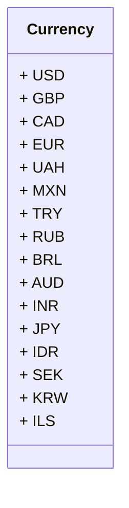

# <input code>

```python
## \file hypotez/src/suppliers/aliexpress/api/models/currencies.py
# -*- coding: utf-8 -*-\
#! venv/Scripts/python.exe # <- venv win
## ~~~~~~~~~~~~~\
""" module: src.suppliers.aliexpress.api.models """
class Currency:
    USD = 'USD'
    GBP = 'GBP'
    CAD = 'CAD'
    EUR = 'EUR'
    UAH = 'UAH'
    MXN = 'MXN'
    TRY = 'TRY'
    RUB = 'RUB'
    BRL = 'BRL'
    AUD = 'AUD'
    INR = 'INR'
    JPY = 'JPY'
    IDR = 'IDR'
    SEK = 'SEK'
    KRW = 'KRW'
    ILS = 'ILS'
```

# <algorithm>

Этот код определяет класс `Currency`, содержащий константы (строковые литералы) для различных валют.  Алгоритм работы чрезвычайно прост: он просто объявляет эти константы внутри класса.  Данные не перемещаются между функциями или методами; они просто декларируются как атрибуты класса.

**Пример:**

```
currency = Currency.USD  # Получение значения USD
```


# <mermaid>



# <explanation>

**Импорты:** Нет импортов. Код не использует внешние модули или классы.

**Классы:**

* **`Currency`:**  Этот класс предназначен для определения и хранения различных валют в виде констант.  Он не содержит методов, только атрибуты (поля). Атрибуты - это сами имена валют (USD, GBP и т.д.) представленные как строковые литералы.

**Функции:** Нет функций.

**Переменные:** Нет переменных, которые изменяются во время выполнения. Есть только константы, хранящие значения валют (например, `Currency.USD`).

**Возможные ошибки или области для улучшений:**

* **Типизация:**  Хотя код использует строковые литералы, добавление типов данных (например, через аннотации типов) могло бы сделать код более ясным и помочь статической проверке типов.  В питоне это не критично, но в других языках это необходимо.

* **Дополняющие методы:**  Вместо хранения просто имен валют, класс `Currency` можно было бы дополнить методами (например, `get_currency_code(currency_name)`), возвращающими ISO-коды валют. Или методами для проверки валидности валюты.  Это расширило бы возможности класса.

* **Использование Enum:**  В Python для представления наборов констант лучше использовать `Enum`, что более стандартизировано и обеспечивает проверку на валидность.


**Цепочка взаимосвязей с другими частями проекта:**

В данном файле определены данные, используемые в модулях, работающих с валютами, которые находятся ниже по иерархии проекта.  Например, это могут быть классы для обработки заказов с AliExpress, где нужно будет использовать корректные коды валют.