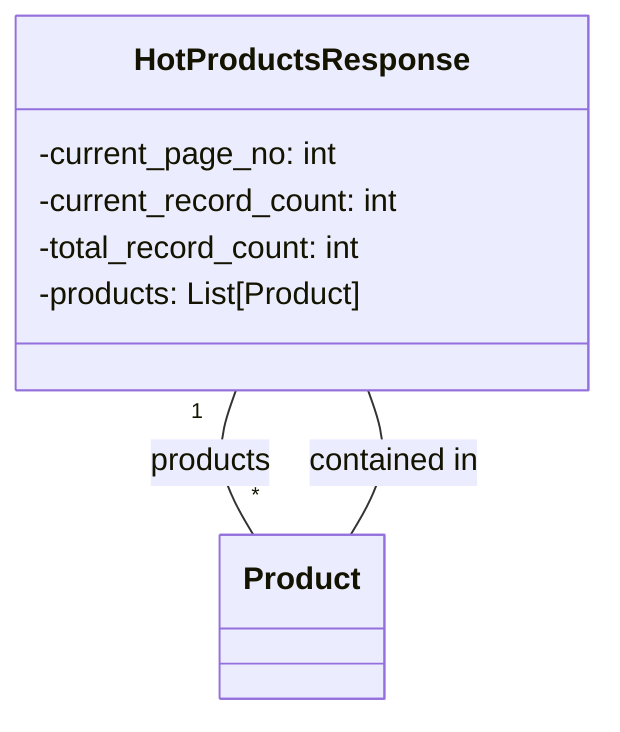

```MD
# Анализ кода файла hypotez/src/suppliers/aliexpress/api/models/hotproducts.py

## <input code>

```python
## \file hypotez/src/suppliers/aliexpress/api/models/hotproducts.py
# -*- coding: utf-8 -*-\
#! venv/Scripts/python.exe # <- venv win
## ~~~~~~~~~~~~~\
""" module: src.suppliers.aliexpress.api.models """
from .product import Product
from typing import List


class HotProductsResponse:
    current_page_no: int
    current_record_count: int
    total_record_count: int
    products: List[Product]
```

## <algorithm>

Алгоритм работы кода прост. Он определяет класс `HotProductsResponse`, который представляет структуру данных для ответа API AliExpress.  Этот класс содержит атрибуты для хранения информации о текущей странице, количестве записей на странице, общем количестве записей и списке продуктов.  По сути, этот код описывает структуру, которая будет использоваться для хранения данных ответа от API.

**Шаг 1:** Импортируются необходимые модули.  В данном случае это модуль `Product` из пакета `.product`.

**Шаг 2:** Определяется класс `HotProductsResponse`.  Этот класс предназначен для представления ответа API, содержащего информацию о горячих товарах.

**Пример использования:**

```python
# Пример заполнения данных
from .product import Product # Предполагается что Product тоже определен
products = [
    Product(name='Продукт 1', price=100),
    Product(name='Продукт 2', price=200)
]
response = HotProductsResponse(
    current_page_no=1,
    current_record_count=2,
    total_record_count=10,
    products=products
)

print(response.products)
```

## <mermaid>




## <explanation>

**Импорты:**

* `from .product import Product`: Импортирует класс `Product` из файла `product.py` в той же директории (`./product.py`).  Это указывает на то, что `HotProductsResponse` предполагается использовать информацию из объекта `Product`.

* `from typing import List`: Импортирует тип `List` из модуля `typing`.  Это позволяет указать, что `products` в `HotProductsResponse` должен быть списком объектов `Product`.


**Классы:**

* `HotProductsResponse`: Этот класс определяет структуру для хранения данных ответа API AliExpress.  Атрибуты `current_page_no`, `current_record_count`, `total_record_count` описывают метаданные ответа (номер страницы, количество товаров на странице, общее количество товаров).  Атрибут `products` хранит список объектов `Product`, описывающих отдельные товары.  Обратите внимание, что в коде нет конструктора. В реальном коде будет присутствовать `__init__` метод для инициализации этих атрибутов.

**Функции:**

Код не содержит функций.  Это всего лишь определение класса.

**Переменные:**

Код не содержит явно объявленных переменных, кроме тех, что являются атрибутами класса `HotProductsResponse`.


**Возможные ошибки и улучшения:**

* **Отсутствует __init__ метод:**  В реальной реализации у класса `HotProductsResponse` должен быть метод `__init__`.  Это важно для корректного создания экземпляров класса.

* **Типизация атрибутов:**  Используется типизация (например, `current_page_no: int`), что хорошо для повышения читабельности и предотвращения ошибок.

* **Обработка ошибок:** Нет обработки ошибок, которые могут возникнуть при взаимодействии с API. В реальных системах это необходимо.


**Взаимосвязи с другими частями проекта:**

Класс `HotProductsResponse` напрямую зависит от класса `Product`.  Это указывает на то, что `product.py` должен определять класс `Product` и содержать атрибуты и методы, необходимые для работы с ним.  Функциональность `HotProductsResponse` без определения `Product` не будет работать, т.к. невозможно обработать ответ API без понимания структуры объектов, которые он содержит.  Далее в цепочке зависимостей идет API взаимодействия с AliExpress, который обеспечивает данные для инициализации `HotProductsResponse`.