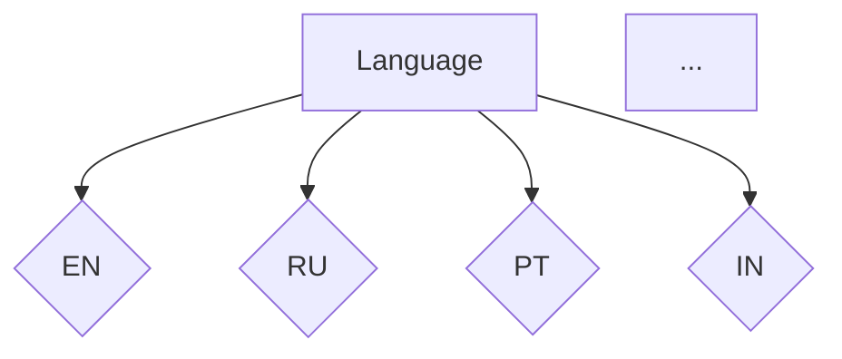
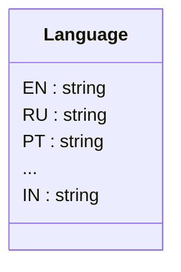

```MD
1. **<input code>**:

```python
## \file hypotez/src/suppliers/aliexpress/api/models/languages.py
# -*- coding: utf-8 -*-
#! venv/Scripts/python.exe # <- venv win
## ~~~~~~~~~~~~~
""" module: src.suppliers.aliexpress.api.models """
class Language:
    EN = 'EN'
    RU = 'RU'
    PT = 'PT'
    ES = 'ES'
    FR = 'FR'
    ID = 'ID'
    IT = 'IT'
    TH = 'TH'
    JA = 'JA'
    AR = 'AR'
    VI = 'VI'
    TR = 'TR'
    DE = 'DE'
    HE = 'HE'
    KO = 'KO'
    NL = 'NL'
    PL = 'PL'
    MX = 'MX'
    CL = 'CL'
    IW = 'IW'
    IN = 'IN'
```

2. **<algorithm>**:

Этот код определяет класс `Language` и внутри него задаёт константы, представляющие языки.  Поскольку это константы, алгоритм работы сводится к их определению.  Нет вычислений или логических операций.  Данные не перемещаются между функциями или методами, так как их нет.



3. **<mermaid>**:



4. **<explanation>**:

* **Импорты**: Нет импортов. Файл определяет собственный класс.

* **Классы**: `Language`: Этот класс определяет набор констант, представляющих различные языки.  Каждый атрибут (например, `Language.EN`) содержит строковое значение, представляющее код языка (например, `'EN'` для английского).  В рамках класса определяются различные языки без каких-либо дополнительных методов.  Возможно, эти значения будут использоваться в других частях проекта (например, для выбора языка интерфейса, перевода текста и т.д.), но сама логика выбора или работы с этими языками в этом файле не прописана.

* **Функции**: Нет функций.

* **Переменные**: Все `EN`, `RU`, и т.д. являются константами, имеющими строковые значения.

* **Возможные ошибки или области для улучшений**:
    * **Отсутствие динамики**:  Константы — это жестко заданные значения. Если в будущем нужно будет добавить языки, придется вручную редактировать код.  Вместо прямого задания констант, предпочтительнее использовать список или словарь для хранения языков, что сделает код более гибким и масштабируемым.
    * **Неясная цель**:  Непонятно, для чего определён этот класс.  Без контекста трудно судить о его полезности.  В идеале, нужно понимать, как этот класс будет использоваться в других частях проекта.

* **Цепочка взаимосвязей с другими частями проекта**:  Поскольку код описывает константы языков, то вероятнее всего, он используется как справочник или набор предопределённых значений для других частей приложения, например, в модулях обработки текстов, для выбора локальных настроек или в контроллерах для запросов к API.  Без дополнительного контекста трудно представить точные связи.

**Выводы**:

Код определяет перечисление языков, что является важной частью для работы с различными языками в приложении. Однако, более гибкое и масштабируемое решение можно реализовать при помощи списков, словарей или перечислений (в зависимости от языка программирования).