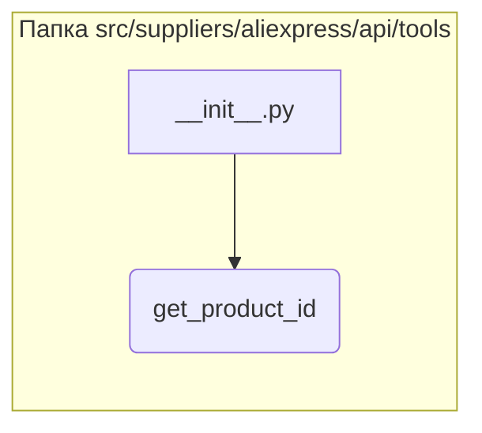

```MD
# Анализ файла hypotez/src/suppliers/aliexpress/api/tools/__init__.py

## <input code>

```python
## \file hypotez/src/suppliers/aliexpress/api/tools/__init__.py
# -*- coding: utf-8 -*-\
#! venv/Scripts/python.exe # <- venv win
## ~~~~~~~~~~~~~\
""" module: src.suppliers.aliexpress.api.tools """
from .get_product_id import get_product_id
```

## <algorithm>

Этот файл является инициализирующим модулем для пакета `tools` в API для AliExpress.  Он импортирует функцию `get_product_id` из модуля `get_product_id`.  Поскольку это инициализирующий файл, он не содержит логики выполнения, а лишь предоставляет доступ к функциям/классам, которые определены в других файлах этого пакета.  В этом случае, логика получения ID продукта реализована в отдельном модуле, который импортируется сюда.  Пошаговая блок-схема:

1. **Импорт:** Модуль `get_product_id` импортируется в текущий модуль.
   * **Пример данных:** Нет конкретных данных, т.к. это импорт, не выполнение.

2. **Инициализация:** Файл инициализируется, предоставляя доступ к функции `get_product_id`.
   * **Пример данных:** Нет конкретных данных, т.к. это инициализация, а не выполнение.


## <mermaid>



## <explanation>

**Импорты:**

Файл `__init__.py` в Python используется для инициализации пакета.  Импорт `from .get_product_id import get_product_id` означает, что модуль `__init__.py` предоставляет доступ к функции `get_product_id`, которая определена в файле `get_product_id.py` внутри той же папки (`src/suppliers/aliexpress/api/tools`).   Это типичный подход для структурирования кода в Python.  Импорт говорит о связи между файлами в этом подпакете.

**Классы:**

В файле нет определений классов.  В нем только импортируются функции.

**Функции:**

Единственная функция, на которую ссылается модуль, - `get_product_id`. Она находится в файле `get_product_id.py`, но описание этой функции отсутствует.  Наличие функции `get_product_id` предполагает, что она принимает какие-то аргументы (вероятно, связанные с AliExpress API) и возвращает идентификатор продукта.

**Переменные:**

Нет переменных.

**Возможные ошибки и улучшения:**

* **Недостающая информация:** Без кода функции `get_product_id` сложно дать подробное описание ее работы.  Не хватает информации о том, как она работает с API AliExpress (какие запросы использует, как обрабатывает результаты).
* **Документация:** Добавьте docstrings (документационные строки) к функции `get_product_id` для большей ясности и удобства использования.
* **Обработка ошибок:** Функция `get_product_id` должна содержать обработку возможных исключений (например, исключения, связанные с запросами к API).


**Цепочка взаимосвязей:**

`get_product_id` скорее всего будет вызываться из других частей проекта (например, из скриптов, которые собирают данные с AliExpress).  Эти вызывающие модули будут использовать функцию `get_product_id` для получения ID продуктов, которые затем будут использоваться в дальнейших операциях (например, для получения описания продукта).

**В заключение:**

Модуль `__init__.py` служит связующим звеном между `get_product_id.py` и остальной частью кодовой базы, позволяя другим частям проекта получать доступ к функциональности по получению ID продукта.  Для более глубокого анализа требуется просмотреть код функции `get_product_id`.