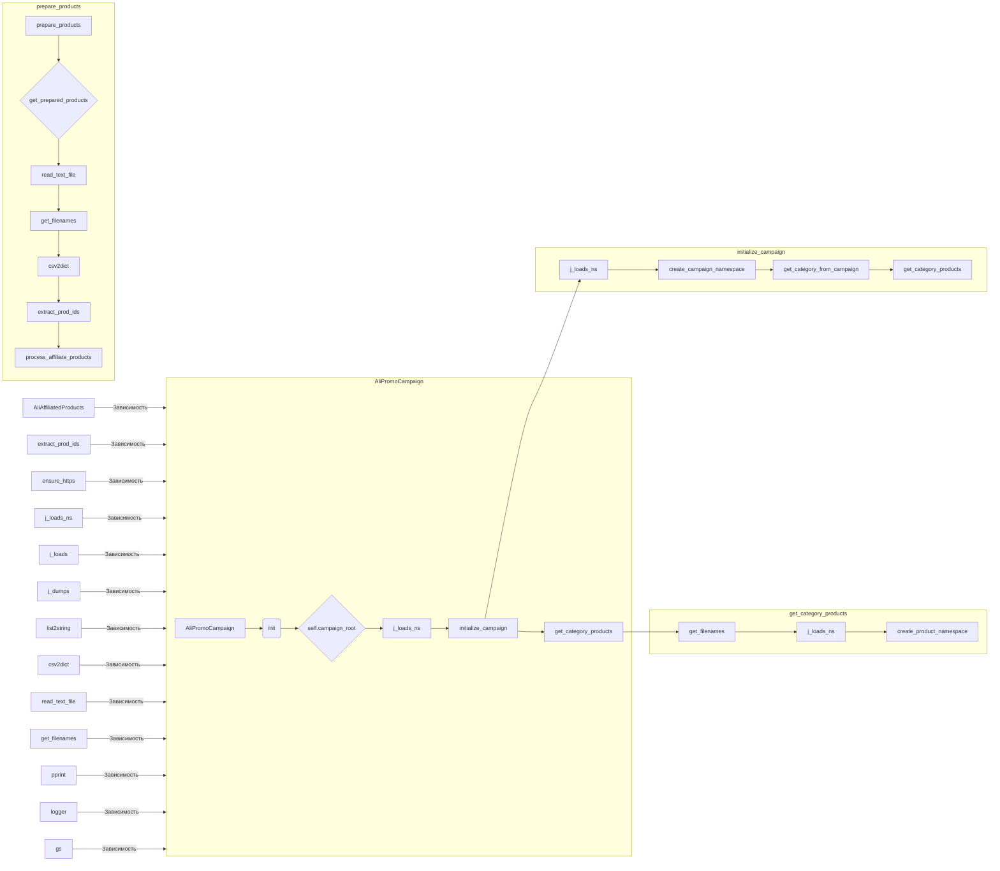

# Анализ кода модуля campaign для AliExpress

### <input code>

```
### Overview

The `campaign` module in the AliExpress system is designed to manage and edit promotional campaigns, interact with Google Sheets for data, and prepare campaign data for use. Below is a high-level overview of the algorithm and workflow within the module.
<pre>
# ... (Код, как в исходном запросе)
</pre>
### <algorithm>

**Блок-схема алгоритма:**

```mermaid
graph TD
    A[Инициализация AliPromoCampaign] --> B{Загрузка данных из JSON};
    B --> C[Создание SimpleNamespace self.campaign];
    C --> D[Получение категории из кампании];
    D --> E[Получение продуктов категории];
    E --> F[Подготовка продуктов];
    F --> G[Обработка данных];
    G --> H[Запись данных (опционально)];
    
    subgraph Получение продуктов категории
        E --> I[Получение файлов .json];
        I --> J[Загрузка данных из файлов .json];
        J --> K[Создание SimpleNamespace для продукта];
        K --> E;
    end

    subgraph Подготовка продуктов
        F --> L[Чтение файла sources.txt];
        L --> M[Чтение файла sources.csv];
        M --> N[Извлечение prod_ids];
        N --> O[Обработка affiliate_products];
        O --> F;
    end


    
```

**Описание блоков:**

* **Инициализация (AliPromoCampaign):**  Создается экземпляр класса `AliPromoCampaign` с параметрами кампании, категории, языка, валюты и флагом обновления. Выполняются операции по определению путей к файлам.
* **Загрузка данных из JSON:** Загружаются данные о кампании из JSON файла.
* **Создание SimpleNamespace self.campaign:** Создается объект `SimpleNamespace` для хранения данных о кампании.
* **Получение категории из кампании:** Извлекается информация о категории из объекта кампании.
* **Получение продуктов категории:** Извлекаются продукты, связанные с категорией. При необходимости происходит обновление.
* **Подготовка продуктов:** Происходит чтение файлов `sources.txt`, `sources.csv`, извлечение `prod_ids` и обработка продуктов.
* **Обработка данных:** Далее происходит обработка данных, подразумевающая потенциальную интеграцию с другими системами.
* **Запись данных:**  Данные могут быть записаны в базу данных, Google Таблицы или другие хранилища.

**Примеры данных:**

- JSON данные содержат информацию о кампании и ее характеристиках.
- Файлы `sources.txt` и `sources.csv` содержат информацию о продуктах.

**Перемещение данных:**

Данные передаются между методами и классами в виде аргументов и атрибутов.  Например, данные о кампании передаются в метод `initialize_campaign`, а затем используются для инициализации атрибутов `self.campaign`.

### <mermaid>



**Объяснение зависимостей:**

Диаграмма показывает, что `AliPromoCampaign` зависит от нескольких других модулей и функций, таких как `AliAffiliatedProducts`, `extract_prod_ids`, `ensure_https`, `j_loads_ns`, `j_loads`, `j_dumps`, `list2string`, `csv2dict`, `read_text_file`, `get_filenames`, `pprint`, `logger` и `gs`.  Эти зависимости указывают на использование функций и классов из других модулей проекта.


### <explanation>

**Импорты:**

Код импортирует модули из стандартной библиотеки Python, типов данных,  модулей проекта `src`, утилит для работы с JSON, преобразования данных, файлами, логгирования и т.д. Это типичная структура для проекта, где модули `src` организованы по функциональным областям (поставщики, утилиты, настройки).

**Классы:**

- `AliPromoCampaign`: Основной класс для управления кампаниями.  Он хранит информацию о кампании, категории, языке и валюте. Методы класса позволяют загружать данные, получать продукты, подготавливать данные для дальнейшей обработки.

**Функции:**

- `j_loads_ns`, `j_loads`: Утилиты для разбора JSON. Различие между ними (скорее всего) заключается в том, что `j_loads_ns` возвращает `SimpleNamespace`, а `j_loads` — обычный словарь.
- `create_campaign_namespace`, `create_product_namespace`:  Функции создают `SimpleNamespace` для хранения данных о кампаниях и продуктах.  Это удобно для доступа к данным по имени атрибутов.
- `get_filenames`, `read_text_file`, `csv2dict`: Функции для работы с файлами, чтение данных из файлов, преобразование данных из CSV в словарь.
- `get_category_products`, `get_category_from_campaign`:  Методы класса для получения продуктов и категории кампании.
- `extract_prod_ids`: Функция, вероятно, извлекающая идентификаторы продуктов из некоторого источника данных.
- `process_affiliate_products`: Функция, обрабатывающая данные о связанных продуктах.


**Переменные:**

Переменные в коде представляют пути к файлам, данные кампании, категории и продукты.   Переменные часто являются атрибутами класса `AliPromoCampaign`.

**Возможные ошибки и улучшения:**

* **Обработка ошибок:** Не хватает обработки ошибок (например, при чтении файлов, парсинге JSON, отсутствии атрибутов). Это может привести к сбою приложения.
* **Логирование:** Важно добавить логгирование, чтобы отслеживать ошибки и успехи.
* **Тестирование:** Необходимо добавить тесты для проверки корректности работы функций и методов.
* **Модульность:** Можно улучшить модульность, вынося некоторые функции в отдельные файлы.
* **Документация:** Документация должна быть более подробной и содержать примеры использования.


**Цепочка взаимосвязей:**

Модуль `campaign` зависит от модулей `src.suppliers.aliexpress`, `src.utils`, `src.logger`, `src.settings`. Данные из внешних источников (например, Google Sheets) используются для заполнения и обновления данных кампании.  Результатом работы модуля `campaign` может быть подготовка данных для других модулей проекта, таких как рекламные кампании.