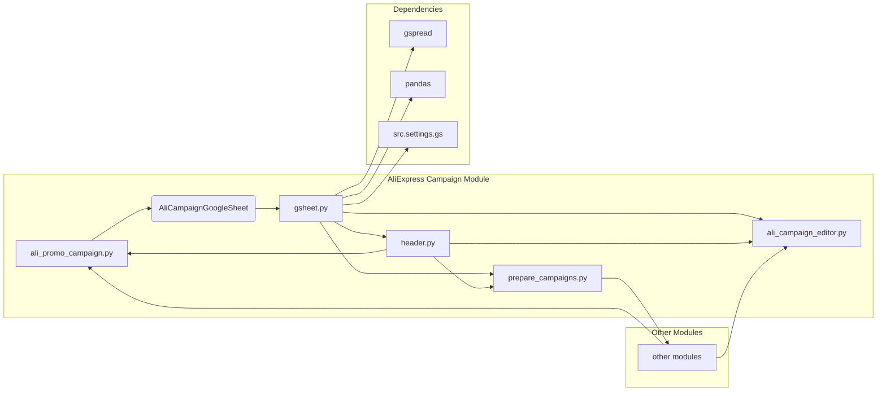

# Анализ кода модуля AliExpress кампаний

## <input code>

```
campaign/                                   # AliExpress campaign management module
├── __init__.py                             # Initializes the campaign module
├── ali_campaign_editor.py                  # Main logic for editing AliExpress campaigns
├── ali_promo_campaign.py                   # Manages promotional campaigns for AliExpress
│   ├── Dependencies:
│   │   └── from src.suppliers.aliexpress import AliCampaignGoogleSheet
├── gsheet.py                               # Handles interactions with Google Sheets for campaign data
│   ├── Dependencies:
│   │   └── gspread
│   │   └── pandas
│   │   └── src.settings.gs
├── header.py                               # Common functions or classes used across the campaign module
├── prepare_campaigns.py                    # Sets up and organizes necessary data for campaigns
├── ttypes.py                               # Defines types and structures used in the campaign module
├── version.py                              # Contains version information for the campaign module
├── _docs/                                  # Documentation directory
│   ├── campaign.md                         # Documentation for the campaign module
│   ├── code_instructions.md                # Instructions for coding and using the campaign module
│   ├── startup_optioins.md                 # Provides information on startup options for the campaign module
├── _dot/                                   # Graphical representations in DOT format
│   ├── aliexpress_campaign.dot             # DOT file representing the structure of the AliExpress campaign
├── _examples/                              # Example scripts directory
│   ├── _examle_prepare_campains.py         # Example script for preparing campaigns
│   ├── _example_ali_promo_campaign.py      # Example script for AliExpress promotional campaigns
│   ├── _example_edit_campaign.py           # Example script for editing campaigns
│   ├── header.py                           # Header example showing common imports and settings
├── _mermaid/                               # Graphical representations in Mermaid format
│   ├── AliAffiliatedProducts.mer           # Mermaid diagram file for affiliated products
│   ├── aliexpress_campaign.mer             # Mermaid diagram file for AliExpress campaign
├── _pytest/                                # Test scripts directory
│   ├── guide_test.md                       # Guide for testing the campaign module
│   ├── test_alipromo_campaign.py           # Test script for the ali_promo_campaign module
│   ├── test_campaign_integration.py        # Test script for integration testing of the campaign module
│   ├── test_edit_capmaign.py               # Test script for editing campaigns
│   ├── test_prepeare_campaigns.py          # Test script for preparing campaigns
```

## <algorithm>

(В данном случае алгоритм сложно описать в виде пошаговой блок-схемы, так как нет исходного кода.  Мы можем только сделать предположения на основе структуры.)

Модуль `campaign` отвечает за управление кампаниями на AliExpress.  Предположительно, он состоит из нескольких компонентов:

* **`ali_promo_campaign.py`**:  Управление рекламными кампаниями. Использует `AliCampaignGoogleSheet` для работы с данными в Google Таблицах.
* **`gsheet.py`**: Обработка данных из Google Таблиц (с использованием библиотек `gspread` и `pandas`).
* **`ali_campaign_editor.py`**: Редактирование кампаний.
* **`prepare_campaigns.py`**: Подготовка данных для кампаний.
* **`header.py`**: Содержит общие функции и классы для других файлов модуля.

Данные об AliExpress кампаниях перемещаются между компонентами через переменные, аргументы функций и возможно объекты классов.

## <mermaid>



## <explanation>

**Импорты:**

* `from src.suppliers.aliexpress import AliCampaignGoogleSheet`: Импортирует класс `AliCampaignGoogleSheet` из модуля `aliexpress` (предположительно, внутри папки `src`).  Это показывает зависимость модуля управления кампаниями от модуля работы с данными AliExpress.
* `gspread`, `pandas`: Библиотеки, необходимые для взаимодействия с Google Таблицами и обработки данных.  Они импортируются в модуль `gsheet.py`.
* `src.settings.gs`: Предположительно, файл с настройками, необходимыми для доступа к Google Таблицам.


**Классы:**

* `AliCampaignGoogleSheet`: Вероятно, класс для взаимодействия с Google Таблицами, содержащий методы для получения и обновления данных, связанных с кампаниями AliExpress.


**Функции:**

Подробную функциональность функций без кода определить сложно. Но по именам файлов можно предположить:

* `ali_promo_campaign.py`: Функции для работы с рекламными кампаниями.
* `gsheet.py`: Функции для работы с Google Таблицами (чтение, запись, обработка данных).
* `ali_campaign_editor.py`: Функции для редактирования кампаний.
* `prepare_campaigns.py`: Функции для подготовки данных.


**Переменные:**

Без исходного кода сложно определить типы и использование переменных. Но очевидно, что переменные хранят данные о кампаниях, которые передаются между функциями и классами.


**Возможные ошибки и улучшения:**

* **Отсутствие документирования:**  Хотя присутствуют файлы `.md`,  подробные комментарии к коду существенно улучшили бы читаемость и понимание его работы.
* **Неявное использование ресурсов:**  Если модуль `gsheet` взаимодействует с Google Таблицами, важно позаботиться о правильном управлении ресурсами (например, закрытии соединений с Google Sheets).
* **Сложность модуля `gsheet`:**  Модуль `gsheet`  имеет внешние зависимости (`gspread`, `pandas`) и импорты из `settings`, что делает его более сложным, но и более гибким в использовании.


**Взаимосвязь с другими частями проекта:**

Модуль `campaign` зависит от других модулей, таких как `aliexpress`, `settings` и библиотек `gspread` и `pandas`.  Наличие дополнительных файлов `_docs`, `_dot` и `_mermaid` говорит о том, что разработчики стараются сохранить структуру и документирование проекта.

**Примечание:**  Для более глубокого анализа необходим исходный код.