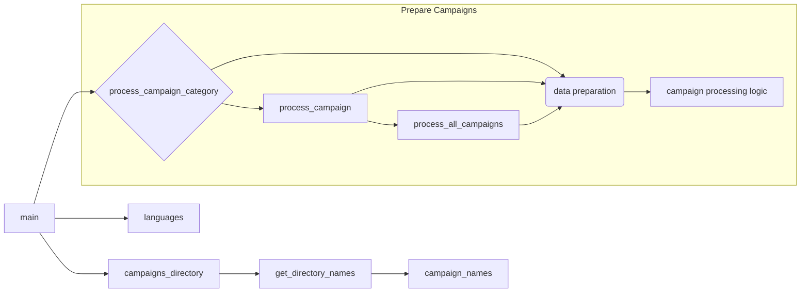

# <input code>

```python
## \file hypotez/src/suppliers/aliexpress/campaign/_examples/_examle_prepare_campains.py
# -*- coding: utf-8 -*-
#! venv/Scripts/python.exe
#! venv/bin/python/python3.12

"""
.. module: src.suppliers.aliexpress.campaign._examples 
	:platform: Windows, Unix
	:synopsis:

"""
MODE = 'dev'

"""
	:platform: Windows, Unix
	:synopsis:

"""


"""
	:platform: Windows, Unix
	:synopsis:

"""


"""
  :platform: Windows, Unix

"""
"""
  :platform: Windows, Unix
  :platform: Windows, Unix
  :synopsis:
"""MODE = 'dev'
  
""" module: src.suppliers.aliexpress.campaign._examples """


from ..prepare_campaigns import *

# Example 1: Process a Single Campaign Category
process_campaign_category("SummerSale", "Electronics", "EN", "USD", force=True)

# Example 2: Process a Specific Campaign
process_campaign("WinterSale", categories=["Clothing", "Toys"], language="EN", currency="USD", force=False)

# Example 3: Process All Campaigns
process_all_campaigns(language="EN", currency="USD", force=True)


campaigns_directory = Path(gs.path.google_drive,'aliexpress','campaigns')
campaign_names = get_directory_names(campaigns_directory)
languages = {'EN': 'USD', 'HE': 'ILS', 'RU': 'ILS'}
```

# <algorithm>

Этот код содержит примеры вызова функций для подготовки кампаний AliExpress.  Алгоритм состоит из следующих шагов:

1. **Импорты**:  Импортируются необходимые функции из модуля `prepare_campaigns` внутри пакета `aliexpress.campaign`.
2. **Вызовы функций**:
   - `process_campaign_category()`: Обрабатывает определённую категорию кампании. Пример: Обработка категории "Electronics" для кампании "SummerSale".
   - `process_campaign()`: Обрабатывает определённую кампанию. Пример: Обработка кампании "WinterSale" с категориями "Clothing" и "Toys".
   - `process_all_campaigns()`: Обрабатывает все кампании. Пример: Обработка всех кампаний с языком "EN" и валютой "USD".
3. **Получение данных о кампаниях**:  Код создаёт переменную `campaigns_directory` , содержащую путь к директории кампаний на Google Drive. Затем `get_directory_names()` получает имена кампаний из этой директории.  Также инициализируются значения `languages`.
4. **Выполнение (непосредственное):** После определения директории и получения имен кампаний, код, скорее всего, передаёт эти данные в функции `process_campaign_category`, `process_campaign` или `process_all_campaigns` для выполнения самих операций подготовки кампаний.

**Пример данных:**

- `campaigns_directory`:  `/path/to/google/drive/aliexpress/campaigns`
- `campaign_names`: `['SummerSale', 'WinterSale', ...]`
- `languages`: {'EN': 'USD', 'HE': 'ILS', 'RU': 'ILS'}


# <mermaid>



**Объяснение диаграммы:**

Главная функция `main` вызывает функции `process_campaign_category`, `process_campaign` и `process_all_campaigns`. Эти функции, вероятно, используют данные о кампаниях, полученные из `campaigns_directory` (имя кампании) и `languages` (язык, валюта) для подготовки кампаний. Внутри `prepare_campaigns` логика обработки данных должна вызываться.

# <explanation>

* **Импорты**: `from ..prepare_campaigns import *` импортирует все функции из модуля `prepare_campaigns`, находящегося в папке `..prepare_campaigns` относительно текущего файла. Это типичная структура импортов Python, когда модуль находится в подпапке, использующей относительный путь `..` для доступа к родительской папке. 

* **Классы**: Нет явных классов. Код использует функции.

* **Функции**: Код содержит примеры вызова функций:
    - `process_campaign_category()`, `process_campaign()`, `process_all_campaigns()`: Эти функции, вероятно,  осуществляют запрос к API AliExpress (или другой системе), извлечение данных о кампаниях, манипулирование ими, сохранение результата в хранилище (базу данных, файл и т.д.).  Подробная функциональность содержится внутри `prepare_campaigns`.
    - `get_directory_names()`:  Функция, которая получает список имён файлов или подпапок из указанной директории.  `gs.path.google_drive` – это, вероятно,  путь к Google Drive, определённый в другом модуле (`gs`).

* **Переменные**:
    - `MODE = 'dev'`: Вероятно, переменная для определения режима работы (разработка, продакшн).
    - `campaigns_directory`: Путь к директории кампаний на Google Drive.
    - `campaign_names`: Список имён кампаний.
    - `languages`: Словарь для соответствия языка и валюты.

* **Возможные ошибки/улучшения**:
    - Отсутствие обработки ошибок: Нет проверки того, существуют ли директории/файлы, или корректны ли данные. Следует добавить обработку исключений (try-except блоки) для повышения отказоустойчивости.
    - Неясная логика: Необходимо дополнительно изучить код из `prepare_campaigns` для понимания полного алгоритма подготовки кампаний.
    - Нехватка документации: Недостаточно комментариев внутри функций `process_campaign_category`, `process_campaign`, `process_all_campaigns` для объяснения, что именно эти функции делают.
    - `gs.path.google_drive`: Непонятно, откуда берётся и как используется `gs.path.google_drive`.  Требуется дополнительная информация об этом модуле (`gs`).


**Цепочка взаимосвязей**:

Код взаимодействует с модулями `prepare_campaigns`, `gs`, скорее всего, с системами хранения данных (Google Drive) и, вероятно, с сервисом API AliExpress для получения и обработки данных о кампаниях.