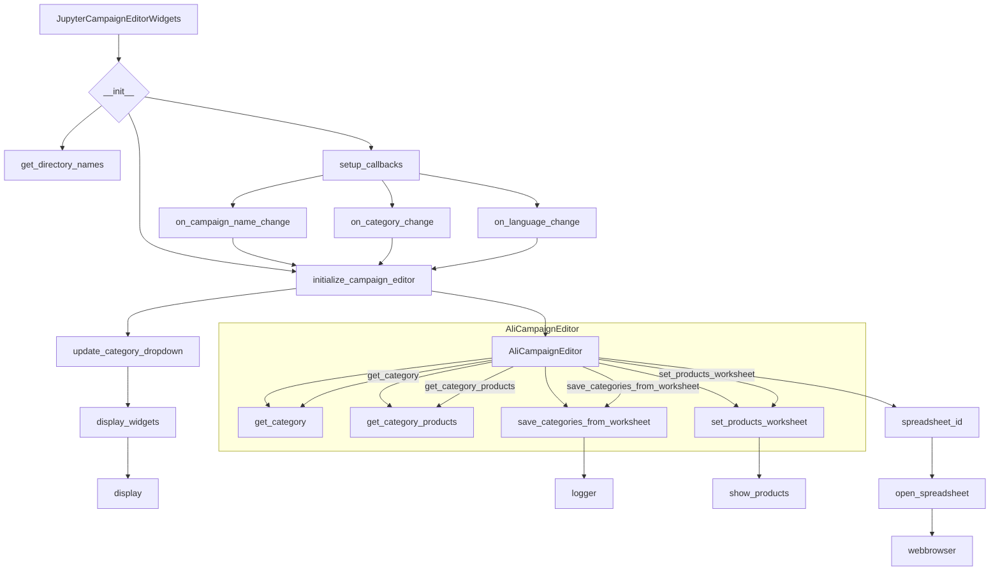

```MD
# <input code>

```python
## \file hypotez/src/suppliers/aliexpress/campaign/ali_campaign_editor_jupyter_widgets.py
# -*- coding: utf-8 -*-\
#! venv/Scripts/python.exe
#! venv/bin/python/python3.12

"""
.. module: src.suppliers.aliexpress.campaign 
	:platform: Windows, Unix
	:synopsis: Jupyter widgets for the AliExpress campaign editor.

This module contains widgets for managing AliExpress campaigns in Jupyter notebooks.

Testfile:
    file test_ali_campaign_editor_jupyter_widgets.py

"""
MODE = 'dev'


from types import SimpleNamespace
import header
from pathlib import Path
from ipywidgets import widgets
from IPython.display import display
import webbrowser

from src import gs
from src.suppliers.aliexpress.campaign import AliCampaignEditor
from src.suppliers.aliexpress.utils import locales
from src.utils import pprint, get_directory_names
from src.logger import logger

class JupyterCampaignEditorWidgets:
    """Widgets for the AliExpress campaign editor.

    This class provides widgets for interacting with and managing AliExpress campaigns,
    including selecting campaigns, categories, and languages, and performing actions such as
    initializing editors, saving campaigns, and showing products.

    Example:
        >>> editor_widgets: JupyterCampaignEditorWidgets = JupyterCampaignEditorWidgets()
        >>> editor_widgets.display_widgets()
    """

    # Class attributes declaration
    language: str = None
    currency: str = None
    campaign_name: str = None
    category_name: str = None
    category:SimpleNamespace = None
    campaign_editor: AliCampaignEditor = None
    products:list[SimpleNamespace] = None
    def __init__(self):
        """Initialize the widgets and set up the campaign editor.

        Sets up the widgets for selecting campaigns, categories, and languages. Also sets up
        default values and callbacks for the widgets.
        """
        self.campaigns_directory:str = Path(
            gs.path.google_drive, "aliexpress", "campaigns"
        )
        
        if not self.campaigns_directory.exists():
            raise FileNotFoundError(
                f"Directory does not exist: {self.campaigns_directory}"
            )

        #self.languages = {"EN": "USD", "HE": "ILS", "RU": "ILS"}
        self.campaign_name_dropdown = widgets.Dropdown(
            options = get_directory_names(self.campaigns_directory),
            description = "Campaign Name:",
        )
        self.category_name_dropdown = widgets.Dropdown(
            options=[], description="Category:"
        )
        self.language_dropdown = widgets.Dropdown(
            options=[f"{key} {value}" for locale in locales for key, value in locale.items()],
            description="Language/Currency:",
        )
        # ... (rest of the class definition)
```

# <algorithm>

**Шаг 1:** Инициализация `JupyterCampaignEditorWidgets`.

   - Создаются виджеты (`Dropdown`, `Button`) для выбора кампании, категории, языка/валюты и действий.
   - Устанавливаются начальные значения и обработчики событий (callbacks) для виджетов.
   - Обрабатывается потенциальная ошибка `FileNotFoundError`, если директория кампаний не существует.
   - Вызывается `initialize_campaign_editor(None)` для инициализации с первым доступным значением.


**Шаг 2:** `initialize_campaign_editor(self, _)`.

   - Получает выбранные значения из виджетов для кампании, категории и языка/валюты.
   - Если имя кампании выбрано, обновляет список категорий в виджете `category_name_dropdown`.
   - Создает экземпляр класса `AliCampaignEditor`, передавая выбранные значения.
   - Если выбрана категория, получает категорию и продукты из `AliCampaignEditor`.
   - В случае отсутствия имени кампании выводит предупреждение.


**Шаг 3:** Обработка событий (callbacks).

    - `on_campaign_name_change`, `on_category_change`, `on_language_change`: Переустанавливают значения атрибутов класса и вызывают `initialize_campaign_editor` при изменении выбранных значений, для обновления состояния виджетов.

**Шаг 4:** `save_campaign(self, _)`.

   - Сохраняет выбранные данные в `AliCampaignEditor`.
   - Вызывает метод `save_categories_from_worksheet` в `AliCampaignEditor` для сохранения данных в Google Таблицу.
   - Обрабатывает потенциальные исключения (`except Exception as ex`).


**Шаг 5:** `show_products(self, _)`.

   - Получает выбранные значения кампании и категории.
   - Создает экземпляр `AliCampaignEditor`, передавая выбранную кампанию, язык и валюту.
   - Вызывает метод `set_products_worksheet` в `AliCampaignEditor` для получения и отображения продуктов.


**Шаг 6:** `open_spreadsheet(self, _)`.

   - Отправляет ссылку на Google Таблицу в браузер, используя `webbrowser.open()`.
   - Если редактор кампании не инициализирован, выводит сообщение об ошибке.


**Шаг 7:** `setup_callbacks(self)`.

   - Устанавливает обработчики событий для всех виджетов.


**Шаг 8:** `display_widgets(self)`.

   - Отображает все виджеты в Jupyter Notebook.
   - Вызывает `initialize_campaign_editor` для инициализации с выбранным по умолчанию значением кампании.


**Пример перемещения данных:** Пользователь выбирает кампанию "SummerSale" в `campaign_name_dropdown`. Это вызывает `on_campaign_name_change`, который устанавливает `self.campaign_name = "SummerSale"` и вызывает `update_category_dropdown`. `update_category_dropdown` обновляет список категорий в `category_name_dropdown`, после чего `initialize_campaign_editor` обновляет значения и создает новый экземпляр `AliCampaignEditor` с новыми данными.

# <mermaid>



**Объяснение зависимостей:**

- `src.gs`:  Вероятно, содержит конфигурацию доступа к Google Drive.
- `src.suppliers.aliexpress.campaign.AliCampaignEditor`: Класс для работы с редактированием кампаний на AliExpress.
- `src.suppliers.aliexpress.utils.locales`: Список доступных языков и валют (возможно, загружается из файла).
- `src.utils.pprint`:  Функция для красивой печати данных (обычно для отладки).
- `src.utils.get_directory_names`: Функция для получения списка имен каталогов.
- `src.logger`:  Модуль для логирования (например, запись ошибок).
- `ipywidges`: Библиотека для создания интерактивных виджетов в Jupyter.
- `IPython.display`: Модуль для отображения результатов в Jupyter.
- `pathlib`: Для работы с путями к файлам.
- `webbrowser`: Для открытия ссылок в браузере.


# <explanation>

**Импорты:**

- `header`: Предположительно, содержит собственные импорты, необходимые для работы проекта.
- `pathlib`: Обеспечивает удобный способ работы с файловыми путями.
- `ipywidges`: Предоставляет инструменты для создания интерактивных элементов управления (виджетов) в Jupyter Notebook.
- `IPython.display`:  Обеспечивает вывод различных объектов (например, виджетов) в Jupyter.
- `webbrowser`:  Для запуска браузера.
- `gs`: (из `src.gs`) - вероятно, модуль для взаимодействия с Google Drive.
- `AliCampaignEditor`: (из `src.suppliers.aliexpress.campaign`) - класс для работы с редактированием кампаний AliExpress.
- `locales`: (из `src.suppliers.aliexpress.utils`) - предоставляет информацию о доступных языках и валютах.
- `pprint`: (из `src.utils`) - для форматированного вывода информации (вероятно, для отладки).
- `get_directory_names`: (из `src.utils`) - для получения списка имен каталогов в указанной директории.
- `logger`: (из `src.logger`) - модуль для ведения журнала событий и ошибок.

**Классы:**

- `JupyterCampaignEditorWidgets`: Этот класс предоставляет набор виджетов для взаимодействия с кампаниями AliExpress в Jupyter Notebook. Он управляет отображением, выбором кампаний, категорий, языков/валют и выполнением действий (сохранение, отображение продуктов, открытие Google таблицы).  Класс содержит атрибуты для хранения состояния (выбранная кампания, категория, язык, валюта, редактор кампании) и методов, связанных с взаимодействием с виджетами (обновление списков категорий, инициализация редактора, сохранение, отображение продуктов).


**Функции:**

- `initialize_campaign_editor`: Инициализирует `AliCampaignEditor` на основе выбранных пользователем данных.
- `update_category_dropdown`: Обновляет список доступных категорий в зависимости от выбранной кампании.
- `on_campaign_name_change`, `on_category_change`, `on_language_change`: Обрабатывают события изменения выбранных значений в виджетах, переинициализируя редактор кампании.
- `save_campaign`: Сохраняет текущую кампанию и её категории в Google Таблицу.
- `show_products`: Отображает продукты выбранной категории.
- `open_spreadsheet`: Открывает Google таблицу в браузере.
- `setup_callbacks`: Настраивает обработчики событий для виджетов.
- `display_widgets`: Отображает все созданные виджеты в Jupyter Notebook.

**Переменные:**

- `MODE`: Значение константы. Вероятно, используется для управления режимом работы (например, `dev`, `prod`).
- `campaigns_directory`: Путь к каталогу кампаний.

**Возможные ошибки и улучшения:**

- Нет обработки ошибок при взаимодействии с Google Spreadsheet API (если используется).
- Может потребоваться более подробная обработка исключений (например, `ValueError` если выбран некорректный язык).
- Необходимо добавить валидацию вводимых данных (например, проверка на пустые значения).
- Вместо `get_directory_names` предпочтительнее использовать методы `pathlib` для получения списка каталогов.

**Взаимосвязь с другими частями проекта:**

Код напрямую использует `AliCampaignEditor` (из `src.suppliers.aliexpress.campaign`),  `gs.path.google_drive`, `locales`, `pprint`, `get_directory_names`, `logger`.  Это указывает на то, что этот код часть более крупной системы для управления кампаниями на AliExpress, которая использует Google Таблицы.