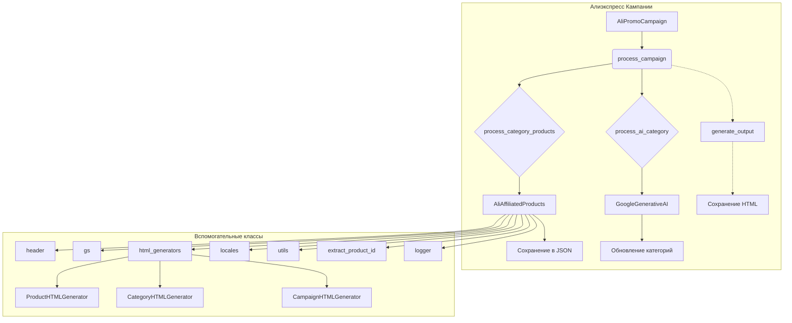

# Анализ кода `ali_promo_campaign.py`

## <input code>

```python
# ... (код из файла)
```

## <algorithm>

Алгоритм работы модуля `ali_promo_campaign.py` заключается в управлении рекламными кампаниями на AliExpress.  Он включает загрузку, обработку данных, создание и редактирование JSON-файлов, а также использование AI для генерации информации.

**Шаг 1:** Инициализация `AliPromoCampaign`.
    * Принимает имя кампании, язык и валюту.
    * Проверяет существование файла JSON с данными кампании.
    * Если файл не найден, запускает процесс создания новой кампании (`process_new_campaign`).
    * Инициализирует языковые и валютные параметры.
    * Инициализирует модели AI (`gemini`, `openai`).
    * **Пример:** `campaign = AliPromoCampaign("new_campaign", "EN", "USD")`

**Шаг 2:** Обработка кампании (`process_campaign`).
    * Ищет категории в директории `category`.
    * Для каждой категории вызывает `process_category_products` и `process_ai_category`.
    * **Пример:** `campaign.process_campaign()`

**Шаг 3:** Обработка товаров в категории (`process_category_products`).
    * Читает список идентификаторов продуктов из файлов в директории `sources`.
    * Использует `AliAffiliatedProducts` для получения информации о партнерских продуктах.
    * Сохраняет данные о продуктах в JSON-файлы.
    * **Пример:** `products = campaign.process_category_products("electronics")`

**Шаг 4:** Обработка категории с использованием AI (`process_ai_category`).
    * Использует загруженные данные о товарах, чтобы сформулировать запрос к AI модели.
    * Получает ответ от AI.
    * Обновляет данные категории в кампании.
    * **Пример:** `campaign.process_ai_category("electronics")`


**Шаг 5:** Создание новой кампании (`process_new_campaign`).
    * Создаёт структуру директорий и файлов для новой кампании.
    * Заполняет данные кампании, категорий и товаров.
    * **Пример:** `campaign.process_new_campaign(campaign_name="HolidaySale", language="RU", currency="ILS")`

**Шаг 6:** Генерация HTML (`generate_output`, `generate_html`, `generate_html_for_campaign`).
    * Форматирует данные о товарах для генерации HTML страниц.
    * Создаёт HTML файлы для каждой категории и для корневого индекса кампании.
    * **Пример:**  `await campaign.generate_output("CampaignName", category_path, products_list)`

Данные передаются между функциями и классами через аргументы и атрибуты объектов.  Например, данные о кампании хранятся в объекте `AliPromoCampaign`, и различные функции используют эти данные для обработки.

## <mermaid>



**Описание диаграммы:**

* `AliPromoCampaign` - главный класс, управляющий кампанией.
* `process_campaign`, `process_category_products`, `process_ai_category` - ключевые методы обработки.
* `AliAffiliatedProducts`, `GoogleGenerativeAI` - классы, используемые для взаимодействия с API AliExpress и AI.
* `html_generators` - модуль, содержащий классы для генерации HTML.
* Зависимости показаны стрелками.  Например, `AliPromoCampaign` использует `AliAffiliatedProducts`.

## <explanation>

**Импорты:** Модуль импортирует необходимые библиотеки и классы из различных модулей `src`. Это указывает на модульную структуру проекта.  Например, импорт `from src import gs` подразумевает, что модуль `gs` предоставляет полезные функции для работы с Google Drive. Импорт из `src.suppliers.aliexpress`, `src.ai`, `src.utils` показывает, что проект использует разделение по поставщикам, AI-моделям и утилитам соответственно.

**Классы:**

* `AliPromoCampaign`: Класс для управления рекламной кампанией. Хранит данные о кампании, языке, валюте, пути, использует модели AI. `__init__` инициализирует кампанию, проверяет наличие данных, обрабатывает новые кампании. `process_campaign` и `process_ai_category` - функции для обработки кампании и категорий с помощью AI. `process_category_products` - функция для обработки товаров в категории.


**Функции:**  Каждая функция имеет четкое назначение: чтение данных из файлов, обработка данных, генерация JSON или HTML, взаимодействие с внешними API.

**Переменные:**  Переменные хранят данные о кампании, категории, товарах, AI-модели, пути к файлам.

**Возможные ошибки и улучшения:**

* **Обработка ошибок:** Некоторые функции (например, чтение файлов) не содержат полной обработки возможных ошибок (исключений). Добавление более подробной обработки исключений (например, `try...except`) значительно улучшит надёжность кода.
* **Чёткое разделение ответственности:** Некоторые функции (`process_ai_category`, `process_category_products`) слишком многофункциональны. Разбиение этих функций на более мелкие, специализированные функции, сделает код более модульным и понятным.
* **Переменные конфигурации:** Для параметров модели AI (например, `assistant_id`) лучше использовать отдельный файл конфигурации (например, `.env`), а не жестко задавать значения в коде.
* **Документация:** Дополнительная документация, особенно к вспомогательным функциям, сделает код более доступным для понимания.
* **Асинхронность:**  Использование `asyncio` для `process_affiliate_products` предполагает асинхронную обработку.  Однако, в `generate_output` нет явного `await` перед вызовом `save_product_titles`, `save_promotion_links` и `generate_html`.  Это может привести к проблемам.  Необходимо убедиться, что соответствующие функции также асинхронны, если предполагается одновременная обработка.

**Взаимосвязи с другими частями проекта:** Проект использует множество модулей из пакета `src`.  Наличие модулей `gs`, `logger`, `jjson`, `convertors` и др. подразумевает, что проект имеет четкую структуру и модульное разделение ответственности.

**Общее:** Код представляет собой сложную систему управления данными рекламных кампаний с использованием AI.  Однако, для улучшения его качества и поддерживаемости, стоит придерживаться принципов SOLID (например, принципы разделения ответственности, единственной ответственности).