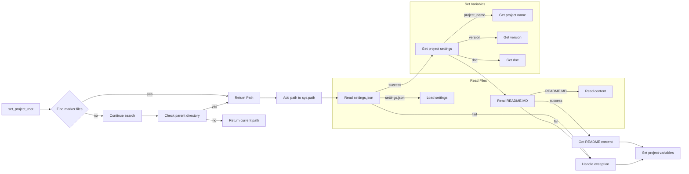

# <input code>

```python
## \file hypotez/src/suppliers/aliexpress/campaign/header.py
# -*- coding: utf-8 -*-\
#! venv/Scripts/python.exe
#! venv/bin/python/python3.12

"""
.. module: src.suppliers.aliexpress.campaign 
	:platform: Windows, Unix
	:synopsis:

"""
MODE = 'dev'


from pathlib import Path
def set_project_root(marker_files=('pyproject.toml', 'requirements.txt', '.git')) -> Path:
    """!
    Finds the root directory of the project starting from the current file's directory,
    searching upwards and stopping at the first directory containing any of the marker files.

    Args:
        marker_files (tuple): Filenames or directory names to identify the project root.
    
    Returns:
        Path: Path to the root directory if found, otherwise the directory where the script is located.
    """
    __root__:Path
    current_path:Path = Path(__file__).resolve().parent
    __root__ = current_path
    for parent in [current_path] + list(current_path.parents):
        if any((parent / marker).exists() for marker in marker_files):
            __root__ = parent
            break
    if __root__ not in sys.path:
        sys.path.insert(0, str(__root__))
    return __root__


# Get the root directory of the project
__root__ = set_project_root()
"""__root__ (Path): Path to the root directory of the project"""

import sys
import json
from src import gs

settings:dict = None
try:
    with open(gs.path.root / 'src' /  'settings.json', 'r') as settings_file:
        settings = json.load(settings_file)
except (FileNotFoundError, json.JSONDecodeError):
    ...

doc_str:str = None
try:
    with open(gs.path.root / 'src' /  'README.MD', 'r') as settings_file:
        doc_str = settings_file.read()
except (FileNotFoundError, json.JSONDecodeError):
    ...


__project_name__ = settings.get("project_name", 'hypotez') if settings  else 'hypotez'
__version__: str = settings.get("version", '')  if settings  else ''
__doc__: str = doc_str if doc_str else ''
__details__: str = ''
__author__: str = settings.get("author", '')  if settings  else ''
__copyright__: str = settings.get("copyrihgnt", '')  if settings  else ''
__cofee__: str = settings.get("cofee", "Treat the developer to a cup of coffee for boosting enthusiasm in development: https://boosty.to/hypo69")  if settings  else "Treat the developer to a cup of coffee for boosting enthusiasm in development: https://boosty.to/hypo69"
```

# <algorithm>

**Шаг 1:** Определение корневой директории проекта.
* Функция `set_project_root` ищет корень проекта, начиная с текущей директории.
* Она проверяет наличие файлов `pyproject.toml`, `requirements.txt` и `.git` в текущей и родительских директориях.
* Если какой-либо из этих файлов найден, функция возвращает путь к этой директории. В противном случае возвращает путь к текущей директории.
* Путь добавляется в sys.path, что позволяет импортировать модули из корневой директории.

**Шаг 2:** Чтение настроек проекта.
* Читает файл `settings.json` из корневой директории проекта.
* Обрабатывает исключения `FileNotFoundError` и `json.JSONDecodeError` в случае если файл не найден или имеет неправильный формат.
* Если файл успешно прочитан, то заполняются переменные `settings`.

**Шаг 3:** Чтение документации.
* Читает файл `README.MD` из корневой директории проекта.
* Обрабатывает исключения `FileNotFoundError` и `json.JSONDecodeError`.
* Содержимое файла сохраняется в `doc_str`.

**Шаг 4:** Извлечение данных из настроек.
* Извлекает значения из словаря настроек `settings`.
* Устанавливает значения переменных `__project_name__`, `__version__`, `__doc__`, `__details__`, `__author__`, `__copyright__`, `__cofee__` на основе извлеченных данных.
* Если данные не найдены, используется значение по умолчанию.


# <mermaid>



# <explanation>

**Импорты:**

* `from pathlib import Path`:  Импортирует класс `Path` для удобной работы с путями к файлам.
* `import sys`: Используется для управления переменной `sys.path`, которая определяет пути поиска модулей.
* `import json`:  Импортирует модуль `json` для работы с файлами в формате JSON.
* `from src import gs`: Импортирует модуль `gs` из пакета `src`. Вероятно, `gs` содержит функции или классы для работы с файлами проекта (например, `gs.path.root` возвращает корневой каталог проекта).  Важно понимать зависимость от `src`,  в котором должны быть определены нужные классы.

**Классы:**

Нет явных классов в данном фрагменте кода.

**Функции:**

* `set_project_root(marker_files)`:  Находит корневую директорию проекта.
    * `marker_files`: Кортеж с именами файлов/папок, по которым определяется корневая директория.  Это гибкий подход.
    * Возвращает `Path` к корневой директории.  Важный аспект — возвращение пути как `Path` объектом, для дальнейшей удобной работы.
    * Управляет списком `sys.path` для добавления пути к корню проекта.


**Переменные:**

* `__root__`:  `Path` объект, хранящий путь к корневой директории проекта.
* `settings`: Словарь, хранящий данные, загруженные из файла `settings.json`.
* `doc_str`: Строка, хранящая содержимое файла `README.MD`.
* `__project_name__`, `__version__`, `__doc__`, `__details__`, `__author__`, `__copyright__`, `__cofee__`:  Переменные, содержащие  свойства проекта, полученные из файла настроек `settings.json` или значения по умолчанию.


**Возможные ошибки и улучшения:**

* **Обработка ошибок:**  Обработка `FileNotFoundError` и `json.JSONDecodeError` улучшает надежность кода. Однако,  можно добавить более детализированную информацию в случае ошибок (например, с помощью исключений).
* **Управление зависимостями:** Непонятно, откуда импортируется `gs`.  Необходимо указать полный путь к модулю или создать явный импорт из `src/gs.py`
* **Валидация данных:** Добавить проверку на корректность данных, полученных из файла `settings.json` (например, тип значения `project_name`, `version`).
* **Использование `configparser`:** Для работы с `settings.json` в формате `.ini` или `toml`  может быть удобнее использовать `configparser` или соответствующий парсер для того формата, что бы избежать ручного разбора JSON.
* **Документация:** Документация (в строках документации) для каждой функции (и, возможно,  для переменных) может быть более подробной, описывая типы параметров и возвращаемых значений.

**Цепочка взаимосвязей:**

Этот фрагмент кода является частью более крупного проекта.  Файл `settings.json` и `README.MD` хранят информацию о проекте.  Модуль `gs`  используется для получения доступа к данным проекта. Файл `header.py` инициирует и настраивает переменные, которые затем могут использоваться другими частями приложения для работы.


```