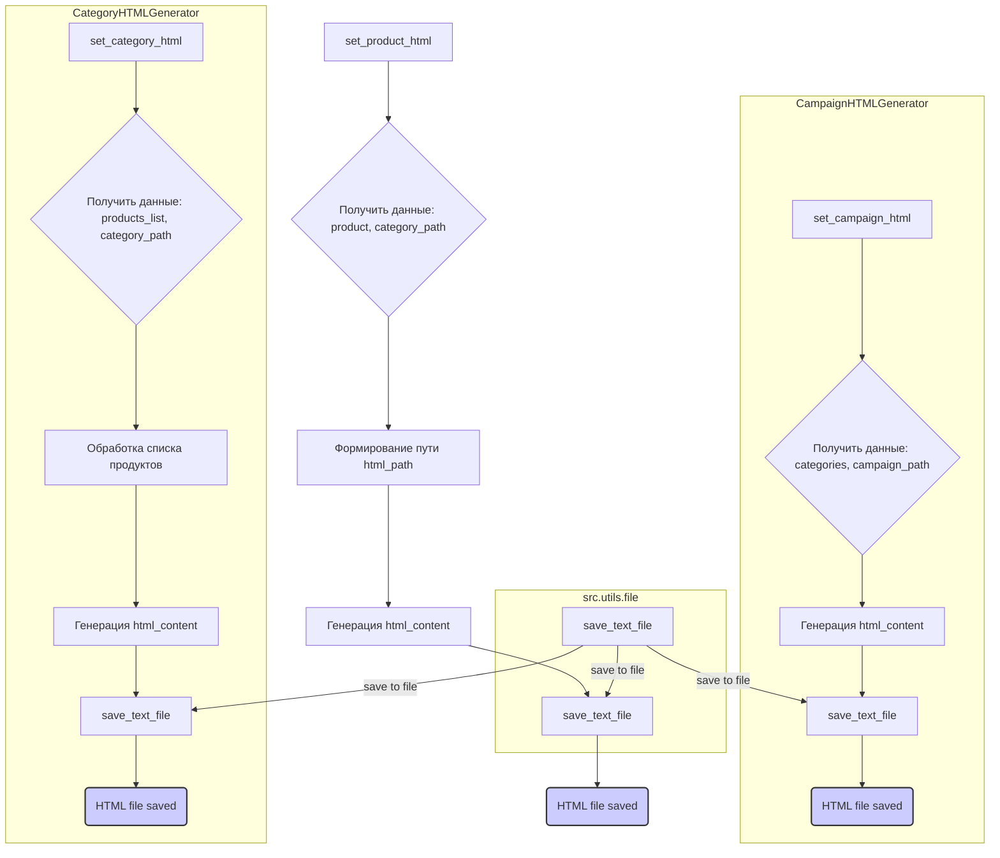

# <input code>

```python
## \file hypotez/src/suppliers/aliexpress/campaign/html_generators.py
# -*- coding: utf-8 -*-\
#! venv/Scripts/python.exe
#! venv/bin/python/python3.12

"""
.. module: src.suppliers.aliexpress.campaign 
	:platform: Windows, Unix
	:synopsis: Генератор HTML контента рекламной кампании

"""
MODE = 'dev'

import header   
from pathlib import Path
from types import SimpleNamespace
from src.utils.file import save_text_file
import html

class ProductHTMLGenerator:
    """ Class for generating HTML for individual products."""

    @staticmethod
    def set_product_html(product: SimpleNamespace, category_path: str | Path):
        """ Creates an HTML file for an individual product.

        @param product: The product details to include in the HTML.
        @param category_path: The path to save the HTML file.
        """
        category_name = Path(category_path).name
        html_path = Path(category_path) / 'html' / f"{product.product_id}.html"

        html_content = f"""<!DOCTYPE html>
<html lang="en">
<head>
    <meta charset="UTF-8">
    <meta name="viewport" content="width=device-width, initial-scale=1.0">
    <title>{html.escape(product.product_title)}</title>
    <link rel="stylesheet" href="https://stackpath.bootstrapcdn.com/bootstrap/5.3.0/css/bootstrap.min.css">
    <link rel="stylesheet" href="styles.css"> <!-- Link to custom CSS file -->
</head>
<body>
    <div class="container">
        <h1 class="my-4">{html.escape(product.product_title)}</h1>
        <div class="card">
            
            <div class="card-body">
                <p class="card-text">Price: <span class="product-price">{product.target_sale_price} {product.target_sale_price_currency}</span></p>
                <p class="card-text">Original Price: <span class="product-original-price">{product.target_original_price} {product.target_original_price_currency}</span></p>
                <p class="card-text">Category: <span class="product-category">{html.escape(product.second_level_category_name)}</span></p>
                <a href="{product.promotion_link}" class="btn btn-primary">Buy Now</a>
            </div>
        </div>
    </div>

    <script src="https://stackpath.bootstrapcdn.com/bootstrap/5.3.0/js/bootstrap.bundle.min.js"></script>
</body>
</html>
"""
        save_text_file(html_content, html_path)


class CategoryHTMLGenerator:
    """ Class for generating HTML for product categories."""

    @staticmethod
    def set_category_html(products_list: list[SimpleNamespace] | SimpleNamespace, category_path: str | Path):
        """ Creates an HTML file for the category.

        @param products_list: List of products to include in the HTML.
        @param category_path: Path to save the HTML file.
        """
        products_list = products_list if isinstance(products_list, list) else [products_list]

        category_name = Path(category_path).name
        html_path = Path(category_path) / 'html' / 'index.html'

        html_content = f"""<!DOCTYPE html>
<html lang="en">
<head>
    <meta charset="UTF-8">
    <meta name="viewport" content="width=device-width, initial-scale=1.0">
    <title>{html.escape(category_name)} Products</title>
    <link rel="stylesheet" href="https://stackpath.bootstrapcdn.com/bootstrap/5.3.0/css/bootstrap.min.css">
    <link rel="stylesheet" href="styles.css"> <!-- Link to custom CSS file -->
</head>
<body>
    <div class="container">
        <h1 class="my-4">{html.escape(category_name)} Products</h1>
        <div class="row product-grid">
    """

        for product in products_list:
            image_url = Path(product.local_saved_image).as_posix()
            html_content += f"""
                <div class="col-md-4 mb-4">
                    <div class="card">
                        
                        <div class="card-body">
                            <h5 class="card-title">{html.escape(product.product_title)}</h5>
                            <p class="card-text">Price: <span class="product-price">{product.target_sale_price} {product.target_sale_price_currency}</span></p>
                            <p class="card-text">Original Price: <span class="product-original-price">{product.target_original_price} {product.target_original_price_currency}</span></p>
                            <p class="card-text">Category: <span class="product-category">{html.escape(product.second_level_category_name)}</span></p>
                            <a href="{product.promotion_link}" class="btn btn-primary">Buy Now</a>
                        </div>
                    </div>
                </div>
            """

        html_content += """
        </div>
    </div>

    <script src="https://stackpath.bootstrapcdn.com/bootstrap/5.3.0/js/bootstrap.bundle.min.js"></script>
</body>
</html>
"""
        save_text_file(html_content, html_path)


class CampaignHTMLGenerator:
    """ Class for generating HTML for a campaign."""

    @staticmethod
    def set_campaign_html(categories: list[str], campaign_path: str | Path):
        """ Creates an HTML file for the campaign, listing all categories.

        @param categories: List of category names.
        @param campaign_path: Path to save the HTML file.
        """
        html_path = Path(campaign_path) / 'index.html'

        html_content = f"""<!DOCTYPE html>
<html lang="en">
<head>
    <meta charset="UTF-8">
    <meta name="viewport" content="width=device-width, initial-scale=1.0">
    <title>Campaign Overview</title>
    <link rel="stylesheet" href="https://stackpath.bootstrapcdn.com/bootstrap/5.3.0/css/bootstrap.min.css">
    <link rel="stylesheet" href="styles.css"> <!-- Link to custom CSS file -->
</head>
<body>
    <div class="container">
        <h1 class="my-4">Campaign Overview</h1>
        <ul class="list-group">
    """

        for category in categories:
            html_content += f"""
                <li class="list-group-item">
                    <a href="{category}/index.html">{html.escape(category)}</a>
                </li>
            """

        html_content += """
        </ul>
    </div>

    <script src="https://stackpath.bootstrapcdn.com/bootstrap/5.3.0/js/bootstrap.bundle.min.js"></script>
</body>
</html>
"""
        save_text_file(html_content, html_path)
```

# <algorithm>

**Шаг 1: Получение входных данных**

- Функции получают данные: `product` (объект `SimpleNamespace`),  `category_path` (путь к категории),  `products_list` (список объектов `SimpleNamespace` или один объект), `category_path` (путь к категории), `categories` (список названий категорий), `campaign_path` (путь к кампании).
- Входные данные определяют, какой тип HTML генерируется (для товара, категории или всей кампании).

**Шаг 2: Формирование пути к файлу**

- Вычисляется путь к HTML-файлу (`html_path`) на основе входных данных. 
- Для отдельного продукта формируется уникальный файл для каждой категории.
- Для категории формируется общий файл `index.html` в соответствующей подпапке.
- Для кампании формируется файл `index.html` в корневой папке.


**Шаг 3: Генерация HTML-контента**

-  Формируется строка HTML-кода (`html_content`) в соответствии с типом генерируемого HTML.
- Используются данные из `product` или `products_list` для заполнения контента.
-  Вставляются ссылки на изображения, названия, цены, оригинальные цены, категории, ссылки для покупки.
- Формат HTML адаптирован для отображения в сетке (Bootstrap).

**Шаг 4: Сохранение HTML-файла**

- Используется функция `save_text_file` из `src.utils.file` для сохранения сгенерированного HTML-контента в соответствующий файл.


# <mermaid>



# <explanation>

**Импорты:**

- `header`: Вероятно, импортирует какие-то специфичные для проекта константы или настройки.
- `pathlib`: Для работы с путями к файлам (например, для создания папок, проверки существования файлов и т.п.).
- `types`: Для использования `SimpleNamespace` для представления данных продукта, что удобно для работы с различными типами данных.
- `src.utils.file`:  Функция `save_text_file` из этого модуля используется для сохранения сгенерированного HTML-кода в файлы.  Это указывает на структурированную организацию кода, где утилиты хранения данных вынесены в отдельный модуль.
- `html`: Для экранирования HTML-символов, чтобы предотвратить XSS (Cross-Site Scripting) атаки. Важный импорт для безопасности веб-приложений.


**Классы:**

- `ProductHTMLGenerator`: Создаёт HTML-страницы для отдельных товаров.
    - `set_product_html`: Собирает информацию о товаре и сохраняет её в HTML-файл в указанном пути.
- `CategoryHTMLGenerator`: Создаёт HTML-страницы для категорий продуктов.
    - `set_category_html`: Собирает список товаров и сохраняет HTML-страницу с отображением этих товаров в указанном пути.
- `CampaignHTMLGenerator`: Создаёт HTML-страницу для всей кампании, содержащую ссылки на категории.
    - `set_campaign_html`: Собирает список названий категорий и сохраняет в файл кампании ссылки на категории.

**Функции:**

- `save_text_file`: Сохраняет строку текста в указанный файл.  Эта функция необходима для сохранения сгенерированного HTML в файлы.

**Переменные:**

- `MODE`: Вероятно, константа, определяющая режим работы программы (например, `dev`, `prod`).
- `html_content`: Содержит строку сгенерированного HTML-кода.


**Возможные ошибки и улучшения:**

- **Обработка ошибок:**  Не хватает обработки ошибок при создании директорий или при сохранении файлов. Необходимо добавлять обработку исключений для таких ситуаций, чтобы программа не прекращала работу при возникновении проблем.
- **Локализация:** Желательно реализовать поддержку разных языков для названий категорий, товаров и т.д., для обеспечения глобальной доступности.
- **Кэширование:** Если HTML-файлы генерируются часто, можно рассмотреть использование кэширования, чтобы ускорить процесс генерации.
- **Шаблоны:** Вместо построения HTML-кода строками, стоит использовать шаблоны, например, `Jinja2`, чтобы улучшить читаемость и возможность изменения структуры.
- **Проверка данных:** Нужно добавить проверки на корректность входных данных (`product`, `products_list`, `categories`) для предотвращения ошибок и улучшения надёжности.
- **CSS**:   Использование отдельных CSS-файлов (`styles.css`) — хорошая практика. Но желательно добавить проверку, что такие файлы существуют.

**Взаимосвязи с другими частями проекта:**

Модуль `html_generators` напрямую зависит от `src.utils.file` для сохранения данных, вероятно, также зависит от `header` для конфигурации.  Он предполагает наличие `SimpleNamespace` объектов, хранящих данные о продуктах, категориях и кампаниях.  Сам по себе он не обрабатывает логику получения данных –  это скорее утилита для преобразования данных в HTML.  Для функционирования необходимо, чтобы данные, которые используют эти функции, предоставлялись из другой части проекта.