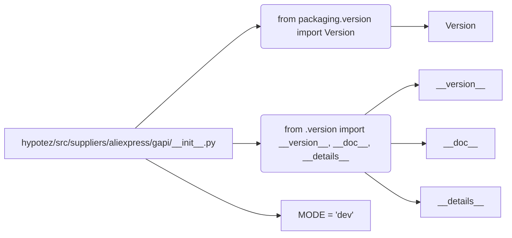

```MD
# <input code>

```python
## \file hypotez/src/suppliers/aliexpress/gapi/__init__.py
# -*- coding: utf-8 -*-
#! venv/Scripts/python.exe
#! venv/bin/python/python3.12

"""
.. module: src.suppliers.aliexpress.gapi 
	:platform: Windows, Unix
	:synopsis:

"""
MODE = 'dev'

from packaging.version import Version
from .version import __version__, __doc__, __details__ 
```

# <algorithm>

Этот код представляет собой инициализационный модуль для пакета `aliexpress.gapi`.  Он не содержит сложной логики.  Алгоритм работы сводится к импорту необходимых модулей и определению константы `MODE`.

* **Шаг 1:** Импортируется модуль `Version` из библиотеки `packaging`.  Этот импорт необходим, вероятно, для обработки версий.
* **Шаг 2:** Импортируются переменные `__version__`, `__doc__` и `__details__` из модуля `version.py` внутри текущей директории. Эти переменные, скорее всего, содержат метаданные о версии, документации и других деталях пакета.
* **Шаг 3:** Определяется константа `MODE` со значением 'dev'. Это указывает, что пакет находится в режиме разработки.

Нет явного алгоритма с пошаговыми операциями, так как код просто выполняет импорты и присваивает значение константе.


# <mermaid>



**Описание диаграммы:**

Модуль `hypotez/src/suppliers/aliexpress/gapi/__init__.py` импортирует необходимые компоненты.  Стрелки указывают на зависимости:

* `from packaging.version import Version`:  Модуль `packaging` используется для работы с версиями.
* `from .version import __version__, __doc__, __details__`:  Из модуля `.version` импортируются переменные, содержащие метаданные.  `.version` находится в той же папке, что и `__init__.py`.


# <explanation>

**Импорты:**

* `from packaging.version import Version`: Импортирует класс `Version` из пакета `packaging`.  Этот пакет используется для работы с версиями программного обеспечения.  Он необходим для корректной обработки версий пакетов, если в коде используются версии.
* `from .version import __version__, __doc__, __details__`: Импортирует переменные `__version__`, `__doc__`, `__details__` из файла `version.py`, находящегося в той же директории. Эти переменные, скорее всего, определены в файле `version.py` и содержат информацию о версии, документации и других деталях пакета `aliexpress.gapi`.  `.` в начале импорта указывает, что импортируется модуль из той же директории, где находится `__init__.py`.

**Классы:**

В этом файле нет определений классов.

**Функции:**

В данном `__init__.py` нет функций.

**Переменные:**

* `MODE = 'dev'`: Переменная, хранящая строку 'dev'. Вероятно, используется для обозначения режима работы (например, dev, production), который может влиять на поведение других частей кода.

**Возможные ошибки или области для улучшений:**

* **Непосредственные импорты:**  Наличие файла `version.py` предполагает, что в проекте существует более сложная структура и разделение ответственности. На будущее, рекомендуется использовать более ясный способ хранения метаданных, например, с помощью  `__init__.py`.
* **Docstrings:**  Хотя в коде есть `docstring`, он немного неполный.  Рекомендуется расширить документацию, чтобы объяснить назначение пакета `aliexpress.gapi` и переменной `MODE`.

**Взаимосвязь с другими частями проекта:**

Файл `__init__.py` является точкой входа для пакета `aliexpress.gapi`. Он импортирует модуль `version.py`, и этот модуль, возможно, содержит дополнительные переменные, которые используются другими частями проекта.  Для более полной детализации необходимы дополнительные файлы проекта.