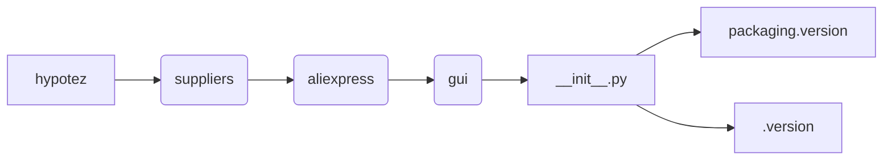

# <input code>

```python
## \file hypotez/src/suppliers/aliexpress/gui/__init__.py
# -*- coding: utf-8 -*-\
#! venv/Scripts/python.exe
#! venv/bin/python/python3.12

"""
.. module: src.suppliers.aliexpress.gui 
	:platform: Windows, Unix
	:synopsis:

"""
MODE = 'dev'

"""
	:platform: Windows, Unix
	:synopsis:

"""


"""
	:platform: Windows, Unix
	:synopsis:

"""


"""
  :platform: Windows, Unix

"""
"""
  :platform: Windows, Unix
  :platform: Windows, Unix
  :synopsis:
"""MODE = 'dev'
  
""" module: src.suppliers.aliexpress.gui """


""" Разные сценарии Алиэхпресс """
...
from packaging.version import Version
from .version import __version__, __doc__, __details__ 
```

# <algorithm>

Этот код представляет собой модуль `__init__.py` для пакета `aliexpress.gui` внутри проекта `hypotez`.  Он, судя по всему, подготавливает среду для дальнейшего использования.  Блок-схема здесь невозможна, поскольку нет конкретных операций. Код содержит лишь импорты и некоторые комментарии,  не содержащие алгоритмической логики.

# <mermaid>



**Описание диаграммы:**

* **hypotez:** Главный проект
* **suppliers:** Пакет, содержащий модули для разных поставщиков данных.
* **aliexpress:** Модуль, специализирующийся на данных от AliExpress.
* **gui:** Подмодуль `aliexpress`, вероятно, отвечающий за графический интерфейс пользователя (GUI) для работы с AliExpress.
* **__init__.py:** Главный файл модуля `gui`. Он содержит импорты и конфигурацию.
* **packaging.version:** Библиотека для работы с версиями пакетов.
* **.version:** Модуль `version`, вероятно, содержащий метаданные (версия, описание, детали) о пакете.

**Зависимости:**

Код явно зависит от библиотеки `packaging`, используемой для работы с версиями. `packaging.version` используется для импорта функции `Version`. Вложенный модуль `.version` необходим для доступа к переменным `__version__`, `__doc__` и `__details__`. Эти метаданные, вероятно, используются для управления версиями или документацией.

# <explanation>

* **Импорты:**
    * `from packaging.version import Version`: Импортирует класс `Version` из библиотеки `packaging`, используемой для работы с версиями пакетов.  Это указывает на то, что в проекте используется система управления версиями пакетов.
    * `from .version import __version__, __doc__, __details__`: Импортирует переменные `__version__`, `__doc__`, и `__details__` из модуля `.version` (возможно, расположенного в папке `hypotez/src/suppliers/aliexpress/gui/version.py`).  Это, вероятно, метаданные о версии модуля и служат для документирования и управления версиями.

* **Классы:** Нет определённых классов в коде.

* **Функции:** Нет определённых функций в коде.

* **Переменные:**
    * `MODE = 'dev'`:  Переменная, вероятно, устанавливающая режим работы приложения (например, `dev` для разработки, `prod` для производства).  Она не используется в текущем фрагменте кода, но может быть использована в других частях проекта.

* **Возможные ошибки или области для улучшений:**
    * Нет проверки валидности значения `MODE`.  Необходимо убедиться, что значение `MODE` соответствует ожидаемым значениям.
    * Нет явного описания, как импортированные метаданные о версии будут использоваться.
    * Комментарии очень общие и не дают точного понимания логики.  Необходимы более подробные комментарии.
    * Не хватает информации о том, откуда берутся значения `__version__`, `__doc__`, и `__details__`.

* **Взаимосвязи с другими частями проекта:**  Этот код является частью более крупной структуры проекта.  Модуль `__init__.py` для `aliexpress.gui` определяет начальную точку входа в этот модуль, связывающий его с другими частями приложения, которые используют его функциональность.  Более подробная информация требуется для анализа полных зависимостей.


**Дополнительные замечания:**

Строки `#! venv/Scripts/python.exe` и `#! venv/bin/python/python3.12` являются заглушками (shebangs), указывающими интерпретатор Python для выполнения скрипта, и могут не использоваться. Обычно такие строки необходимы для запуска скриптов на системах, которые не настроены на автоматическое определение интерпретатора Python.