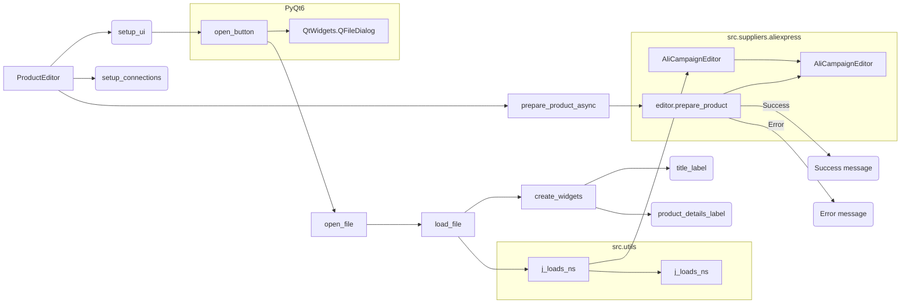

```MD
# <input code>

```python
## \file hypotez/src/suppliers/aliexpress/gui/product.py
# -*- coding: utf-8 -*-
#! venv/Scripts/python.exe
#! venv/bin/python/python3.12

"""
.. module: src.suppliers.aliexpress.gui 
	:platform: Windows, Unix
	:synopsis:

"""
MODE = 'dev'

"""
	:platform: Windows, Unix
	:synopsis:

"""


"""
	:platform: Windows, Unix
	:synopsis:

"""


"""
  :platform: Windows, Unix

"""
"""
  :platform: Windows, Unix
  :platform: Windows, Unix
  :synopsis:
"""MODE = 'dev'
  
""" module: src.suppliers.aliexpress.gui """


""" Window editor for products """


import header
import sys
from pathlib import Path
from types import SimpleNamespace
from PyQt6 import QtWidgets, QtGui, QtCore
from src.utils import j_loads_ns, j_dumps
from src.suppliers.aliexpress.campaign import AliCampaignEditor

class ProductEditor(QtWidgets.QWidget):
    data: SimpleNamespace = None
    language: str = 'EN'
    currency: str = 'USD'
    file_path: str = None
    editor: AliCampaignEditor

    def __init__(self, parent=None, main_app=None):
        """ Initialize the ProductEditor widget """
        super().__init__(parent)
        self.main_app = main_app  # Save the MainApp instance

        self.setup_ui()
        self.setup_connections()

    def setup_ui(self):
        """ Setup the user interface """
        self.setWindowTitle("Product Editor")
        self.resize(1800, 800)

        # Define UI components
        self.open_button = QtWidgets.QPushButton("Open JSON File")
        self.open_button.clicked.connect(self.open_file)

        self.file_name_label = QtWidgets.QLabel("No file selected")
        
        self.prepare_button = QtWidgets.QPushButton("Prepare Product")
        self.prepare_button.clicked.connect(self.prepare_product_async)

        layout = QtWidgets.QVBoxLayout(self)
        layout.addWidget(self.open_button)
        layout.addWidget(self.file_name_label)
        layout.addWidget(self.prepare_button)

        self.setLayout(layout)

    def setup_connections(self):
        """ Setup signal-slot connections """
        pass

    def open_file(self):
        """ Open a file dialog to select and load a JSON file """
        file_path, _ = QtWidgets.QFileDialog.getOpenFileName(
            self,
            "Open JSON File",
            "c:/user/documents/repos/hypotez/data/aliexpress/products",
            "JSON files (*.json)"
        )
        if not file_path:
            return  # No file selected

        self.load_file(file_path)

    def load_file(self, file_path):
        """ Load a JSON file """
        try:
            self.data = j_loads_ns(file_path)
            self.file_path = file_path
            self.file_name_label.setText(f"File: {self.file_path}")
            self.editor = AliCampaignEditor(file_path=file_path)
            self.create_widgets(self.data)
        except Exception as ex:
            QtWidgets.QMessageBox.critical(self, "Error", f"Failed to load JSON file: {ex}")

    def create_widgets(self, data):
        """ Create widgets based on the data loaded from the JSON file """
        layout = self.layout()

        # Remove previous widgets except open button and file label
        for i in reversed(range(layout.count())):
            widget = layout.itemAt(i).widget()
            if widget not in [self.open_button, self.file_name_label, self.prepare_button]:
                widget.deleteLater()

        title_label = QtWidgets.QLabel(f"Product Title: {data.title}")
        layout.addWidget(title_label)

        # Additional product-specific details
        product_details_label = QtWidgets.QLabel(f"Product Details: {data.details}")
        layout.addWidget(product_details_label)

    @QtCore.pyqtSlot()
    async def prepare_product_async(self):
        """ Asynchronously prepare the product """
        if self.editor:
            try:
                await self.editor.prepare_product()
                QtWidgets.QMessageBox.information(self, "Success", "Product prepared successfully.")
            except Exception as ex:
                QtWidgets.QMessageBox.critical(self, "Error", f"Failed to prepare product: {ex}")
```

# <algorithm>

**Шаг 1:** Инициализация ProductEditor.
- Создаётся объект ProductEditor.
- Настраиваются интерфейс (setup_ui) и соединения (setup_connections).
- Сохраняется ссылка на MainApp.

**Шаг 2:** Открытие файла (open_file).
- Пользователь выбирает JSON-файл.
- При успешном выборе файла функция load_file вызывается для загрузки данных.

**Шаг 3:** Загрузка файла (load_file).
- Функция j_loads_ns из модуля src.utils загружает JSON-данные из указанного файла.
- Данные сохраняются в атрибуте data.
- Создаётся экземпляр класса AliCampaignEditor.
- Вызывается create_widgets для обновления интерфейса.

**Шаг 4:** Создание виджетов (create_widgets).
- Удаляются все предыдущие виджеты кроме кнопки "Open JSON File" и "File Name Label".
- Создаются и добавляются новые виджеты (QLabel), отображающие загруженные данные из файла.

**Шаг 5:** Асинхронная подготовка продукта (prepare_product_async).
- Если редактор продукта существует, запускается асинхронная подготовка продукта, используя editor.prepare_product().
- Если подготовка проходит успешно, выводится сообщение об успехе.
- В случае ошибки, выводится сообщение об ошибке.

**Примеры:**
- Если пользователь открывает файл с названием "product1.json", то self.file_path будет содержать этот путь.
- Если в загруженном файле есть поле "title" со значением "Awesome Product", то title_label будет отображать текст "Product Title: Awesome Product".


# <mermaid>



**Объяснение зависимостей:**

- `ProductEditor` зависит от `QtWidgets`, `QtGui`, `QtCore` (PyQt6).
- `ProductEditor` зависит от `j_loads_ns`, `j_dumps` (из `src.utils`).
- `ProductEditor` зависит от `AliCampaignEditor` (из `src.suppliers.aliexpress.campaign`).
- `AliCampaignEditor` вероятно имеет свои зависимости, которые не видны из представленного кода.


# <explanation>

**Импорты:**

- `header`, `sys`, `Path` (из `pathlib`): Вероятно, используются для специфических задач, не показанных в примере.
- `SimpleNamespace` (из `types`):  Используется для создания объекта, который по сути является контейнером для данных. В данном случае, для хранения загруженных JSON данных.
- `QtWidgets`, `QtGui`, `QtCore` (из `PyQt6`):  Библиотека для создания графического интерфейса пользователя.
- `j_loads_ns`, `j_dumps` (из `src.utils`):  Функции для обработки JSON-данных (разбор и преобразование).  `j_loads_ns` предполагает разбор JSON в `SimpleNamespace`.
- `AliCampaignEditor` (из `src.suppliers.aliexpress.campaign`):  Класс, который, вероятно, занимается подготовкой данных кампании.

**Классы:**

- `ProductEditor`: Класс, отвечающий за отображение и взаимодействие с интерфейсом пользователя для редактирования данных о продуктах.
    - `data`: Хранит загруженные данные продукта в формате `SimpleNamespace`.
    - `language`, `currency`, `file_path`:  Атрибуты для хранения данных о языке, валюте и пути к файлу.
    - `editor`: Экземпляр класса `AliCampaignEditor`.
    - `__init__`: Инициализирует виджет и устанавливает связь с `main_app` (вероятно, приложением).
    - `setup_ui`: Создаёт интерфейс пользователя (кнопки, метки).
    - `setup_connections`: Устанавливает связи между элементами интерфейса и обработкой событий.
    - `open_file`: Открывает диалог выбора файла и вызывает `load_file` для загрузки JSON данных.
    - `load_file`: Загружает JSON данные и обновляет виджеты.
    - `create_widgets`: Создаёт виджеты отображения данных о продуктах.
    - `prepare_product_async`: Асинхронно готовит продукт, используя `AliCampaignEditor`.

**Функции:**

- `open_file`: Открывает диалоговое окно для выбора JSON файла.
- `load_file`: Загружает содержимое JSON-файла и заполняет данные ProductEditor.
- `create_widgets`: Удаляет старые виджеты и добавляет новые, отражающие данные из загруженного JSON.
- `prepare_product_async`:  Асинхронно готовит данные продукта, используя `AliCampaignEditor` (вероятно, выполняя дополнительные операции, например, отправка запроса на сервер).

**Переменные:**

- `MODE`: Флаг для настройки режима работы.
- `file_path`: Путь к загружаемому файлу.
- `data`:  Объект, хранящий загруженные данные.

**Возможные ошибки и улучшения:**

- Нет обработки случая, когда выбранный файл не является JSON.
- Нет проверки, что `self.editor` не `None` в функции `prepare_product_async`.
- Отсутствие проверки на правильный формат JSON.
- Необходимо явно указывать тип возвращаемых значений функций.
- Необходимо добавить более подробную обработку исключений, например, в функции `open_file` и `prepare_product_async`
- Добавить логику проверки, что загруженный файл существует.
- Лучше переписать метод `create_widgets` так, чтобы виджеты создавались не удаляя старые.

**Взаимосвязи с другими частями проекта:**

Код взаимодействует с `src.utils` для работы с JSON, а также с `src.suppliers.aliexpress.campaign` для подготовки продукта. Вероятно, существуют и другие зависимости, которые не видны из представленного отрывка.