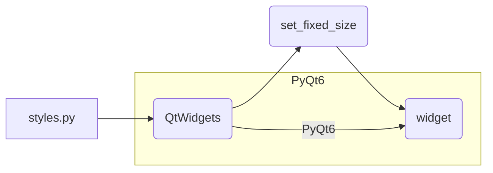

# <input code>

```python
## \file hypotez/src/suppliers/aliexpress/gui/styles.py
# -*- coding: utf-8 -*-\
#! venv/Scripts/python.exe
#! venv/bin/python/python3.12

"""
.. module: src.suppliers.aliexpress.gui 
	:platform: Windows, Unix
	:synopsis:

"""
MODE = 'dev'

"""
	:platform: Windows, Unix
	:synopsis:

"""


"""
	:platform: Windows, Unix
	:synopsis:

"""


"""
  :platform: Windows, Unix

"""
"""
  :platform: Windows, Unix
  :platform: Windows, Unix
  :synopsis:
"""MODE = 'dev'
  
""" module: src.suppliers.aliexpress.gui """


""" Common styling functions for UI elements """

from PyQt6 import QtWidgets

def set_fixed_size(widget: QtWidgets.QWidget, width: int, height: int):
    """ Set a fixed size for a given widget """
    widget.setFixedSize(width, height)
```

# <algorithm>

```mermaid
graph TD
    A[Вход] --> B{widget, width, height};
    B --widget is QtWidgets.QWidget, width and height are ints--> C[setFixedSize(width, height)];
    C --> D[Выход];
```

**Пример:**

Если `widget` - это объект `QtWidgets.QPushButton`, `width` равен 100, а `height` равен 50, то функция `set_fixed_size` установит размеры кнопки в 100x50 пикселей.


# <mermaid>



**Объяснение диаграммы:**

Модуль `styles.py` использует модуль `PyQt6`, в частности класс `QtWidgets`.  Функция `set_fixed_size` взаимодействует с объектом `widget` (который, как видно из типов, должен быть из `QtWidgets`).


# <explanation>

**Импорты:**

- `from PyQt6 import QtWidgets`: Импортирует модуль `QtWidgets` из библиотеки `PyQt6`.  Это ключевой импорт, так как `QtWidgets` предоставляет классы и функции для создания графического пользовательского интерфейса (GUI) в приложениях PyQt6.  Это прямо связанно с файлами GUI, которые находятся в пакете `src.suppliers.aliexpress.gui`.

**Классы:**

- Нет определенных классов, только функция.

**Функции:**

- `set_fixed_size(widget: QtWidgets.QWidget, width: int, height: int)`: Эта функция устанавливает фиксированный размер виджета `widget` (объект из `QtWidgets`, например, кнопка, метка, поле ввода).  Функция принимает три параметра:
    - `widget`: Виджет, размер которого нужно установить.
    - `width`: Ширина виджета в пикселях.
    - `height`: Высота виджета в пикселях.
    - Пример использования:

```python
import sys
from PyQt6 import QtWidgets

app = QtWidgets.QApplication(sys.argv)

# Создаем виджет (например, кнопку)
button = QtWidgets.QPushButton("Моя кнопка")

# Устанавливаем фиксированный размер
set_fixed_size(button, 150, 50)

# ... (остальной код для отображения кнопки)
```


**Переменные:**

- `MODE`:  Переменная со значением "dev".  Она не используется внутри функции, скорее всего, это константа для определения режима работы (разработки, отладки, производства) или другая конфигурация.

**Возможные ошибки и улучшения:**

- **Проверка типов:** В идеале, проверка типов (`width` и `height` должны быть целыми числами) была бы добавлена для повышения надежности.  Можно добавить проверку, чтобы `width` и `height` были больше или равны 0, чтобы избежать проблем с отрисовкой.
- **Документация:** Документация к коду написана в стиле Sphinx, но она могла бы быть ещё более информативной.  Включите описание значений и возможные ошибки.
- **Обработка исключений:** Нет обработки исключений, если введен неверный тип данных.
- **Связь с другими частями проекта:**  Функция `set_fixed_size` напрямую используется в других частях приложения, например, при создании элементов интерфейса в файлах `*.py` в `src.suppliers.aliexpress.gui`. Для дальнейшего анализа необходимы эти файлы.


```