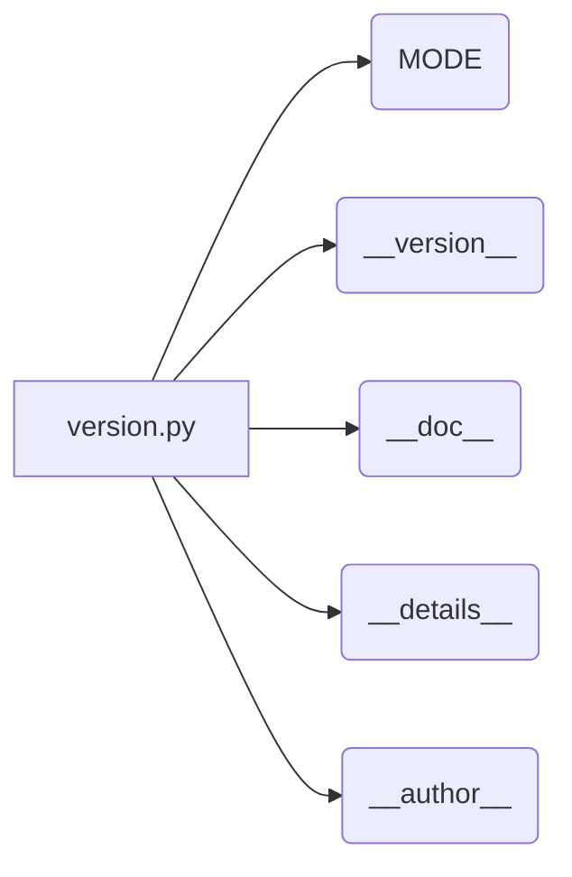

# <input code>

```python
## \file hypotez/src/suppliers/aliexpress/gui/version.py
# -*- coding: utf-8 -*-\n#! venv/Scripts/python.exe\n#! venv/bin/python/python3.12\n
"""
.. module: src.suppliers.aliexpress.gui 
	:platform: Windows, Unix
	:synopsis:

"""
MODE = 'dev'

"""
	:platform: Windows, Unix
	:synopsis:

"""


"""
	:platform: Windows, Unix
	:synopsis:

"""


"""
  :platform: Windows, Unix

"""
"""
  :platform: Windows, Unix
  :platform: Windows, Unix
  :synopsis:
"""MODE = 'dev'
  
""" module: src.suppliers.aliexpress.gui """


"""
- `__version__`: This variable holds the version of the module or package.
- `__name__`: Contains the name of the module. If the script is being run directly, the value will be `"__main__"`.
- `__doc__`: The module's documentation string.
- `__details__`: This variable likely contains additional details about the module, but the exact purpose depends on the specific module or package.
- `__annotations__`: Contains type annotations for variables and functions in the module.
- `__author__`: The name(s) of the author(s) of the module.
"""
__name__:str
__version__="3.12.0.0.0.4"
__doc__:str=f""" Графический интерфейс для управления рекламными кампаниями. """

__details__:str=f"""  """

__annotations__


__author__='hypotez '
```

# <algorithm>

Этот код не содержит алгоритма в традиционном понимании. Он представляет собой файл с описанием модуля (или пакета) `src.suppliers.aliexpress.gui`, содержащий переменные, описывающие его версию, имя, документацию, авторство и т. д.  Данные не передаются между функциями или классами.

# <mermaid>



**Описание диаграммы:**

Файл `version.py` содержит несколько констант (переменных, значения которых не меняются), описывающих его сам:

* **MODE:** переменная со значением 'dev' (вероятно, для режима разработки).
* **__version__:** строковая константа, хранящая версию модуля.
* **__doc__:** строковая константа, содержащая документацию модуля.
* **__details__:** строковая константа, содержащая дополнительную информацию о модуле.
* **__author__:** строковая константа, содержащая имя автора.

# <explanation>

Этот Python-файл определяет атрибуты модуля `src.suppliers.aliexpress.gui`.

**Импорты:**

Файл не содержит импортов, он определяет только константы.

**Классы:**

В коде нет объявлений классов.

**Функции:**

В коде нет функций.

**Переменные:**

Все переменные являются константами, которые хранят информацию о модуле:

* `MODE`: Переменная со строковым значением 'dev'.
* `__version__`: Переменная со строковым значением "3.12.0.0.0.4".
* `__doc__`: Переменная со строковым значением документации модуля.
* `__details__`: Переменная со строковым значением, скорее всего, для дополнительной информации.
* `__author__`: Переменная со строковым значением, хранящая имя автора.

**Возможные ошибки или области для улучшений:**

* **Документация:** Документация могла бы быть более подробной и структурированной.
* **Типы данных:** Не везде указаны корректные типы данных (например, в `__name__`).
* **Стандарты:** Не совсем соблюдены стандарты PEP 8, особенно в многострочных строках документации.  Рекомендуется использовать docstrings.


**Цепочка взаимосвязей:**

Этот файл является частью пакета `src.suppliers.aliexpress.gui`.  Он определяет атрибуты этого пакета, которые, вероятно, используются другими компонентами GUI для идентификации и работы с модулем.  Например, другие части кода могут считывать `__version__` для получения информации о текущей версии.