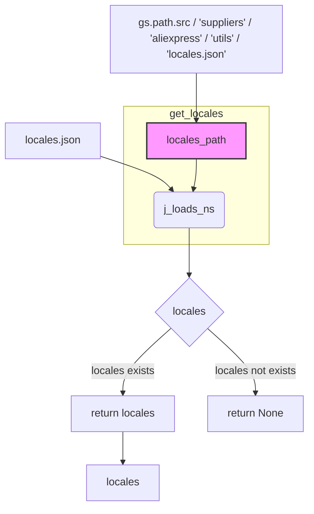

```MD
# <input code>

```python
## \file hypotez/src/suppliers/aliexpress/utils/locales.py
# -*- coding: utf-8 -*-
#! venv/Scripts/python.exe
#! venv/bin/python/python3.12

"""
.. module: src.suppliers.aliexpress.utils 
	:platform: Windows, Unix
	:synopsis: Module for loading locales data from JSON file.

This module contains functions for loading and processing locales data from a JSON file.

Functions:
    load_locales_data(path: Path) -> list[dict[str, str]]:
        Load locales data from a JSON file.

Examples:
    >>> from src.suppliers.aliexpress.utils.locales import load_locales_data
    >>> locales = load_locales_data(Path('/path/to/locales.json'))
    >>> print(locales)
    [{\'EN\': \'USD\'}, {\'HE\': \'ILS\'}, {\'RU\': \'ILS\'}, {\'EN\': \'EUR\'}, {\'EN\': \'GBR\'}, {\'RU\': \'EUR\'}]

"""
MODE = 'dev'

from pathlib import Path

from src import gs
from src.utils import j_loads
from src.utils.jjson import j_loads_ns

def get_locales(locales_path: Path | str) -> list[dict[str, str]] | None:
    """Load locales data from a JSON file.

    Args:
        path (Path): Path to the JSON file containing locales data.

    Returns:
        list[dict[str, str]]: List of dictionaries with locale and currency pairs.

    Examples:
        >>> from src.suppliers.aliexpress.utils.locales import load_locales_data
        >>> locales = load_locales_data(Path('/path/to/locales.json'))
        >>> print(locales)
        [{\'EN\': \'USD\'}, {\'HE\': \'ILS\'}, {\'RU\': \'ILS\'}, {\'EN\': \'EUR\'}, {\'EN\': \'GBR\'}, {\'RU\': \'EUR\'}]
    """
    locales = j_loads_ns(locales_path)
    return locales.locales or None

locales: list[dict[str, str]] | None = get_locales (gs.path.src / 'suppliers' / 'aliexpress' / 'utils' / 'locales.json') # defined locales for campaigns
```

# <algorithm>

**Шаг 1:** Функция `get_locales` принимает путь к файлу `locales.json` в качестве аргумента.

**Шаг 2:** Функция `j_loads_ns` загружает данные из файла `locales.json` в формате JSON.  Предполагается, что в файле содержится структура данных, содержащая атрибут `locales`.

**Шаг 3:** Функция возвращает значение атрибута `locales` из загруженной структуры данных. Если `locales` не определено или пусто, возвращает `None`.

**Шаг 4:** Глобальная переменная `locales` инициализируется результатом вызова `get_locales` с путем к файлу `locales.json` в директории `src/suppliers/aliexpress/utils`.


**Пример данных в `locales.json`:**

```json
{
  "locales": [
    {"EN": "USD"},
    {"HE": "ILS"},
    {"RU": "ILS"},
    {"EN": "EUR"},
    {"EN": "GBR"},
    {"RU": "EUR"}
  ]
}
```

# <mermaid>



**Описание диаграммы:**

* `locales.json`: Файл, содержащий данные о локализации.
* `j_loads_ns`: Функция, загружающая данные из `locales.json` (предполагается, что она находится в `src.utils.jjson`).
* `locales`: Переменная, содержащая результат загрузки данных.
* `get_locales`: Функция, которая загружает данные, проверяет наличие ключа `locales` и возвращает его или `None`.
* `gs.path.src / 'suppliers' / 'aliexpress' / 'utils' / 'locales.json'`: Путь к файлу `locales.json`.
* `locales`: Глобальная переменная, содержащая загруженные данные.


# <explanation>

**Импорты:**

* `from pathlib import Path`: Импортирует класс `Path` для работы с путями к файлам.
* `from src import gs`: Импортирует модуль `gs`, скорее всего, содержащий константы или функции, связанные с путями к ресурсам проекта.  Связь с `src` означает, что этот модуль находится в корневом каталоге проекта (или в директории, обозначенной как `src`).
* `from src.utils import j_loads`: Импортирует функцию `j_loads` для работы с JSON данными. Связь с `src.utils` указывает на то, что этот модуль находится в подкаталоге `utils` проекта `src`.
* `from src.utils.jjson import j_loads_ns`: Импортирует функцию `j_loads_ns`, также предполагается, что она находится в подкаталоге `jjson` пакета `utils` для работы со специфическим типом JSON данных.

**Классы:**

Нет определенных классов в данном коде.

**Функции:**

* `get_locales(locales_path: Path | str) -> list[dict[str, str]] | None`: Функция, загружающая данные о локализации из файла JSON.
    * `locales_path`: Путь к файлу `locales.json`.
    * Возвращает список словарей, где каждый словарь представляет пару "код языка" - "валюта", или `None`, если файл не найден или структура данных некорректна.


**Переменные:**

* `MODE`: Строковая переменная, хранящая значение режима (например, 'dev').
* `locales`: Глобальная переменная типа `list[dict[str, str]] | None`, хранящая загруженные данные о локализации. Инициализируется результатом вызова функции `get_locales`.

**Возможные ошибки и улучшения:**

* **Обработка исключений:**  Код не обрабатывает возможные исключения (например, файл не найден, ошибка парсинга JSON). Добавьте обработку исключений `FileNotFoundError` и `JSONDecodeError` для повышения надежности.
* **Проверка на корректность данных:** Необходимо добавить проверку, что полученный список словарей имеет корректную структуру, содержащую ключи "код языка" и "валюта".


**Взаимосвязи с другими частями проекта:**

Функция `get_locales` использует функции из модулей `src.utils` и `src.utils.jjson`, что указывает на зависимость от этих модулей в проекте.  `gs.path.src`  подразумевает, что `gs` предоставляет средства для работы с путями, относительными к корневому каталогу проекта `src`.

**Заключение:**

Код загружает данные локализации из JSON файла, но нуждается в улучшениях для обработки ошибок и повышения надежности.