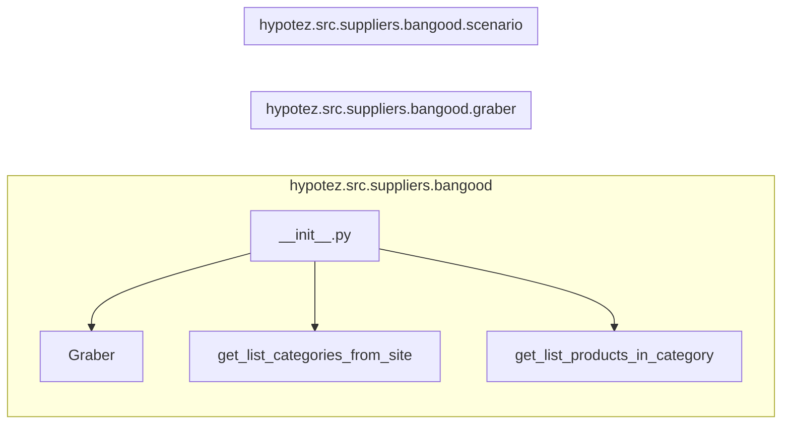

# Анализ кода файла hypotez/src/suppliers/bangood/__init__.py

## <input code>

```python
## \file hypotez/src/suppliers/bangood/__init__.py
# -*- coding: utf-8 -*-\
#! venv/Scripts/python.exe
#! venv/bin/python/python3.12

"""
.. module: src.suppliers.bangood 
	:platform: Windows, Unix
	:synopsis:

"""
MODE = 'dev'

from .graber import Graber
from .scenario import get_list_categories_from_site, get_list_products_in_category
```

## <algorithm>

(Схема алгоритма отсутствует, так как в предоставленном коде нет логики с последовательными действиями. Код только импортирует модули.)

## <mermaid>



## <explanation>

Этот файл `__init__.py`  является инициализатором пакета `bangood` внутри модуля `suppliers` проекта `hypotez`.  Он отвечает за импорт функций и классов из других модулей внутри того же пакета.

**Импорты:**

* `from .graber import Graber`: Импортирует класс `Graber` из модуля `graber.py`  в текущем пакете `bangood`.  Это указывает на то, что `graber.py` содержит логику для сбора данных с сайта Banggood.
* `from .scenario import get_list_categories_from_site, get_list_products_in_category`:  Импортирует функции `get_list_categories_from_site` и `get_list_products_in_category` из модуля `scenario.py`  в текущем пакете. Вероятно, эти функции реализуют логику получения списка категорий и продуктов для конкретной категории с сайта.


**Классы:**

* `Graber`:  Класс, вероятно, отвечающий за взаимодействие с сайтом Banggood. Подробнее об этом классе можно узнать из файла `graber.py`


**Функции:**

* `get_list_categories_from_site()`: Функция для получения списка категорий с сайта Banggood.  Подробная реализация этой функции содержится в `scenario.py`.
* `get_list_products_in_category()`: Функция для получения списка продуктов в заданной категории. Подробная реализация содержится в `scenario.py`.

**Переменные:**

* `MODE = 'dev'`: Переменная, хранящая строку 'dev'. Ее значение не оказывает влияния на представленный код, но, вероятно, используется для конфигурации или выбора режима работы в более широком контексте проекта.


**Возможные ошибки и улучшения:**

* Отсутствует реализация конкретных логических операций внутри инициализационного файла `__init__.py`. Этот файл исключительно служит для экспорта функций и классов. Это хорошо, т.к. поддерживает разделение ответственности и хорошую организацию кода.
* Необходима дальнейшая проверка и анализ кода файлов `graber.py` и `scenario.py` для понимания полной функциональности.


**Взаимосвязи с другими частями проекта:**

Файл `__init__.py` служит связующим звеном для доступа к функциональности, реализованной в других модулях пакета `bangood`.  В дальнейшем код этого пакета будет взаимодействовать с другими частями проекта, например, для обработки полученных данных или отображения результатов в интерфейсе.  Непосредственная логика взаимодействия в данном `__init__.py` отсутствует, но импортированные компоненты предположительно будут использоваться в других частях приложения `hypotez`.