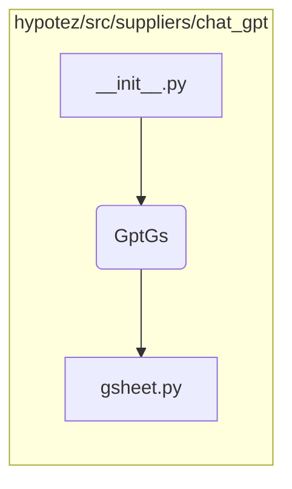

# <input code>

```python
## \file hypotez/src/suppliers/chat_gpt/__init__.py
# -*- coding: utf-8 -*-
#! venv/Scripts/python.exe
#! venv/bin/python/python3.12

"""
.. module: src.suppliers.chat_gpt 
	:platform: Windows, Unix
	:synopsis:

"""
MODE = 'dev'

from .gsheet import GptGs
```

# <algorithm>

Этот код представляет собой модуль инициализации для пакета `chat_gpt` внутри проекта `hypotez`.  Он импортирует класс `GptGs` из подмодуля `gsheet`.  Алгоритм состоит из одной простой операции:

1. **Импорт:** Модуль `gsheet` импортируется. Это указывает интерпретатору Python на необходимость поиска и использования кода, находящегося в файле `gsheet.py` внутри той же папки.


# <mermaid>



**Объяснение диаграммы:**

Диаграмма отображает зависимость `__init__.py` от `gsheet.py` внутри пакета `chat_gpt`. Модуль `__init__.py` импортирует `GptGs`, который, в свою очередь, зависит от кода в `gsheet.py`.


# <explanation>

**Импорты:**

- `from .gsheet import GptGs`: Эта строка импортирует класс `GptGs` из модуля `gsheet.py`, который находится в том же каталоге (`.`) что и текущий файл `__init__.py`.  Это стандартный способ импортировать элементы из подмодулей Python.

**Переменные:**

- `MODE = 'dev'`: Эта переменная, вероятно, определяет режим работы (например, `dev` для разработки, `prod` для производства).  Это константа, и она не предполагает переназначение.

**Классы:**

- `GptGs`:  Этот класс определен в модуле `gsheet.py`.  Данный код лишь импортирует этот класс для последующего использования в других частях проекта.  Без доступа к `gsheet.py` мы не можем точно описать его функциональность.


**Функции:**

Этот файл не содержит функций. Он только импортирует класс из другого файла.

**Возможные ошибки и улучшения:**

- **Нет обработки ошибок:** Если `gsheet.py` не найден или содержит ошибки, то программа вызовет исключение во время выполнения, которое нужно будет обработать. Для повышения устойчивости рекомендуется добавить проверку на существование `gsheet.py` и обработку исключений `ImportError`.
- **Документация:** Добавьте более подробную документацию к классу `GptGs` и модулю `__init__.py` в стиле Sphinx, используя docstrings, чтобы описать назначение, атрибуты и методы класса.

**Связь с другими частями проекта:**

Этот модуль `__init__.py` является частью пакета `chat_gpt`, который, скорее всего, взаимодействует с другими частями проекта `hypotez` для обработки данных или выполнения задач, связанных с чат-ботом ChatGPT.  Связь с другими частями устанавливается через вызовы функций или методов в коде `GptGs`, но без доступа к полному коду `hypotez` мы не можем определить точные взаимодействия.


**Пример использования (гипотетический):**

В другом модуле проекта `hypotez` можно импортировать `GptGs` и создать его экземпляр:

```python
from hypotez.src.suppliers.chat_gpt import GptGs

gpt_supplier = GptGs()
# Далее выполнение действий с gpt_supplier
```

Этот пример демонстрирует, как `__init__.py` делает класс `GptGs` доступным для использования в других частях проекта.