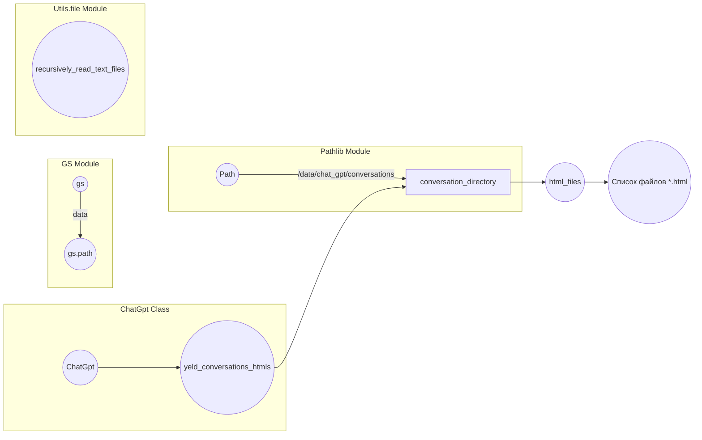

# <input code>

```python
## \file hypotez/src/suppliers/chat_gpt/chat_gpt.py
# -*- coding: utf-8 -*-
#! venv/Scripts/python.exe
#! venv/bin/python/python3.12

"""
.. module: src.suppliers.chat_gpt 
	:platform: Windows, Unix
	:synopsis:

"""
MODE = 'dev'

"""
	:platform: Windows, Unix
	:synopsis:

"""


"""
	:platform: Windows, Unix
	:synopsis:

"""


"""
  :platform: Windows, Unix

"""
"""
  :platform: Windows, Unix
  :platform: Windows, Unix
  :synopsis:
"""MODE = 'dev'
  
import header
from pathlib import Path
from src import gs
from src.utils.file import recursively_read_text_files
class ChatGpt:

    def yeld_conversations_htmls(self) -> str:
        """"""
        ...
        conversation_directory = Path(gs.path.data / 'chat_gpt' / 'conversations')
        html_files = conversation_directory.glob("*.html")

```

# <algorithm>

```mermaid
graph TD
    A[Начало] --> B{Получить директорию conversations};
    B -- true --> C[conversation_directory = Path(gs.path.data / 'chat_gpt' / 'conversations')];
    C --> D{Пройти по всем файлам в директории};
    D -- true --> E[html_files = conversation_directory.glob("*.html")];
    E --> F[Возврат списка файлов *.html];
    F --> G[Конец];
```

**Пример:**

Если `gs.path.data` указывает на директорию `/data`, то `conversation_directory` будет `/data/chat_gpt/conversations`.  Алгоритм перебирает все файлы в этой папке, имеющие расширение `.html`. Результат - список найденных файлов.


# <mermaid>



**Объяснение зависимостей:**

* `gs`: Модуль, вероятно, содержит пути к различным ресурсам (в данном случае, к директории `data`). Он напрямую связан с `ChatGpt`.
* `Pathlib`: Предоставляет объекты `Path` для работы с путями к файлам. Он используется для получения пути к директории с файлами `html`.
* `src.utils.file`: Этот модуль, вероятно, содержит утилиты для работы с файлами, в данном случае, `recursively_read_text_files` (хотя последняя строка не использует его).

# <explanation>

**Импорты:**

* `import header`: Импортирует, вероятно, пользовательский модуль `header`, содержащий общую функциональность. Без конкретного кода `header`, сложно сказать о его содержании.
* `from pathlib import Path`: Импортирует класс `Path` из модуля `pathlib`, для работы с файловыми путями в системе независимо от операционной системы.
* `from src import gs`: Импортирует модуль `gs`, вероятно, содержащий данные о путях к различным ресурсам проекта.
* `from src.utils.file import recursively_read_text_files`: Импортирует функцию `recursively_read_text_files` из модуля `src.utils.file`, скорее всего, предназначенную для рекурсивного поиска и чтения текстовых файлов.


**Классы:**

* `ChatGpt`: Класс, вероятно, предназначен для взаимодействия с чат-ботом ChatGPT. Метод `yeld_conversations_htmls` предназначен для получения списка файлов HTML с диалогами.

**Функции:**

* `yeld_conversations_htmls(self) -> str`: Метод класса `ChatGpt`. Он принимает `self` (ссылку на текущий экземпляр класса) и возвращает строку (по типу списка, предположительно). Метод получает директорию с разговорами, перебирает файлы с расширением `.html` в этой директории, и, вероятно, возвращает данные из этих файлов (пока неясно, в каком формате, учитывая использование `...`).

**Переменные:**

* `MODE = 'dev'`: Переменная, вероятно, задает режим работы приложения (в данном случае, `dev`).
* `conversation_directory`: Переменная типа `Path`, содержащая путь к директории с файлами диалогов.
* `html_files`: Переменная, содержащая итератор по файлам с расширением `.html` в директории `conversation_directory`.


**Возможные ошибки и улучшения:**

* Код фрагментарный и неполный. Не хватает логики внутри `yeld_conversations_htmls`, чтобы понять, как происходит чтение и обработка данных из файлов.
* Не указан тип возвращаемой информации из `yeld_conversations_htmls`. Возможна ошибка, если `html_files` возвращает пустой итератор, что приведет к ошибке.
* Отсутствие обработки исключений. Возможно, стоит добавить проверку на существование директории `conversation_directory` и обработку ошибок при чтении файлов.

**Взаимосвязи с другими частями проекта:**

Код явно использует модуль `gs`, который, скорее всего, содержит информацию о путях к ресурсам проекта (например, данные, конфигурации).  Поэтому `ChatGpt` напрямую зависит от `gs`.  `src.utils.file` – вспомогательный модуль, который возможно используется другими частями проекта.  Взаимодействие `ChatGpt` с другими частями проекта будет зависеть от того, как будет реализована функция `yeld_conversations_htmls`.  Нужно увидеть дальнейший код, чтобы полностью понять взаимодействие.