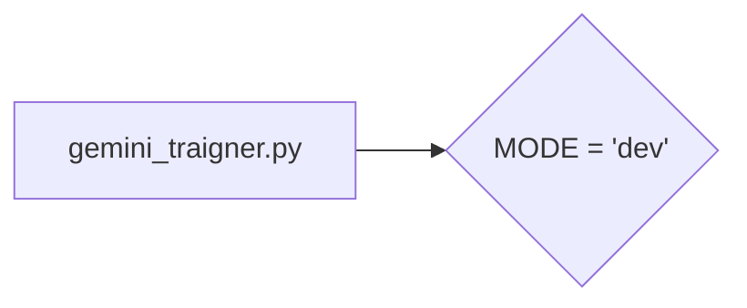

# <input code>

```python
## \file hypotez/src/suppliers/chat_gpt/gemini_traigner.py
# -*- coding: utf-8 -*-
#! venv/Scripts/python.exe
#! venv/bin/python/python3.12

"""
.. module: src.suppliers.chat_gpt 
	:platform: Windows, Unix
	:synopsis:

"""
MODE = 'dev'

"""
	:platform: Windows, Unix
	:synopsis:

"""


"""
	:platform: Windows, Unix
	:synopsis:

"""


"""
  :platform: Windows, Unix

"""
"""
  :platform: Windows, Unix
  :platform: Windows, Unix
  :synopsis:
"""MODE = 'dev'
```

# <algorithm>

Этот код представляет собой фрагмент Python-скрипта, скорее всего, из более крупного проекта.  Алгоритм не определен, поскольку в коде нет выраженных циклов, условных операторов или вызовов функций, выполняющих какие-либо действия.  Код содержит только несколько строк документации и глобальную переменную `MODE`.  Пошаговая блок-схема не применима, так как нет алгоритма.

# <mermaid>



# <explanation>

* **Импорты**:  Нет импортов.  Это означает, что данный код не использует модули или классы из других файлов или пакетов. В контексте `src.` предполагается, что это часть проекта.  Фрагмент кода не показывает какие-либо импорты, которые могли бы существовать в других частях файла `gemini_traigner.py`.

* **Классы**: Нет классов.

* **Функции**: Нет функций.

* **Переменные**:  `MODE = 'dev'` — это глобальная переменная, которая содержит строковое значение 'dev'.  Предположительно, эта переменная используется для определения режима работы, например, 'dev' для разработки, 'prod' для производства.  Контекст её использования будет зависеть от кода, который находится в других частях файла или в других файлах проекта.

* **Возможные ошибки или области для улучшений**:  Код слишком короткий и неполный, чтобы оценить возможные ошибки.  Отсутствие импортов и логики делает его бесполезным без контекста.  Добавление комментариев с описанием предназначения переменной `MODE` и других данных, которые могут быть в других частях кода, улучшило бы его.


* **Цепочка взаимосвязей с другими частями проекта**:  Без импортов или функций, невозможно определить взаимосвязь с другими частями проекта.  Вероятно, эта переменная `MODE` используется где-то в другом месте проекта.  Возможно, в других частях `gemini_traigner.py`, или в других модулях или файлах в папке `suppliers`, или даже в других частях проекта.


**Вывод:**  Код содержит только объявление глобальной переменной.  Без дополнительных деталей, его функциональность не может быть определена.  В целом, это фрагмент документации или необязательные детали проекта, которые не содержат работоспособного кода.