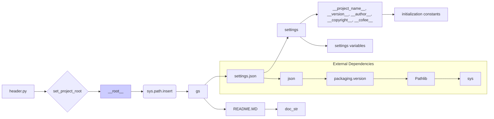

# <input code>

```python
## \file hypotez/src/suppliers/chat_gpt/header.py
# -*- coding: utf-8 -*-\
#! venv/Scripts/python.exe
#! venv/bin/python/python3.12

"""
.. module: src.suppliers.chat_gpt 
	:platform: Windows, Unix
	:synopsis:

"""
MODE = 'dev'

import sys
import json
from packaging.version import Version

from pathlib import Path
def set_project_root(marker_files=('pyproject.toml', 'requirements.txt', '.git')) -> Path:
    """
    Finds the root directory of the project starting from the current file's directory,
    searching upwards and stopping at the first directory containing any of the marker files.

    Args:
        marker_files (tuple): Filenames or directory names to identify the project root.
    
    Returns:
        Path: Path to the root directory if found, otherwise the directory where the script is located.
    """
    __root__:Path
    current_path:Path = Path(__file__).resolve().parent
    __root__ = current_path
    for parent in [current_path] + list(current_path.parents):
        if any((parent / marker).exists() for marker in marker_files):
            __root__ = parent
            break
    if __root__ not in sys.path:
        sys.path.insert(0, str(__root__))
    return __root__


# Get the root directory of the project
__root__ = set_project_root()
"""__root__ (Path): Path to the root directory of the project"""

from src import gs

settings:dict = None
try:
    with open(gs.path.root / 'src' /  'settings.json', 'r') as settings_file:
        settings = json.load(settings_file)
except (FileNotFoundError, json.JSONDecodeError):
    ...

doc_str:str = None
try:
    with open(gs.path.root / 'src' /  'README.MD', 'r') as settings_file:
        doc_str = settings_file.read()
except (FileNotFoundError, json.JSONDecodeError):
    ...


__project_name__ = settings.get("project_name", 'hypotez') if settings  else 'hypotez'
__version__: str = settings.get("version", '')  if settings  else ''
__doc__: str = doc_str if doc_str else ''
__details__: str = ''
__author__: str = settings.get("author", '')  if settings  else ''
__copyright__: str = settings.get("copyrihgnt", '')  if settings  else ''
__cofee__: str = settings.get("cofee", "Treat the developer to a cup of coffee for boosting enthusiasm in development: https://boosty.to/hypo69")  if settings  else "Treat the developer to a cup of coffee for boosting enthusiasm in development: https://boosty.to/hypo69"
```

# <algorithm>

**Алгоритм работы кода:**

1. **Находит корневой каталог проекта:** Функция `set_project_root` ищет корневой каталог проекта, начиная с текущего файла и поднимаясь вверх по директориям. Она проверяет наличие файлов (или каталогов), указанных в `marker_files`, чтобы определить корневой каталог. Если корневой каталог не находится в `sys.path`, он добавляется в начало этого списка.

   * **Пример:** Если файл `header.py` находится в `hypotez/src/suppliers/chat_gpt`, а проект находится в `hypotez`, функция найдет `hypotez` и добавит его в `sys.path`.
   
2. **Инициализирует переменные:** Код загружает переменные из файла `settings.json` в корневой директории проекта. Эти переменные включают имя проекта, версию, описание (из `README.MD`) и др.
   * **Пример:** Если `settings.json` содержит `"project_name": "MyProject"` и `"version": "1.0.0"`, переменные `__project_name__` и `__version__` примут эти значения соответственно.
   
3. **Обработка исключений:** Использование `try...except` блоков обрабатывает возможные ошибки, такие как `FileNotFoundError` и `json.JSONDecodeError` при чтении файлов `settings.json` и `README.MD`.
   * **Пример:** Если `settings.json` не найден, переменная `settings` останется `None`, и значения по умолчанию будут использованы для соответствующих переменных.

4. **Инициализация констант:** Код заполняет различные константы, такие как `__project_name__`, `__version__`, `__doc__` и т.д., значениями из `settings.json` или значениями по умолчанию, если соответствующие данные отсутствуют.

**Перемещение данных:**

Данные передаются между функциями, в основном, через аргументы и возвращаемые значения.  `set_project_root` возвращает путь к корневому каталогу, который затем используется для чтения данных из `settings.json` и `README.MD`.

# <mermaid>




# <explanation>

**Импорты:**

- `sys`: Модуль для доступа к системе, в данном случае для манипуляции с `sys.path`.
- `json`: Модуль для работы с JSON-файлами, используется для загрузки настроек из `settings.json`.
- `packaging.version`: Модуль для работы с версиями пакетов (не используется напрямую, но импортирован).
- `pathlib`: Модуль для работы с путями к файлам и каталогам.
- `src import gs`: Предполагает, что `gs` — это модуль (возможно, из `src`), содержащий функции или классы для работы с путями к файлам.  Это важная зависимость, так как определяет, как программа находит файлы проекта.

**Классы:**

Нет явных классов в представленном коде.

**Функции:**

- `set_project_root(marker_files)`: Находит корневой каталог проекта, поднимаясь по директориям от текущего файла, пока не найдет каталог, содержащий файлы или директории из `marker_files`.  Она встраивает найденный корневой каталог в `sys.path`.  Возвращает `Path` объекта корневого каталога.
  - **Аргументы:** `marker_files` (кортеж строк).
  - **Возвращаемое значение:** `Path` к корневому каталогу.
  - **Пример:** `set_project_root(('pyproject.toml',))` найдет корневой каталог, содержащий `pyproject.toml`.

**Переменные:**

- `__root__`: Путь к корневому каталогу проекта.
- `settings`: Словарь, содержащий настройки проекта, полученные из `settings.json`.
- `doc_str`: Строка, содержащая содержимое файла `README.MD`.
- `__project_name__`, `__version__`, `__doc__`, `__details__`, `__author__`, `__copyright__`, `__cofee__`:  Константы, содержащие информацию о проекте. Они получены из `settings.json` или имеют значения по умолчанию.

**Возможные ошибки и улучшения:**

- **Обработка пустого `settings.json`:**  Проверка, что `settings` не пусто (или не `None`) перед доступом к элементам в нём.
- **Улучшение обработки ошибок:** Более подробная информация об ошибках при чтении `settings.json` или `README.MD` (например, тип ошибки).
- **Оптимизация поиска корневого каталога:** Если файлов маркеров (`marker_files`) много, поиск может занять долгое время. Можно использовать `os.path.abspath()` для поиска директории сразу.
- **Документация:**  Документация функций могла бы быть более подробной, особенно касательно возможных ошибок и значения параметров.


**Взаимосвязь с другими частями проекта:**

Функция `set_project_root` и использование `src.gs` указывают на существование модуля `gs` в пакете `src`, который предоставляет информацию о путях к файлам проекта.   В дальнейшем, код использует `gs.path.root` для доступа к файлам проекта, что демонстрирует зависимость от этого модуля, который определяет структуру проекта. Код `header.py` отвечает за подготовку окружения для последующих модулей приложения.