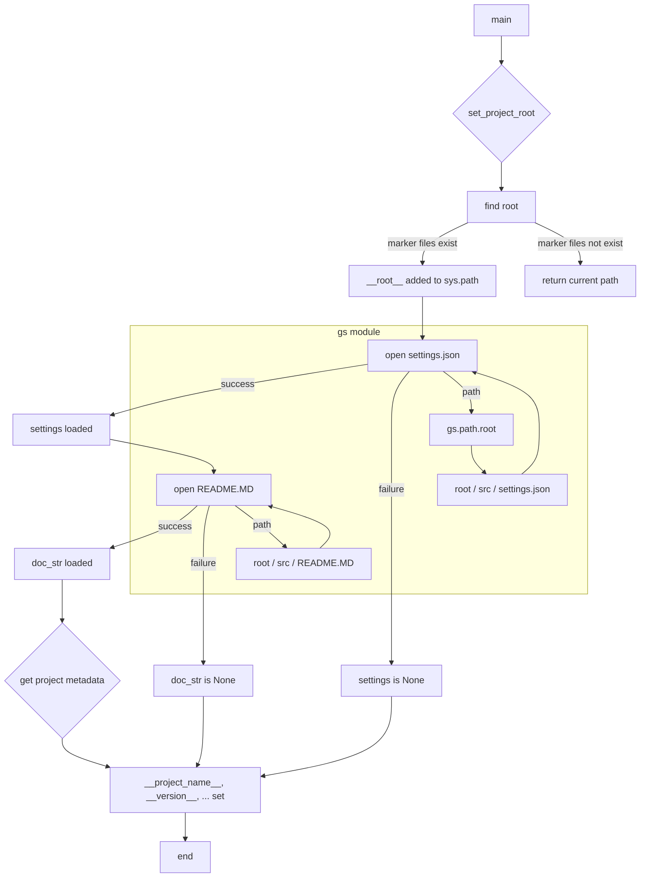

# <input code>

```python
## \file hypotez/src/suppliers/chat_gpt/scenarios/header.py
# -*- coding: utf-8 -*-
#! venv/Scripts/python.exe
#! venv/bin/python/python3.12

"""
.. module: src.suppliers.chat_gpt.scenarios 
	:platform: Windows, Unix
	:synopsis:

"""
MODE = 'dev'

"""
	:platform: Windows, Unix
	:synopsis:

"""

"""
	:platform: Windows, Unix
	:synopsis:

"""


"""
  :platform: Windows, Unix

"""
"""
  :platform: Windows, Unix
  :platform: Windows, Unix
  :synopsis:
"""MODE = 'dev'
  
""" module: src.suppliers.etzmaleh """

import sys
import json
from packaging.version import Version

from pathlib import Path
def set_project_root(marker_files=('pyproject.toml', 'requirements.txt', '.git')) -> Path:
    """
    Finds the root directory of the project starting from the current file's directory,
    searching upwards and stopping at the first directory containing any of the marker files.

    Args:
        marker_files (tuple): Filenames or directory names to identify the project root.
    
    Returns:
        Path: Path to the root directory if found, otherwise the directory where the script is located.
    """
    __root__:Path
    current_path:Path = Path(__file__).resolve().parent
    __root__ = current_path
    for parent in [current_path] + list(current_path.parents):
        if any((parent / marker).exists() for marker in marker_files):
            __root__ = parent
            break
    if __root__ not in sys.path:
        sys.path.insert(0, str(__root__))
    return __root__


# Get the root directory of the project
__root__ = set_project_root()
"""__root__ (Path): Path to the root directory of the project"""

from src import gs

settings:dict = None
try:
    with open(gs.path.root / 'src' /  'settings.json', 'r') as settings_file:
        settings = json.load(settings_file)
except (FileNotFoundError, json.JSONDecodeError):
    ...

doc_str:str = None
try:
    with open(gs.path.root / 'src' /  'README.MD', 'r') as settings_file:
        doc_str = settings_file.read()
except (FileNotFoundError, json.JSONDecodeError):
    ...


__project_name__ = settings.get("project_name", 'hypotez') if settings  else 'hypotez'
__version__: str = settings.get("version", '')  if settings  else ''
__doc__: str = doc_str if doc_str else ''
__details__: str = ''
__author__: str = settings.get("author", '')  if settings  else ''
__copyright__: str = settings.get("copyrihgnt", '')  if settings  else ''
__cofee__: str = settings.get("cofee", "Treat the developer to a cup of coffee for boosting enthusiasm in development: https://boosty.to/hypo69")  if settings  else "Treat the developer to a cup of coffee for boosting enthusiasm in development: https://boosty.to/hypo69"
```

# <algorithm>

1. **Инициализация:**
   - Определяется переменная `MODE` со значением 'dev'.
   - Импортируются необходимые модули: `sys`, `json`, `Version` из `packaging`, и `Path` из `pathlib`.

2. **Поиск корневой директории проекта:**
   - Функция `set_project_root` ищет корневую директорию проекта, начиная с текущего файла.
   - Она перебирает родительские директории, проверяя наличие файлов `pyproject.toml`, `requirements.txt`, или `.git`.
   - Если корневая директория найдена, она добавляется в `sys.path`.
   - Возвращает найденную корневую директорию.
   - Пример: если текущий файл находится в `hypotez/src/suppliers/chat_gpt/scenarios`, функция найдет директорию `hypotez` и вернет ее.

3. **Чтение настроек:**
   - Получается корневая директория `__root__` с помощью функции `set_project_root`.
   - Файл `settings.json` в корневой директории проекта читается в переменную `settings`.
   - Обрабатываются исключения `FileNotFoundError` и `json.JSONDecodeError` в случае отсутствия или поврежденности файла.


4. **Чтение документации:**
   - Файл `README.MD` в корневой директории проекта читается в переменную `doc_str`.
   - Обрабатываются исключения `FileNotFoundError` и `json.JSONDecodeError` в случае отсутствия или поврежденности файла.

5. **Получение метаданных проекта:**
   - Переменные `__project_name__`, `__version__`, `__doc__`, `__details__`, `__author__`, `__copyright__`, `__cofee__` получают значения из словаря `settings` или принимают значения по умолчанию.
   - Пример: если в `settings.json` есть поле `project_name` со значением "MyProject", то `__project_name__` получит это значение.


# <mermaid>



# <explanation>

**Импорты:**

- `sys`: Предоставляет доступ к системным переменным и функциям.
- `json`: Для работы с JSON-файлами.
- `packaging.version`: Для работы с версиями.
- `pathlib`: Для работы с файловыми путями.
- `src.gs`:  Этот импорт предполагает наличие модуля `gs` в директории `src`. Вероятно, этот модуль содержит функции, работающие с путями к файлам проекта (например, `gs.path.root`).


**Классы:**

Нет классов.


**Функции:**

- `set_project_root(marker_files)`: Находит корневую директорию проекта, поднимаясь по цепочке родительских каталогов, пока не найдет директорию, содержащую один из указанных файлов.  Аргумент `marker_files` позволяет гибко настраивать поиск. Возвращает `Path` к корневой директории.

**Переменные:**

- `MODE`: Строковая константа, вероятно, определяющая режим работы.
- `__root__`:  `Path` объект, хранящий путь к корневому каталогу проекта.
- `settings`: Словарь, содержащий настройки из файла `settings.json`.
- `doc_str`: Строка, содержащая текст из файла `README.MD`.
- `__project_name__`, `__version__`, `__doc__`, `__details__`, `__author__`, `__copyright__`, `__cofee__`:  Строковые переменные, содержащие метаданные о проекте, полученные из `settings.json`.


**Возможные ошибки и улучшения:**

- **Обработка исключений:** Код корректно обрабатывает `FileNotFoundError` и `json.JSONDecodeError`, но можно добавить более подробные сообщения об ошибках, например, используя `logging`.
- **Типизация:** Использование `Type Hinting` (`-> Path`, `: dict`)  улучшает читаемость и поддерживает статическую типизацию.
- **Логирование:** Добавление логирования (`logging`) позволит отслеживать ход выполнения скрипта, например, при поиске корневой директории.
- **Дополнительные проверки:** Проверка корректности данных в `settings.json` (например, наличие требуемых полей) может повысить надежность.
- **Константы:**  Использование констант для часто используемых путей (`src/settings.json`, `src/README.MD`) повысит читаемость.


**Взаимосвязи с другими частями проекта:**

Модуль `gs` (из `src.gs`) играет ключевую роль, предоставляя функционал работы с путями. Вероятно, другие части проекта (например, `gs` или `settings`) используют полученные значения `__root__` или данные из `settings.json`.  Модуль `gs` отвечает за логику работы с путями к ресурсам проекта. Без контекста проекта (например, полный путь `src`) трудно оценить точное местоположение файла `gs.py`.